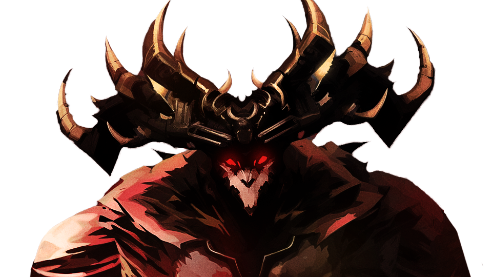

# Welcome!
{: .center}

This website contains a guide to the Temple of Febe Challenge Mode in Guild Wars 2. The objective of this guide is to be both a launch point for players just starting to get into the encounter, and a reference for more experienced players who want to increase their knowledge.

The entire guide can be read sequentially using the "Previous" and "Next" buttons present on most pages, but feel free to search or navigate to whatever most interests you.

<a href="introduction/getting-started.html">
<button class="button intro-button" role="link">Start Reading</button>
</a>

<a href="mechanics/mechanics.html">
<button class="button mechanics-button" role="link">Mechanics Reference</button>
</a>

<a href="unit/overview.html">
<button class="button strategy-button" role="link">Strategy Guide</button>
</a>

### Feedback and Contributions

This guide was made thanks to the help of multiple members of the community, and is open-source! If you feel anything is incorrect or can be made better, please open an issue [here](https://github.com/SilverHalf/temple-of-febe/issues)! If you have anything you want to contribute, feel free contact me on github or discord.

