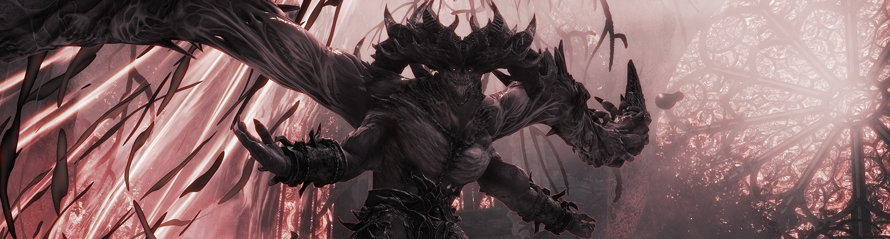

{: .mx-0 }

This website is currently a work in progress! Lots of content is still waiting to be moved over from the old guide.
If you want to see the old guilde, you can find it [here](https://templeoffebe.tiiny.site/).

# Welcome to Temple of Febe Challenge Mode!

Temple of Febe CM is one of the most difficult endgame boss fights in Guild Wars 2. This encounter stresses both individual player mechanics, and the squad’s overall coordination, but is also extremely rewarding and fun when played correctly.

The objective of this guide is to be both a launch point for players just starting to get into the encounter, and a reference for more experienced players who want to increase their knowledge.

---

### Sections to Explore

There are four main sections to this guide. You can read them one by one, or just jump to whatever you're interested in. These consist of:

1. An introduction with information about how to get into ToF CM, including communities and tips for getting into your first run.
2. A full description of every mechanic present in the fight, including effects, mitigation, common strategies, and other useful or interesting information.
3. A brief overview of some commonly used strategies employed by organized groups, and the choices driving them.
4. A detailed play-by-play breakdown of UNIT strat, one of the most used strategies in PUG groups.

---

### Feedback and Contributions

This guide was made thanks to the help of multiple members of the community. If you feel anything is incorrect or can be made better, please open an issue! If you have anything you want to contribute, please contact me!
