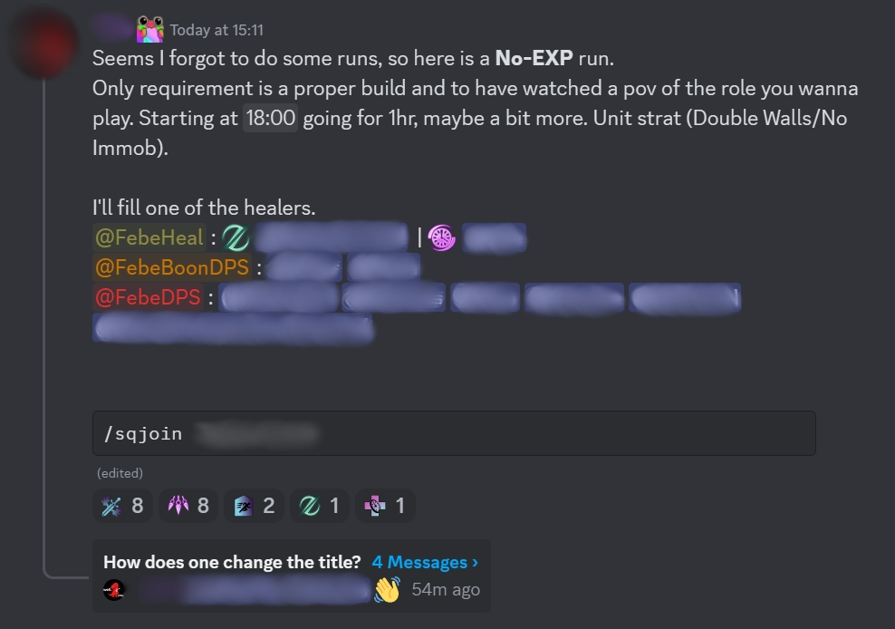
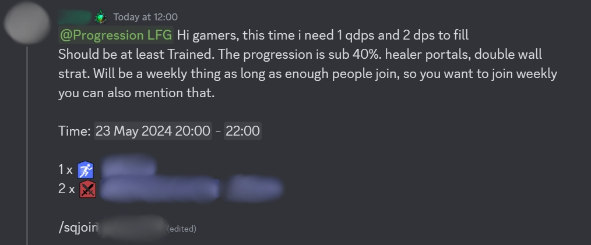

[Previous](getting-started.html){: .btn } [  Next  ](arcdps-logs.html){: .btn }

# Getting into your first run

Starting is actually very simple! Hop over to the progression LFG channels on the previously mentioned [servers](getting-started.html) and look for a No Experience run. These are made for people like you! No-exp events are run regularly on both communities by experienced members.

Most commanders will only require that you have an appropriate build for your role, and that you know how to play your class. Just sign up for runs and follow the commander’s calls, and you will have a blast!

{: .warning }
ToF CM is still one of the most challenging endgame encounters! You should have some experience in other endgame content before joining any runs.

# Getting into more runs

As you advance further into the encounter and see more mechanics, you will likely want to run with people who have similar experience as yourself. Both communities mentioned in the [introduction](getting-started.html) use an _experience level_ system: you can submit logs demonstrating your skill, and get assigned _discord roles_ that guarantee your progress to all members of the community. There are various roles with increasing requirements, and more advanced roles are prerequisite to eventually get into runs with players going for the kill.

If you are a dedicated gamer and want to run multiple times a week, you will likely benefit from forming or joining a static group.

[Previous](getting-started.html){: .btn } [   Next   ](arcdps-logs.html){: .btn }