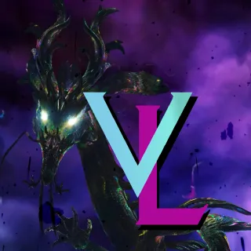

[Previous](../index.html){: .btn } [Next](arcdps-logs.html){: .btn }

# Getting Started

Similarly to other challenging endgame encounters, it can be difficult if not downright impossble to find a group for ToF CM in the public LFG. The complexity of the fight mandates voice chat, and most people interested in running it congregate in external online communities, primarily on [discord](https://discord.com/).

There are two communities that regularly host public runs:

- The  [Temple of Febe CM](https://discord.gg/GBWkn3Az){: .text-red-300 .fw-700} discord server, born after the introduction of the bossfight, and exclusively dedicated to the encounter.

- The  [Void Lounge](https://discord.gg/UXmjTayf){: .text-purple-000 .fw-700}  discord server, created originally for Harvest Temple Challenge Mode, has since expanded also to ToF CM.

Both of these communities are _incredible_ resources for players looking to get into ToF, and I highly recommend anyone interested in the encounter to join one or both.

[Previous](../index.html){: .btn } [Next](arcdps-logs.html){: .btn }