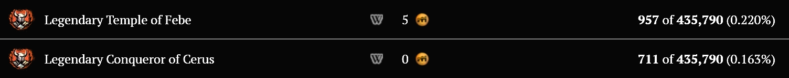

[Previous](first-runs.html){: .btn } [Next](../mechanics/breakdown.html){: .btn }

# Legendary Challenge Mode

Temple of Febe is the first encounter in Guild Wars 2 to introduce a Legendary Challenge Mode.
When this is activated, the boss' HP increases by about 24 million, reaching over 130 million HP.
While conceptually simple, this make the fight anything but: its difficulty eclipses _almost_ everything
else currently available in the game (more on this below).

This difficulty arises from the difficult damage check introduced by Cerus' extra sponginess, which 
becomes especially pronounced in the final phase. 

If you aim to clear the LCM, it is _strongly recommended_ to first clear the normal CM, for
two reasons. Firstly, most LCM groups will only accept players who havereached certain damage thresholds in the 
normal CM version of the fight. The most common threshold is **27.5k dps** in the final phase for pure
dps players, or **13k dps** for boondps.

Secondly and more important, the mechanics are essentially identical between CM and LCM, so building
familiarity with them is extremely useful for progressing.
Looking at stats on [gw2efficency](https://gw2efficiency.com/account/unlock-statistics?filter.category=362),
you can see that about 75% of people who completed the CM have also completed the LCM: this is no
coincidence.

Completing the Legendary Challenge will give you a lovely reward: a unique purple title.

# Embodiment Of Sin

EoS is the title run for Temple of Febe, requiring that players kill the Challenge Mode with all
of Cerus's aspects empowered. For various reasons, this is currently the hardest fight in Guild
Wars, [by far](https://gw2efficiency.com/account/unlock-statistics?filter.search=Apathetic).

EoS requires different builds and strategies compared to the CM and LCM, which won't be covered
in this guide. However, the individual attacks are the same as in the CM, so EoS players can still
benefit from referencing this guide.

If you aim to kill this version of the fight, first kill the LCM, then hope you can find nine other
like-minded players, and be prepared to spend a _lot_ of time on progression.

[Previous](first-runs.html){: .btn } [Next](../mechanics/breakdown.html){: .btn }