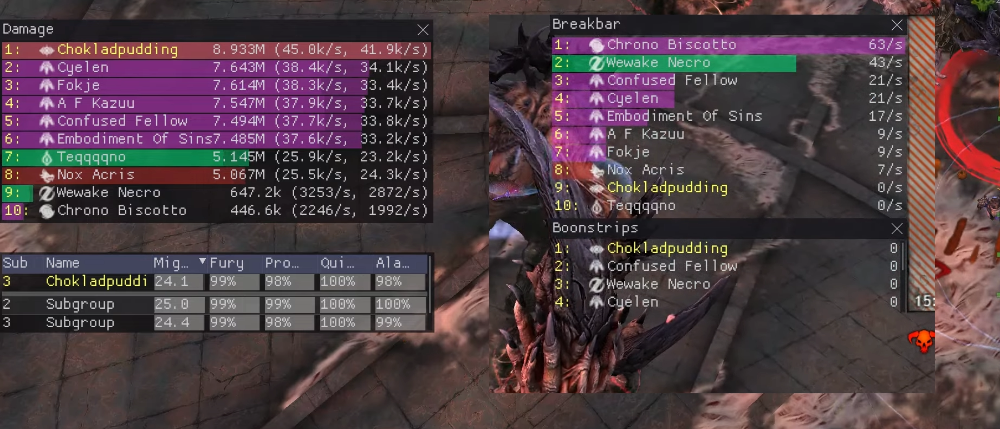

[ < ](getting-started.html){: .btn } [ > ](first-runs.html){: .btn }

# Useful Things to Have

Here you will find a list of external tools and utilites. These aren't strictly mandatory, but most come highly recommended by GW2's hardcore community.

Try them out and see what you think!

---

## ArcDPS: Combat Logs and Real-Time Charts

[ArcDPS](https://www.deltaconnected.com/arcdps/) is at its core a damage meter: an add-on for Guild Wars 2 that enables you to see exactly how much damage you are dealing to the boss. However, it also has another very important function: it works as a general combat metrics tool, tracking and logging every detail of an encounter from beginning to end.

ArcDPS logs are incredibly useful: they show you exactly how an encounter played out, what skills each player used, who was affected by what mechanic. Regularly checking your logs and understanding what you can improve is an important step towards becoming a better player.

Snowcrows, one of the premier raiding guilds, offers a nice [guide](https://snowcrows.com/guides/getting-started/arc-dps) to installing and setting up ArcDPS.

---

## Upload, Archive and Read your Logs

ArcDPS logs can be viewed using the [Elite Insights](https://github.com/baaron4/GW2-Elite-Insights-Parser) parser. However, don't go downloading anything just yet: most people just upload their logs to a convenient hosting website. The simplest option is [DPS Report](https://dps.report/). Simply drag and drop the .zevtc archive generated by your ArcDPS, and you will obtain a nice link to a parsed log. For example: [dps.report](https://dps.report/w7qK-20240401-230033_cerus). You can then share this link with anyone you want.

If you don't want to go through the hassle of manually uploading all of your logs, I recommend using [Wingman Uploader](https://gw2wingman.nevermindcreations.de/uploader). This tool automatically uploads your logs to the Wingman website, where you can then browse them individually, and compare your performance to other players'. For example, [here](https://gw2wingman.nevermindcreations.de/cerus) you can find the average and top performances for Temple of Febe (make sure to select Challenge Mode!), and you can also view the best performing logs for each patch to see how they are doing their damage.

[ < ](getting-started.html){: .btn } [ > ](first-runs.html){: .btn }