[Return to Home](index.html){: .btn }
{: .center}

## Cerus, the Glaive of House Nephus
{: .center .no_toc}

| **Health** | 95'557'328 (CM) or 117'057'712 (LCM) |
| **Armor** |  2597 (standard) |
| **Instance**| Day |
| **Enrage Timer** | 10 minutes - kills all players on running out. |

This section contains a detailed description of the various attacks and mechanics present in the Temple of Febe encounter.

<b>Table of Contents</b>

1. TOC
{:toc}

#### Main Points
{: .no_toc}

- Cerus's abilities are linked to his six [Aspects], each of which has one characteristic attack.
- As the fight progresses, Cerus will  **Empower** some of his recurring attacks, greatly increasing the challenge they pose.
- On failing certain mechanics, Cerus will gain stacks of  [Empowered], which permanently buff his damage for the rest of the fight.
- The final 10% is a dangerous healing check.

---

### Legendary Mode

Temple of Febe was the first encounter in Guild Wars 2 to introduce a Legendary Challenge Mode. When this is activated, the boss’ HP increases from 95'557'328 to 117'057'712. Furthermore, several mechanics receive additional buffs that make them much more difficult to manage:

-  [Insatiable] stacks become permanent when [Gluttony] becomes  [Empowered](#-empowered-1.)
- Adds spawned in from [Malice] have increased health and toughness.
- Failing [Regret] will instantly kill the entire squad, and  [Extreme Vulnerability] will instantly defeat players upon gaining two stacks.
- [Enraged Smash] will grant three stacks of  [Empowered] instead of two.

The result is an extremely punishing encounter with a tight damage and healing check. A successful clear of the LCM requires minimal errors in the entire fight, all the way up to the end.

IIt is strongly recommended to clear the normal CM before attempting LCM: mechanics are very similar, and building familiarity with them is extremely useful. All strategies using in CM are equally viable in LCM.

---

### Embodiment of Sin

Embodiment of Sin is a title obtained upon completing the  [Apathetic](https://wiki.guildwars2.com/wiki/Secrets_of_the_Obscure_(achievements)#achievement7820) achievement. This requires killing Cerus CM while all of his [Aspects] are  [Empowered](#-empowered-1).

This introduces significant difficulties, as it forces groups to deal with  [Gluttony] and  [Regret] mechanics that are usually not seen in regular runs.

EoS kills are usually progressed in static groups using different strategies and compositions than standard runs.

## Arena - the Temple of Febe

The location in which you fight Cerus is the Temple of Febe. It is accessible from the portal in the [Wizard's Tower](https://wiki.guildwars2.com/wiki/The_Wizard%27s_Tower), and can be entered freely once the [Treachery](https://wiki.guildwars2.com/wiki/Treachery) story step is completed.

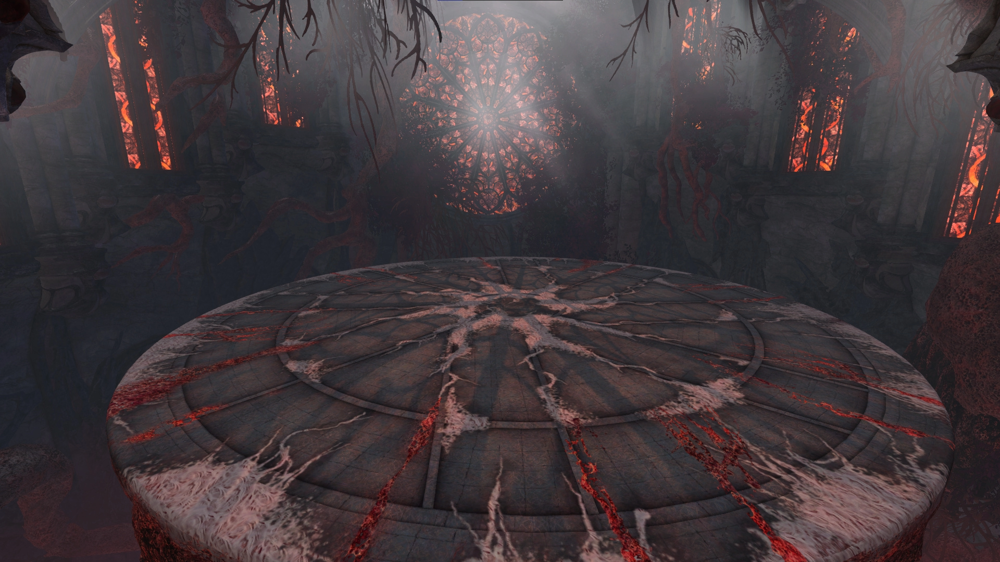

Cerus will spawn in the center of this arena, and never moves from there.

In Challenge Mode, any player that falls off the arena is instantly defeated.

The arena is not a single collision mesh, but many combined. This creates some strange issues with pathfinding, both when dealing with moving [adds](aspects/malice.html) that spawn throughout the fight, but also when using skills that require an uninterrupted path, such as  [Blink](https://wiki.guildwars2.com/wiki/Blink). These skills may not function properly when cast towards or from certain 

## Fight Structure and Phases

The encounter consists of **four main phases** and **two split phases**.

---

### Main Phases

In these parts of the fight, Cerus is vulnerable and active. His mechanics consist of [Aspect] attacks, with each phase having its own unique sequence of mechanics that does not vary between pulls.

Furthermore, Cerus will summon in individual [Embodiments] at consistent intervals, with each one then performing the attack corresponding to its aspect. Learning to manage the overlap between these attacks and the ones originating from the boss is a large part of progression on this encounter.

---

#### First Phase - 100% to 80%
{: .no_toc}

<b>View Timeline</b>

  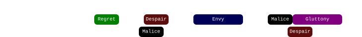
  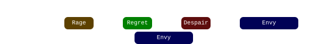

This is the simplest phase, where mechanics are still relatively unforgiving. Cerus will spawn in an [Embodiment] every 30 seconds.

#### Second Phase - 80% to 50%
{: .no_toc}

<b>View Timeline</b>

  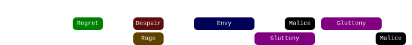
  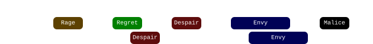
  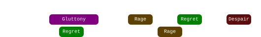

In this phase, at least two [Aspects] will be  [Empowered](#-empowered-1), increasing the challenge posed. [Embodiments] will start spawning in every 20 seconds.
{: .no_toc}

#### Third Phase - 50% to 10%
{: .no_toc}

<b>View Timeline</b>

  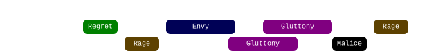
  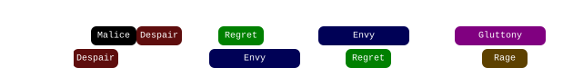
  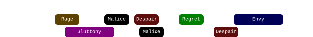
  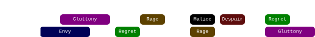
  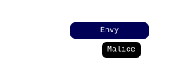

At least four [Aspects] will be  [Empowered](#-empowered-1), bringing noticeable difficulty. [Embodiments] will start spawning in every 15 seconds.

#### Final Phase - 10% to 0%
{: .no_toc}

<b>View Timeline</b>

  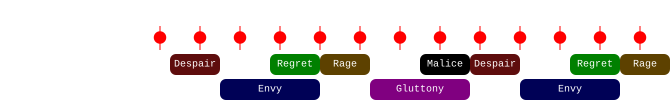

The most difficult part of the fight. This phase starts with a  [Defiance Bar] and [Petrify] attack. Once this is done, Cerus will start casting [Enraged Smash] every four seconds, progressively gaining stacks of  [Empowered]. Meanwhile, a new [Embodiment] will spawn in every 5 seconds.

---

### Split Phases

The first and second split phase occur at 80% and 50% HP respectively. Each split phase begins with a  [Defiance Bar] and the [Petrify] attack, after which Cerus will disappear and all six [Embodiments] will spawn onto the platform in their standard positions.

Three [Embodiments] will gain the  [Empowered](#-empowered-1) effect. These can be identified due to being noticeably larger than usual.

- [Envy], [Rage] and [Regret] will always empower at 80%.
- [Despair], [Gluttony] and [Malice] will always empower at 50%.

After the beginning of the split phase proper, an [Embodiment] will perform the attack associated with their aspect every 12 seconds until the end of the phase. The first attack will almost always be [Gluttony], while the second and following are randomly selected.

Killing an Embodiment will complete the split phase and resummon Cerus, beginning the next [main phase]. Furthermore **all living Aspects will transfer their unique buffs to Cerus**. This includes both types of   **Empowered**.

{: .note}
Killing an  [Empowered](#-empowered-1) Embodiment will result in the corresponding attack not being  [Empowered](#-empowered-1) on Cerus. However, the opposite is also true: killing an un-empowered Embodiment will result in the corresponding attack becoming  [Empowered](#-empowered-1). This is usually only done on Embodiment of Sin runs.

The practical result is that at the end of the 80% split, at least two of Cerus's skills will be  [Empowered](#-empowered-1), increasing to at least four under 50%.

---

### Transition into 10%

The transition at the end of the third phase has some peculiarities due to [Embodiment] attacks potentially carrying over into the following phase. In particular, when the  [Defiance Bar] appears: 
- Any [Embodiments] that have already spawned will finish casting their ability.
- [Malice] tethers will not disappear, spawning Malices when they complete. Any Malices already present will despawn.
- Any [Gluttony] orbs already present will despawn.
- Any [Despair] puddles that were spawned in by the [Embodiment] of Despair will persist throughout the final phase. Puddles that were spawned by the boss will instead disappear.

This means that

## Aspects of Cerus
Cerus has six aspects: **[Envy]**, **[Malice]**, **[Gluttony]**, **[Despair]**, **[Rage]** and **[Regret]**. Each aspect corresponds to a unique attack and to an [Embodiment].

- [Envious Gaze](#envy---envious-gaze) (Envy) - rotating wall that strips boons.
- [Malicious Intent](#malice---malicious-intent) (Malice) - adds spawning on random players.
- [Insatiable Hunger](#gluttony---insatiable-hunger) (Gluttony) - orbs converging on the boss.
- [Wail of Despair](#despair---wail-of-despair) (Despair) -  spreads that leave lingering pools.
- [Crushing Regret](#regret---crushing-regret) (Regret) - green circle.
- [Cry of Rage](#rage---cry-of-rage) (Rage) - massive damaging AoE.

---

### Embodiments
{: .no_toc}

Embodiments are adds that resemble miniature versions of Cerus. There are six of them, each of them corresponding to one of Cerus's [Aspects]. They spawn throughout the fight in fixed locations, shown in the figure below.

{: .warning }
Cerus's Aspects are always present on the map, even when not visible. Their model is still loaded and occupies the same position as always, which means that their hitboxes will still block projectiles.

When summoned during by Cerus during one of his [main phases](#main-phases), Embodiments will be  [Invulnerable], immediately perform the attack associated with their aspect and then despawn. Embodiments are only vulnerable when summoned at the beginning of a [split phase](#split-phases).

### Despair - Wail of Despair

This attack has two components: the first is a set of "spreads": small circular AoEs that target all players and take 5 seconds to fill, dealing damage when complete. Players will take damage from all AoEs they are in.

GIF credit: Snowcrows

Successively, every AoE will leave a lingering pool where it drops, which deals damage and applies  [Torment] to all players in it. The pools persist for 120 seconds or until phase end. Similarly to the initial damage, pool damage also scales based on the number of overlapping pools.

{: .empowered_description }
The AoEs and pools double in radius. Pools additionally ignore all forms of  [Invulnerability] and  [Evasion], and last until the phase ends. 

#### Extra Information
{: .no_toc}

- There is a second's delay between the initial drop and the first pulse of damage from the resulting pools.
- When Cerus does this attack he will use the voice lines: _"(groan)"_ or _"You will suffocate!"_
- **BUG:** as long as the Embodiment of Despair is not visible on the platform, any pools it has dropped will be purely visual, not dealing damage nor inflicting conditions.

#### Mitigation <a href='#mitigation-tables'>?</a>
{: .no_toc .center}

  <ul class="mechtable">
    <li class="table-header">
      
      
      
      
      
      
      
      
    </li>
    <li class="table-row">
      
      
      
      
      
      
      
      
    </li>
    <li class="emp-row">
      
      
      
      
      
      
      
      
    </li>
  </ul>

1. Only applies to the initial damage, and not to the lingering pools.

---

#### Strategy
{: .no_toc}

It is possible to avoid both the initial damage and the resulting pool by dodging when the AoE is almost full. Depending on the timing of the dodge, this can result in the AoE dropping at the beginning of the dodge if the dodge is late enough, or at the end of the dodge if done early enough.

[Flower] is relatively forgiving with dodge timings, but in [UNIT] early dodges wil place the pool where your teammates finish their own dodge, potentially killing them.

Players can use  [Distortion] and other forms of  [Invulnerability] to avoid both components of the attack when un-Empowered. When  [Empowered](#-empowered-1),  [Invulnerability] does not work on the pools, so an established strategy is to use it to stop the initial damage, and then dodge out of the resulting pool before its first damage tick (~1 second). 

An equally valid strategy is to dodge the initial drop earlier than usual, and then use a mobility skill to quickly get out of the pools before taking any damage.

When  [Empowered](#-empowered-1), the AoEs from this attack take up a large amount of space. Common strategies to keep the arena clear involve placing them in organized formations far from the boss.

### Envy - Envious Gaze

Spawns a wall centered on the boss or the Embodiment of Envy, depending on who cast it. The wall completes a full rotation counterclockwise before disappearing, dealing damage and corrupting all boons on allies it hits, pets and minions included.

GIF credit: Snowcrows

{: .empowered_description }
A second wall spawns opposite to the first one, and rotates in the same direction at double the speed. The enemy casting the wall also gains all boons that are corrupted, except for  [Alacrity] and  [Quickness].

#### Extra Information
{: .no_toc}

- When Cerus casts this ability, the wall will target a random player. When the [Embodiment] of Envy casts it, it will target the boss, except in split phases, where it will target the player who opened the instance. This player can and should bait the wall off the squad to ensure the group is not inconvenienced.
- The boss's hitbox will deal damage but won't corrupt boons. You can dodge through it if necessary.
- When Cerus does this attack he will use the voice lines: _"Run... Run..."_ or _"Do not look away."_

#### Mitigation <a href='#mitigation-tables'>?</a>
{: .no_toc .center}

  <ul class="mechtable">
    <li class="table-header">
      
      
      
      
      
      
      
      
    </li>
    <li class="table-row">
      
      
      
      
      
      
      
      
    </li>
    <li class="emp-row">
      
      
      
      
      
      
      
      
    </li>
  </ul>

1. Prevents application of conditions, but not the boon corruption.
2. Only prevents the damage, not the boon corruption.
3. Prevents the boon corruption, but only for the fast wall when empowered.

---

#### Strategy
{: .no_toc}

When cast from the boss, it's important to stack tightly before the mechanic, so as to consistently bait it towards the same direction. Avoiding the attack in its normal version then becomes as simple as sidestepping it to the left, and then following it around the boss. 

With the  [Empowered](#-empowered-1) version, dealing with the walls is one of the main problems of encounter strategy, and the solution varies based on the instant in the fight where the mechanic occurs.

It is possible to jump-dodge the fast wall: with the correct timing this will avoid both the damage and the boon corrupt. However, since the damage is usually trivial, most people prefer to just jump. Try to jump while running towards the wall, so your overall clearance is greater. With practice, this becomes very consistent.

In case someone get hit by the empowered wall, players should be ready to strip boons from the boss with skills such as  [Revenant]'s  [Banish Enchantment] and  [Scourge]'s  [Dark Pact]. Supports should also be prepared to cleanse conditions and re-apply boons to their subgroups.

### Gluttony - Insatiable Hunger

Three large orbs and several smaller ones will spawn randomly around the edge of the platform, and start moving towards the caster, whether it be Cerus or the [Embodiment] of Gluttony. Each large orb must be body-blocked by three different players to be destroyed. Blocking any large orb will give a stack of  [Insatiable], which deals a constant damage every second.

GIF credit: Snowcrows

If any orbs reach Cerus, they will give him  [Barrier]. Large orbs will also apply up to 3 stacks of  [Empowered], depending on how many people collected.

{: .empowered_description }
Five orbs spawn, instead of three.  [Insatiable] stacks last for longer.

{: .legendary }
When  [Empowered](#-empowered-1),  [Insatiable] stacks are permanent.

#### Extra Information
{: .no_toc}

- Each player blocking an orb reduces the number of  [Empowered] stacks given by one.
- Large orbs that reach the boss give him 500k  [Barrier], regardless of the number of players who collected them.
- Small orbs give 250-300k  [Barrier] total. This means that if no other reflect sources are available, a squad would gain more damage from a  [Virtuoso] taking  [Feedback] over  [Signet of Illusions].
- Dodging through a large orb will not count for the purpose of collecting it.
- When Cerus does this attack he will use the voice lines: _"Come to me..."_, _"I feed..."_ or _(laughs)_.
- **BUG:** if two orbs are collected in rapid succession (within 0.8 seconds), one of the two will despawn without giving  [Insatiable]. This can be done relatively easily by a  [Mesmer] with  [Blink], but is also possible with other movement skills, such as a  [Scourge]'s  [Path of Gluttony], or by running between two close orbs.

#### Mitigation <a href='#mitigation-tables'>?</a>
{: .no_toc .center}

  <ul class="mechtable">
    <li class="table-header">
      
      
      
      
      
      
      
      
    </li>
    <li class="table-row">
      
      
      
      
      
      
      
      
    </li>
    <li class="emp-row">
      
      
      
      
      
      
      
      
    </li>
  </ul>

1. Affects the damage applied by  [Insatiable].
2. Affects the small orbs, but not the large ones.

---

#### Strategy
{: .no_toc}
This attack is often one of the easiest ways to bleed  [Empowered] to the boss. It is crucial that the squad spreads out correctly in order to intercept all of the orbs.

One of the most commonly used methods to ensure this is to have two [marked](https://wiki.guildwars2.com/wiki/Commander#Markers) players, one in each subgroup. These people then call out the side of the boss they move to when collecting, and their subgroups follow them. Subgroups can set a [personal target](https://wiki.guildwars2.com/wiki/Call_Target#Set_Personal_Target) on the player they’re supposed to follow to see them better. Since there are five people per subgroup, this also makes it simpler to collect during overlaps with the [Regret] mechanic.

Because of the permanent  [Insatiable] stacks, Gluttony is almost never  [Empowered](#-empowered-1) outside of title runs. In this case, groups will often run a third healer to manage the additional damage pressure. Deleting orbs will make collecting the rest much more manageable.

DPS players should try to avoid going over 3 stacks of  [Insatiable], 6 for title runs.

### Malice - Malicious Intent

Targets a random player with a tether. After 5 seconds, the tether will complete, applying a damage-over-time effect and spawning a Malice on the player's location.

GIF credit: Snowcrows

Malices are adds that will immediately start walking toward Cerus. If they reach him, they will be sacrificed, and Cerus will gain 5 stacks of  [Empowered] and 95k  [Barrier] for each Malice.

Malices are immune to hard crowd control, and spawn with  [Resistance] that cannot be corrupted or removed, and lasts for 30 seconds, expiring just before the add reaches the boss.

{: .empowered_description }
Three players will be targeted by tethers, resulting in three Malices spawning.

{: .legendary}
Malices have increased health and toughness.

#### Extra Information
{: .no_toc}

- Malices have 2252 toughness in normal CM, compared to the global standard of 2597, meaning that power damage is 15.3% more effective. In legendary CM, they instead have standard toughness.
- Malices have 630'960  HP in normal CM. In legendary CM, they instead have 946'440 HP (50% more).
- If placed in certain areas on the east side of the platform, Malices will pathfind to a point just north or south of the boss, instead of directly towards it, as shown in the figure.
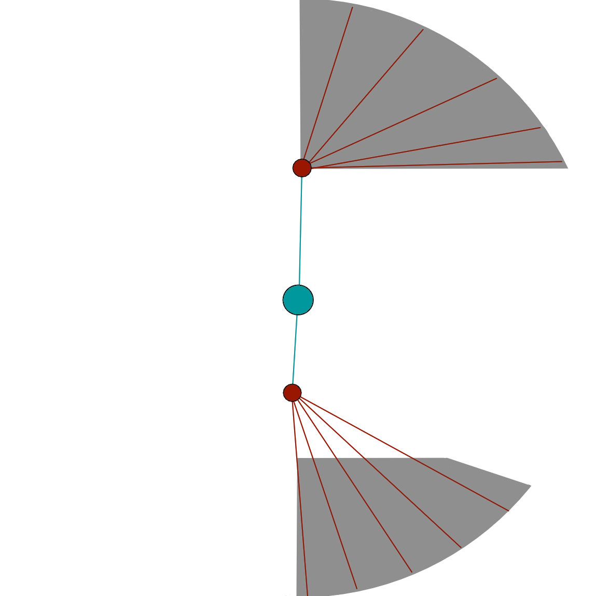
- Malices are affected by all forms of soft crowd control once their  [Resistance] runs out.
- Players will receive a sound cue and their screen border will become purple-white when targeted by the tether. Additionally, the remaining time before the tether completes is shown as a timer above their heads.
- This attack has a maximum range, and if no-one is in it, no tethers will be applied and no adds will spawn.
- When Cerus does this attack he will use the voice lines: _"To me, return..."_ or _"I hunger for power..."_

#### Mitigation <a href='#mitigation-tables'>?</a>
{: .no_toc .center}

  <ul class="mechtable">
    <li class="table-header">
      
      
      
      
      
      
      
      
    </li>
    <li class="table-row">
      
      
      
      
      
      
      
      
    </li>
    <li class="emp-row">
      
      
      
      
      
      
      
      
    </li>
  </ul>

1. Affects the DoT applied by tethers.
2. Prevents the tether DoT from being applied.

---

#### Strategy
{: .no_toc}

This mechanics is dealt with by spawning the Malices far from the boss, usually using portals such as  [Scourge]'s  [Sand Swell] or a  [Mesmer]'s  [Portal Entre].

The Malices are then dealt with in one of three ways, based on the conditions in the encounter and the strategy:
1.   [Immobilizing] and killing them in melee once their  [Resistance] expires (typical of [Flower] strat but also used in the opening phases of [UNIT]).
2. Proactively positioning the squad so that the adds are cleaved down before they can pose a problem (exclusive to [UNIT]).
3. With decent DPS, it is often possible to phase the boss so that the adds despawn without requiring further action on the squad's behalf.

Placing the Malices within the zones depicted above, on the eastern edge of the platform, will ensure that they are as far as possible from the boss when they lose their  [Resistance], giving the squad more time to comfortably kill them.

Commonly  [Immobilizing] is done by a  [Scourge] using  [Dark Pact] for single Malices and  [Epidemic] for multiples. Other classes with group immobilizes are also useful for this, such as  [Druid] and  [Specter]

 [Blocking](https://wiki.guildwars2.com/wiki/Block) the damage over time effect is recommended, especially in the final 10% when the healers are already under pressure.

### Rage - Cry of Rage

Cerus charges up an attack that affects a large AoE centered on himself, dealing massive, unavoidable damage and inflicting  [Exposed] to any players it hits.

GIF credit: Snowcrows

Additionally, Cerus will gain a stack of  [Empowered] for each player hit.

{: .empowered_description }
The AoE is much larger.

#### Extra Information
{: .no_toc}

- When Cerus does this attack he will use the voice lines: _(screams)_ or _"Back!"_

#### Mitigation <a href='#mitigation-tables'>?</a>
{: .no_toc .center}

  <ul class="mechtable">
    <li class="table-header">
      
      
      
      
      
      
      
      
    </li>
    <li class="table-row">
      
      
      
      
      
      
      
      
    </li>
    <li class="emp-row">
      
      
      
      
      
      
      
      
    </li>
  </ul>

---

#### Strategy
{: .no_toc}

Portals are used to move the squad out of the attack’s area of effect, usually either  [Sand Swell] on  [Scourge] or  [Portal Entre] on  [Mesmer].

 [Portal Entre] can be prepared outside of the radius of the attack, and should generally be opened on top of the squad or in the center of the boss's hitbox.

 [Sand Swell]'s range is less than the radius of the  [Empowered](#-empowered-1) attack. When the situation calls for it, the  [Scourge] should pre-position at the correct distance from the boss so that the portal clears the outer edge of the AoE.

Since  [Sand Swell] is not as easily visible as  [Portal Entre], it is common practice to place a marker on the  [Scourge], who by positioning preemptively facilitates the other players' finding the portal entrance.

### Regret - Crushing Regret

Spawns a green circle on a random player that explodes after 5 seconds. If there are less than 5 players in its radius, it will  [Downstate] every player and give them a stack of  [Exposed], and Cerus will gain 5 stacks of  [Empowered].

GIF credit: Snowcrows

The green also deals a small amount of unavoidable squad-wide damage, and applies a stack of  [Extreme Vulnerability] for 3 seconds. 

{: .empowered_description }
Three greens will spawn, targeting random different players. Each green is functionally identical to the un-empowered version, except it requires at least three people instead of five. Players who receive two stacks of  [Extreme Vulnerability] due to being in two greens at the same time will be put into  [Downstate]. People who take three stacks due to being in three greens will be instantly defeated.

{: .legendary}
Failing a green will instantly defeat the entire squad. Players who receive two stacks of  [Extreme Vulnerability] will be instantly defeated.

#### Extra Information
{: .no_toc}
- Has a maximum range. If you and the green are on opposite sides of the arena, you won’t die if it fails.
- In normal CM, current hypothesis is that failed greens deal a massive amount of damage that ignores all forms of  [Invulnerability]. This would enable them to ignore  [Downstate], and has the side effect of also invalidating other forms of player invulnerability.
- This is the only one of Cerus's Aspect attacks that does not have any associated voice lines.

#### Mitigation <a href='#mitigation-tables'>?</a>
{: .no_toc .center}

  <ul class="mechtable">
    <li class="table-header">
      
      
      
      
      
      
      
      
    </li>
    <li class="table-row">
      
      
      
      
      
      
      
      
    </li>
    <li class="emp-row">
      
      
      
      
      
      
      
      
    </li>
  </ul>

1. _Only in normal CM_, effects that prevent lethal damage ( [A.E.D.](https://wiki.guildwars2.com/wiki/A.E.D.),  [Rebound!],  [Reversal of Fortune](https://wiki.guildwars2.com/wiki/Reversal_of_Fortune)) will allow a player to not get downed by a failed green or two overlapping greens. These effects are not sufficient in case of multiple failed greens or three overlapping greens. However, skills that grant damage-to-healing conversion or prevention for an interval, such as  [Infuse Light](https://wiki.guildwars2.com/wiki/Infuse_Light),  [Defiant Stance](https://wiki.guildwars2.com/wiki/Defiant_Stance) and  [We Will Never Yield!] _will_ prevent downing from multiple green failures and triple overlaps.

Thanks to @mashi for helping me test this!

---

#### Strategy
{: .no_toc}
Managing the normal version of this attack is trivial, however the  [Empowered](#-empowered-1) version, known as "triple greens" is one of the most difficult mechanics in the entire game, and is rarely seen outside of title runs. This mechanic is managed in two ways:
1. "Solving" the greens by ensuring that three people are in each and that they do not overlap.
2. "Cheesing" the mechanic using squad-wide damage prevention skills such as  [Rebound!] and  [We Will Never Yield!].

---

#### Solving Greens
{: .no_toc}
"Solving" triple greens requires dividing the squad into 3 groups of at least 3 people. Each group has a designated “Anchor” player and a designated “Runner” player, with the third player being the “Backup”, and the 10th player the “Float”.

In the following image, each circle represents a player, with the first row being the Anchors, the second the Backups, and the last one the Runners and Floats, while the columns represent individual groups.

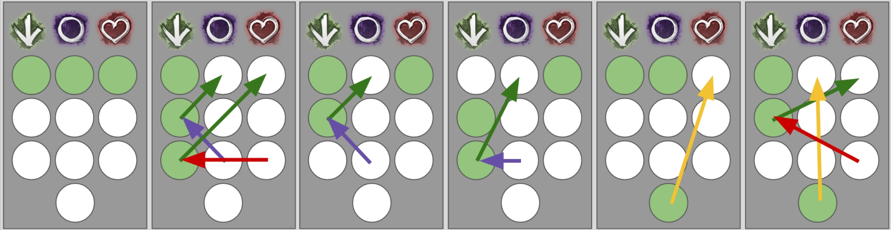

Image credit: @Luna

The Anchors are usually [marked](https://wiki.guildwars2.com/wiki/Commander#Markers), and spread out to pre-established locations before each green mechanic, with their groups following them. When greens appear, each player acts according to their role:

- **Anchors** - never move from their stack after reaching their position.
- **Runners** - If they have a green, and there are multiple greens in their stack, they move to a stack where there is no green. If their stack has no greens, and another has multiple, they move to the other one.
- **Backups** - If they have a green and their anchor has a green, they move to a stack where there is no green. Otherwise, they remain with their stack.
- **Float** - If they have a green, they move to a stack with no green. Otherwise, they can back up for a dead or unavailable player, or provide additional security in case of confused situations.

Proper pre-positioning before each green is crucial for this strategy to work, as any confusion regarding which green belongs to which group can be fatal.

---

#### Cheesing Greens
{: .no_toc}
Skills such as  [Rebound!] and  [We Will Never Yield!] permit an entire subgroup to stand in the overlap between greens, satisfying their conditions without dying to  [Extreme Vulnerability].

 [Rebound!] can save a subgroup from two overlapping greens: this lets the group split into two groups instead of three, with the only issue arising if all three greens spawn in the same subgroup.

 [We Will Never Yield!] is extremely strong as it is the only skill that permits players to stack all three greens with almost no risk. For this reason, bringing several  [Paragons] makes this mechanic almost trivial to solve.

## Other Attacks

Apart from [Aspect] mechanics, Cerus performs two other important attacks:

- [Petrify](other/petrify.html): occurs on every phase transition.
- [Enraged Smash](other/smash.html): increasing, pulsing, unavoidable damage throughout the final phase of the fight.

---

### Petrify

This attack is performed whenever Cerus gains a  [Defiance Bar], at 80%, 50% and 10% HP.

Cerus will tether to each player, applying a stack of  [Petrify](https://wiki.guildwars2.com/wiki/Petrify_(effect)), with an additional stack applied every 0.7 seconds for 7 seconds. Stacks have individual duration, and reduce outgoing damage, speed and casting speed by 10% for 7 seconds. At 10 stacks, players are stunned for 8 seconds. This stun cannot be impeded or broken.

The attack can be interrupted by breaking Cerus’  [Defiance Bar]. This removes the two stacks with the longest duration remaining.

If the  [Defiance Bar] is not broken within 7.7 seconds of it appearing, the entire squad is _instantly defeated_.

#### Extra Information
{: .no_toc}

- The  [Defiance Bar] requires 3600 damage to be broken.
- The condition damage reduction is evaluated on every condition damage tick; condition stacks that are applied with this effect will not have reduced damage on damage ticks that happen after the effect runs out.
-  [Petrify](https://wiki.guildwars2.com/wiki/Petrify_(effect)) is not visible in the user interface.
- It is possible to phase even after the stun occurs, if the boss is afflicted by defiance-breaking conditions, such as  [Chill],  [Immobilize] or  [Fear].

#### Mitigation <a href='#mitigation-tables'>?</a>
{: .no_toc .center}

  <ul class="mechtable">
    <li class="table-header">
      
      
      
      
      
      
      
      
    </li>
    <li class="table-row">
      
      
      
      
      
      
      
      
    </li>
  </ul>

---

#### Strategy
{: .no_toc}
Quickly breaking Cerus's  [Defiance Bar] is extremely important. Not only is it a de-facto DPS increase, it also facilitates transitions, especially in the final phase.

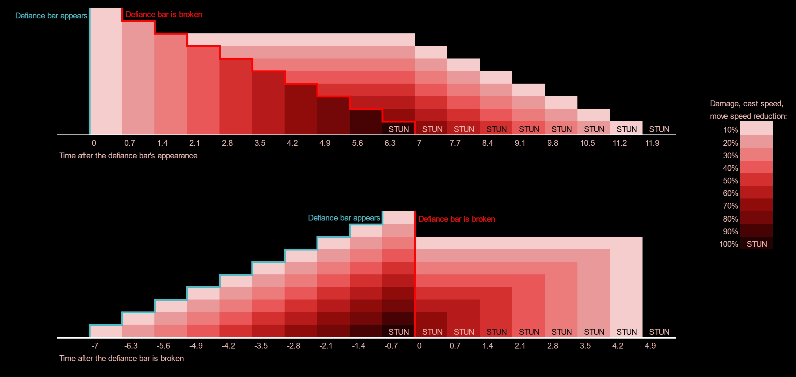

If the bar is broken within 1.4 seconds of its appearance, it will have no effects whatsoever on the beginning of the next phase. Any more, and the squad will be debuffed for five seconds. This is not terrible in the split phases, but for Legendary Mode you will need all the damage you can get in the final 10%.

Fortunately, the  [Defiance Bar] is not very difficult to break. Healers should be bringing heavy CC skills such as  [Summon Flesh Golem] and  [Signet of Humility], and everyone else should just use basic CC skills.

### Enraged Smash

Deals unavoidable damage to all players, and gives Cerus two stacks of  [Empowered]. The damage dealt by each smash therefore increases gradually until either Cerus or the squad dies.

Cerus will perform this attack every four seconds in the final phase of the fight, and will not perform any other attacks. The first attack will occur right after the players break his  [Defiance Bar] at the end of the third phase.

{: .legendary}
Cerus will gain three  [Empowered] stacks whenever he performs this attack, instead of two.

#### Extra Information
{: .no_toc}
- Cerus will gain the  [Empowered] stacks _before_ applying damage. This means that the phase will always start with at least two stacks.
- The damage dealt by this skill is affected by direct damage reduction, such as from  [Protection](https://wiki.guildwars2.com/wiki/Protection),  [Ascended Food](https://wiki.guildwars2.com/wiki/Spherified_Peppercorn-Spiced_Oyster_Soup) or  [Rite of the Great Dwarf](https://wiki.guildwars2.com/wiki/Rite_of_the_Great_Dwarf).

#### Mitigation <a href='#mitigation-tables'>?</a>
{: .no_toc .center}

  <ul class="mechtable">
    <li class="table-header">
      
      
      
      
      
      
      
      
    </li>
    <li class="table-row">
      
      
      
      
      
      
      
      
    </li>
  </ul>

---

#### Strategy
{: .no_toc}
This skill's existence imposes a soft limit on the number of  [Empowered] stacks you can let Cerus gain before getting to the final phase. This is especially pronounced in legendary CM, where it becomes extremely difficult to keep the squad alive if the final phase begins with 10 or more stacks.

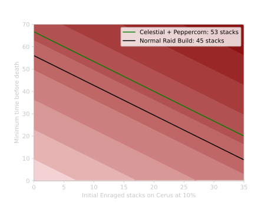
{: .center}

The figure above shows the minimum survival time in the final LCM phase for two DPS builds: a normal, raid-ready  [Condition Virtuoso](https://snowcrows.com/builds/raids/mesmer/condition-virtuoso), and a modified [version](http://en.gw2skills.net/editor/?PiwAgy3lVwQYKsEmLW6WdxdA-DyQY/o9oLrEaJzxoQaFvA89CIIBx2/tQ/DGUB-e) of the same build that is running  [Spherified Peppercorn-Spiced Oyster Soup](https://wiki.guildwars2.com/wiki/Spherified_Peppercorn-Spiced_Oyster_Soup) for more survivability. There is about a +/-5% variance in the damage dealt by each smash, so each build starts running the risk of getting one-shot at 45 and 53  [Empowered] respectively. With the Peppercorn build, if starting at 0 stacks, this means around 68 seconds into the phase. If starting at 10  [Empowered], this is lowered to 52 seconds, a much tighter interval.

## Effects

This section contains information on unique effects present in the Temple of Febe encounter.

---

###  Empowered

This is an effect granted to Cerus whenever certain mechanics are misplayed.  [Empowered] is **permanent** and stacks in intensity, with each stack increasing Cerus’s damage by 5%, up to a maximum of 99 stacks, when his attacks additionally become unblockable.

Due to the difficult healing check at the end of the fight, players should try to avoid giving stacks to the boss as much as possible. In Legendary Mode, it is almost impossible to complete the encounter if Cerus has more than 10 stacks at the beginning of the final phase, while the normal CM is a bit more lenient.

#### Stack Sources
{: .no_toc}
All possible sources of  [Empowered] are provided below for reference's sake.

- [Insatiable Huger](#gluttony---insatiable-hunger) - 1-3 stacks every time an orb is not collected.
- [Malicious Intent](#malice---malicious-intent) - 5 stacks when a summoned Malice reaches Cerus and is sacrificed.
- [Cry of Rage](#rage---cry-of-rage) - one stack whenever a player is hit by the AoE.
- [Enraged Smash] - 2 stacks whenever Cerus uses this attack (3 in legendary mode).
- [Crushing Regret](#regret---crushing-regret) - 5 stacks whenever there are not enough players in a green.

---

###  Empowered

This in reality is not a single effect, but six different ones:

-  [Empowered Despair](https://wiki.guildwars2.com/wiki/Empowered_Despair_(Cerus))
-  [Empowered Envy](https://wiki.guildwars2.com/wiki/Empowered_Envy_(Cerus))
-  [Empowered Gluttony](https://wiki.guildwars2.com/wiki/Empowered_Gluttony_(Cerus))
-  [Empowered Malice](https://wiki.guildwars2.com/wiki/Empowered_Malice_(Cerus))
-  [Empowered Rage](https://wiki.guildwars2.com/wiki/Empowered_Rage_(Cerus))
-  [Empowered Regret](https://wiki.guildwars2.com/wiki/Empowered_Regret_(Cerus))

Each of these significantly buffs the skill related to its connected [Aspect] for the user, which can be either Cerus or his associated [Embodiment].

 [Empowered](#-empowered-1) is gained by [Embodiments] at the start of [split phases]. In particular:

- [Envy], [Rage] and [Regret] will gain it at the 80% phase.
- [Despair], [Gluttony] and [Malice] will gain in at the 50% phase.

Any [Embodiments] that are alive and have the effect at the end of a split phase will transfer it to Cerus.

Any [Embodiments] that do not have the effect and are killed during a split phase will grant the effect to Cerus.

[Embodiments] affected by  [Empowered](#-empowered-1) are noticeably larger than their regular counterparts. Cerus instead is not visually affected by this effect.

---

###  Insatiable

This is an effect granted by blocking orbs from [Gluttony]'s attack. It stacks in intensity, with each orb granting an additional stack. Stacks last 60 seconds and deal 350 damage every second, unaffected by any increases or reductions.

{: .empowered_description }
Stacks last for three minutes.

{: .legendary }
Stacks are permanent.

## Mitigation Tables

Whenever an attack directly affects the players, we highlight how various skills interact with its effects using a table such as the following one.

  <ul class="mechtable">
    <li class="table-header">
      
      
      
      
      
      
      
      
    </li>
    <li class="table-row">
      
      
      
      
      
      
      
      
    </li>
    <li class="emp-row">
      
      
      
      
      
      
      
      
    </li>
  </ul>

The top header represents various skills, buffs and abilities:   [Distortion], damage-to-healing conversion such as  [Infuse Light],  [Feedback] and other projectile mitigation,  [Evasion],  Jumping,  [Protection],  [Blocking]/[Aegis] and  [Barrier].

The following row represents levels of mitigation for the normal attack.  means that the corresponding skill is effective against the attack if used correctly,  means the attack can be at least partially mitigated, and  means the skill has no effect whatsoever on the attack. The second row, if present, represents the same but for the  Empowered version of the skill.

[Return to Home](index.html){: .btn } [Return to Top](#cerus-the-glaive-of-house-nephus){: .btn .fixed}
{: .center}

<!-- Guide Links -->
[Aspect]: #aspects-of-cerus
[Aspects]: #aspects-of-cerus
[Embodiment]: #embodiments
[Embodiments]: #embodiments
[Empowered]: #-empowered
[Petrify]: #petrify
[Enraged Smash]: #enraged-smash
[main phase]: #main-phases
[split phases]: #split-phases
[Flower]: #cerus-the-glaive-of-house-nephus
[UNIT]: #cerus-the-glaive-of-house-nephus
[Despair]: #despair---wail-of-despair
[Envy]: #envy---envious-gaze
[Gluttony]: #gluttony---insatiable-hunger
[Malice]: #malice---malicious-intent
[Rage]: #rage---cry-of-rage
[Regret]: #regret---crushing-regret

<!-- buffs/debuffs -->
[Evasion]: https://wiki.guildwars2.com/wiki/Evade
[Protection]: https://wiki.guildwars2.com/wiki/Protection
[Blocking]: https://wiki.guildwars2.com/wiki/Block
[Aegis]: https://wiki.guildwars2.com/wiki/Aegis
[Barrier]: https://wiki.guildwars2.com/wiki/Barrier
[Invulnerable]: https://wiki.guildwars2.com/wiki/Invulnerability
[Invulnerability]: https://wiki.guildwars2.com/wiki/Invulnerability
[Torment]: https://wiki.guildwars2.com/wiki/Torment
[Alacrity]: https://wiki.guildwars2.com/wiki/Alacrity
[Quickness]: https://wiki.guildwars2.com/wiki/Quickness
[Immobilize]: https://wiki.guildwars2.com/wiki/Immobile
[Immobilized]: https://wiki.guildwars2.com/wiki/Immobile
[Immobilizing]: https://wiki.guildwars2.com/wiki/Immobile
[Resistance]: https://wiki.guildwars2.com/wiki/Resistance
[Exposed]: https://wiki.guildwars2.com/wiki/Exposed
[Extreme Vulnerability]: https://wiki.guildwars2.com/wiki/Extreme_Vulnerability
[Downstate]: https://wiki.guildwars2.com/wiki/Downed
[Chill]: https://wiki.guildwars2.com/wiki/Chilled
[Fear]: https://wiki.guildwars2.com/wiki/Fear

<!-- Classes/Specializations -->
[Mesmer]: https://wiki.guildwars2.com/wiki/Mesmer
[Virtuoso]: https://wiki.guildwars2.com/wiki/Virtuoso
[Revenant]: https://wiki.guildwars2.com/wiki/Revenant
[Scourge]: https://wiki.guildwars2.com/wiki/Scourge
[Druid]: https://wiki.guildwars2.com/wiki/Druid
[Specter]: https://wiki.guildwars2.com/wiki/Specter
[Paragons]: https://wiki.guildwars2.com/wiki/Paragon

<!-- Skills -->
[Distortion]: https://wiki.guildwars2.com/wiki/Distortion
[Infuse Light]: https://wiki.guildwars2.com/wiki/Infuse_Light
[Feedback]: https://wiki.guildwars2.com/wiki/Feedback
[Signet of Illusions]: https://wiki.guildwars2.com/wiki/Signet_of_Illusions
[Banish Enchantment]: https://wiki.guildwars2.com/wiki/Banish_Enchantment
[Scourge]: https://wiki.guildwars2.com/wiki/Scourge
[Dark Pact]: https://wiki.guildwars2.com/wiki/Dark_Pact
[Gorge]: https://wiki.guildwars2.com/wiki/Gorge
[Blink]: https://wiki.guildwars2.com/wiki/Blink
[Path of Gluttony]: https://wiki.guildwars2.com/wiki/Path_of_Gluttony
[Sand Swell]: https://wiki.guildwars2.com/wiki/Sand_Swell
[Portal Entre]: https://wiki.guildwars2.com/wiki/Portal_Entre
[Epidemic]: https://wiki.guildwars2.com/wiki/Epidemic
[We Will Never Yield!]: https://wiki.guildwars2.com/wiki/%22We_Will_Never_Yield!%22
[Rebound!]: https://wiki.guildwars2.com/wiki/%22Rebound!%22
[Signet of Humility]: https://wiki.guildwars2.com/wiki/Signet_of_Humility
[Summon Flesh Golem]: https://wiki.guildwars2.com/wiki/Summon_Flesh_Golem

<!-- Other -->
[Defiance Bar]: https://wiki.guildwars2.com/wiki/Defiance_bar
[Insatiable]: https://wiki.guildwars2.com/wiki/Insatiable

