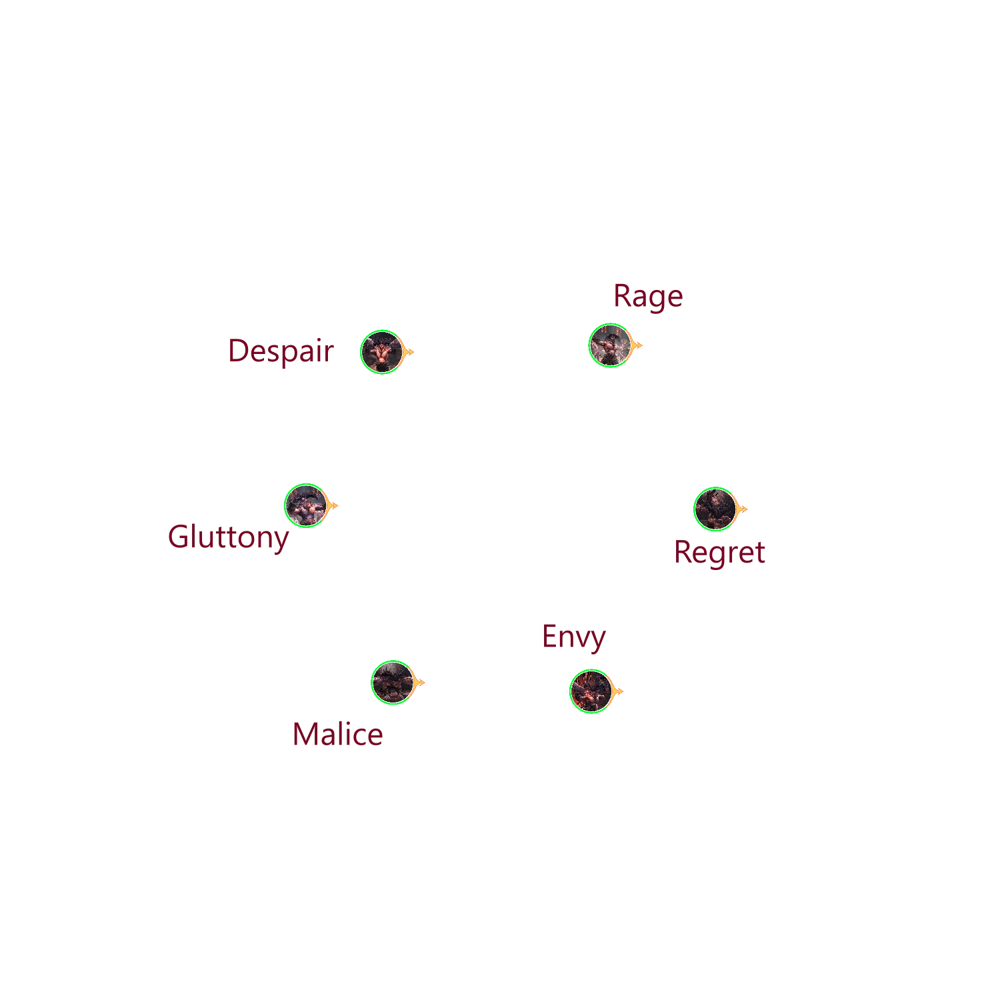
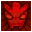

[Previous](empowered.html){: .btn } [Next](){: .btn }
# Aspects of Cerus

Cerus has six aspects: **Envy**, **Malice**, **Gluttony**, **Despair**, **Rage** and **Regret**. Each aspect corresponds to an its own add that can spawn throughout the fight in fixed locations, shown in the figure below. Adds resemble miniature versions of Cerus, and are **invulnerable**, except during split phases.

{: .warning }
Cerus's Aspects are always present on the map, even when not visible. Their model is still loaded and occupies the same position as always, which means that their hitboxes will still block projectiles.

## Aspect Attacks

Each Aspect of Cerus is associated with its own individual mechanic, totaling six mechanics. These attacks will be performed at set times by Cerus, and will additionally be performed by the Aspects whenever they are summoned. Cerus and his Aspects can and will perform separate attacks at the same time, and learning to deal with these overlaps is a large part of encounter progression.

The six Aspect mechanics are, in no particular order:

- [Envious Gaze]() (Envy) - rotating wall that strips boons.
- [Malicious Intent]() (Malice) - adds spawning on random players.
- [Insatiable Hunger]() (Gluttony) - orbs converging on the boss.
- [Wail of Despair]() (Despair) -  spreads that leave lingering pools.
- [Crushing Regret]() (Regret) - green circle.
- [Cry of Rage]() (Rage) - massive damaging AoE.

Further, deep information will be presented for each of these mechanics later.

Since the timing of when the boss and his aspects execute their attacks is always the same, the encounter is overall very deterministic. Through practice, most players will soon memorize the sequences of mechanics, and should be prepared to execute them before they happen. This is doubly important if you are planning on leading a group through the encounter.

## Split Phases and Empowered Aspects

At the beginning of each split phase, Cerus will disappear and his Aspects will become visibe and vulnerable in their usual positions. He will not reappear until the squad kills one of them.

Three Aspects will gain the  **Empowered** effect (which is different from the  [Empowered] effect). They can be quickly identified due to being noticeably larger than normal, furthermore:

- Envy, Rage and Regret will always empower in the 80% split phase.
- Despair, Gluttony and Malice will always empower in the 50% split phase.

 **Empowered buffs the Aspect's characteristic skill**, making it more much difficult to deal with. The only way to make an Aspect lose  Empowered is by killing it during a split phase. Vice versa, Aspects will *gain*  Empowered if you kill their de-powered version.

**At the end of every split phase, Aspects will transfer all their unique buffs to Cerus**. This includes both types of  Empowered. This means that at the end of the 80% split, at least two of Cerus's skills will be buffed, which increases to at least four at the end of the 50% split.

Since empowered skills affect the squad in a much different way compared to normal skills, the choice of which Aspects to kill in each split phase is one of the cruxes of encounter strategy.

[Previous](empowered.html){: .btn } [Next](){: .btn }

[Empowered]: https://wiki.guildwars2.com/wiki/Empowered_(Cerus)