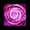
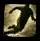
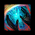
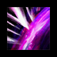
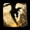
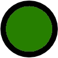
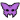
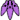
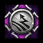

[Previous](gluttony.html){: .btn } [Next](){: .btn }

# Wail of Despair

This attack has two components: the first is a set of small circular AoEs that target all players and take 5 seconds to fill, dealing damage when complete. Players will take damage from all AoEs they are in.

Successively, every AoE will leave a lingering pool where it drops, which deals damage and applies  [Torment](https://wiki.guildwars2.com/wiki/Torment) to all players in it. The pools persist for 120 seconds or until phase end. Similarly to the initial damage, pool damage also scales based on the number of overlapping pools.

{: .empowered }
The AoEs and pools double in radius. Pools additionally ignore  [Invulnerability](https://wiki.guildwars2.com/wiki/Distortion) and  [Evasion](https://wiki.guildwars2.com/wiki/Evade), and last until the phase ends. 

  <ul class="mechtable">
    <li class="table-header">
      

        
      

      

        
      

      

        
      

      

        
      

      

        
      

      

        
      

      

        
      

      

        
      

    </li>
    <li class="table-row">
      

        
      

      

        
      

      

        
      

      

        
      

      

        
      

      

        
      

      

        
      

      

        
      

    </li>
    <li class="table-row">
      

        
      

      

        
      

      

        
      

      

        
      

      

        
      

      

        
      

      

        
      

      

        
      

    </li>
  </ul>

1. Only applies to the initial damage, and not to the lingering pools.

## Extra Information

- There is a second's delay between the initial drop and the first pulse of damage from the resulting pools.

## Strategy

Wait until the AoE indicator is almost full, then dodge. If done correctly, this will result in the pool dropping at the start of the dodge, and the you will not take any damage. **Make sure not to dodge early**. Early dodges place your pool where your teammates finish their own dodge, potentially killing them! Alternatively, you can use the orbs above your head as a cue: try to dodge when they fall.

 [Mesmers](https://wiki.guildwars2.com/wiki/Mesmer) can use  [Distortion](https://wiki.guildwars2.com/wiki/Distortion)  to avoid both components of the attack when unempowered. When  Empowered,  [Distortion](https://wiki.guildwars2.com/wiki/Distortion) does not work on the pools, so instead use it to stop the initial damage, walk a bit and then roll out of the pools, taking advantage of the delay before the first pulse. 

 [Virtuosos](https://wiki.guildwars2.com/wiki/Virtuoso) can reset the cooldown of their  [Distortion](https://wiki.guildwars2.com/wiki/Distortion) using  [Signet of Illusions](https://wiki.guildwars2.com/wiki/Signet_of_Illusions), ensuring they have it ready for every despair in the fight.

When  Empowered, the pools take a _huge_ amount of space. Common strategies to keep the arena free involve placing them in organized formations, usually in lines far from the boss.

[Previous](gluttony.html){: .btn } [Next](){: .btn }

[Empowered]: https://wiki.guildwars2.com/wiki/Empowered_(Cerus)