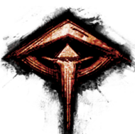
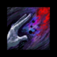
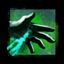
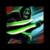

[Previous](../aspects.html){: .btn } [Next](){: .btn }

# Envious Gaze

Spawns a wall centered on the boss or the Envy add, depending on who cast it. The wall completes a full rotation counterclockwise before disappearing, and deals damage and corrupts all boons on allies it hits, pets and minions included.

{: .empowered }
A second wall spawns opposite to the first one, and rotates in the same direction at double the speed. The enemy casting the wall also gains all boons that are corrupted, except for  [Quickness](https://wiki.guildwars2.com/wiki/Quickness) and  [Alacrity](https://wiki.guildwars2.com/wiki/Alacrity).

  <ul class="mechtable">
    <li class="table-header">
      

        
      

      

        
      

      

        
      

      

        
      

      

        
      

      

        
      

      

        
      

      

        
      

    </li>
    <li class="table-row">
      

        
      

      

        
      

      

        
      

      

        
      

      

        
      

      

        
      

      

        
      

      

        
      

    </li>
    <li class="emp-row">
      

        
      

      

        
      

      

        
      

      

        
      

      

        
      

      

        
      

      

        
      

      

        
      

    </li>
  </ul>

1. Prevents application of conditions, but not the boon removal.
2. Only prevents the damage, not the boon corruption.
3. Prevents the boon corruption, but only for the fast wall when empowered.

## Extra Information

- When Cerus casts this ability, the wall will target a random player. When Envy casts it, it will target the boss, except in split phases, where it will target the player who opened the instance. This player can and should bait the wall off the squad to ensure the group is not inconvenienced.
- The boss's hitbox will deal damage but won't corrupt boons. You can dodge through it if necessary.
- **BUG:** if cast from the add, the fast wall *will* steal  [Quickness](https://wiki.guildwars2.com/wiki/Quickness) and  [Alacrity](https://wiki.guildwars2.com/wiki/Alacrity). This can result in faster, invisible add walls, if the boons don’t run out in time. This usually only happens in groups with very high damage or that are attempting the Embodiment of Sin achievement.

## Strategy

With the normal version, avoiding this attack is as simple as sidestepping it to the left, and then following it around the boss.

With the empowered version, dealing with the walls is one of the main problems of encounter strategy, and the solution varies based on the instant in the fight where the mechanic occurs.

Often with empowered walls it is necessary to avoid the fast wall. Jump-dodging the wall with the correct timing will avoid both the damage and the boon corrupt, however, since the damage is usually trivial, most people prefer to just jump. Try to jump while running towards the wall, so your overall clearance is greater. With practice, this becomes very consistent.

Stripping the boons from the boss is very important in case someone get hit by the empowered wall. Common skills for this are  [Revenant's](https://wiki.guildwars2.com/wiki/Revenant)  [Banish Enchantment](https://wiki.guildwars2.com/wiki/Banish_Enchantment) and  [Scourge's](https://wiki.guildwars2.com/wiki/Scourge)  [Dark Pact](https://wiki.guildwars2.com/wiki/Dark_Pact) (dagger 3) and  [Gorge](https://wiki.guildwars2.com/wiki/Gorge) (sword 3 flip skill).

[Previous](../aspects.html){: .btn } [Next](){: .btn }
