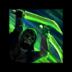

[Previous](malice.html){: .btn } [Next](despair.html){: .btn }

# Insatiable Hunger

Several smaller orbs and three large orbs will spawn randomly around the edge of the platform, and start moving towards Cerus. Each large orb must be body-blocked by three players to be collected. Blocking any large orb will give a stack of  [Insatiable](https://wiki.guildwars2.com/wiki/Insatiable), which deals 350 damage per second for 60 seconds. If any orbs reach Cerus, they will give him  [Barrier](https://wiki.guildwars2.com/wiki/Barrier). Large orbs will also apply up to 3 stacks of  [Empowered], depending on how many people collected.

{: .empowered }
Five orbs spawn, instead of three.  [Insatiable](https://wiki.guildwars2.com/wiki/Insatiable) stacks are permanent.

  <ul class="mechtable">
    <li class="table-header">
      

        
      

      

        
      

      

        
      

      

        
      

      

        
      

      

        
      

      

        
      

      

        
      

    </li>
    <li class="table-row">
      

        
      

      

        
      

      

        
      

      

        
      

      

        
      

      

        
      

      

        
      

      

        
      

    </li>
    <li class="emp-row">
      

        
      

      

        
      

      

        
      

      

        
      

      

        
      

      

        
      

      

        
      

      

        
      

    </li>
  </ul>

1. Affects the damage applied by  [Insatiable](https://wiki.guildwars2.com/wiki/Insatiable).
2. Affects the small orbs, but not the large ones.

## Extra Information

- Each player blocking an orb reduces the number of  [Empowered] stacks given by one.
- Large orbs that reach the boss give him 500k  [Barrier](https://wiki.guildwars2.com/wiki/Barrier), independant of the number of players who collected them.
- Small orbs give 250-300k  [Barrier](https://wiki.guildwars2.com/wiki/Barrier) total. This means, for example, that a squad would gain more damage from a  [Mesmer](https://wiki.guildwars2.com/wiki/Mesmer) taking  [Feedback](https://wiki.guildwars2.com/wiki/Feedback) over  [Signet of Illusions](https://wiki.guildwars2.com/wiki/Signet_of_Illusions).
- If reflected, small orbs will give  [Barrier](https://wiki.guildwars2.com/wiki/Barrier) to players instead of the boss.
- Dodging through a large orb will not count as a body-block.
- **BUG:** if two orbs are collected in rapid succession (within 0.8 seconds), one of the two will despawn without giving  [Insatiable](https://wiki.guildwars2.com/wiki/Insatiable). This can be done relatively easily by a  [Mesmer](https://wiki.guildwars2.com/wiki/Mesmer) with  [Blink](https://wiki.guildwars2.com/wiki/Blink), but can also be done with other movement skills, such as a  [Scourge's](https://wiki.guildwars2.com/wiki/Scourge)  [Path of Gluttony](https://wiki.guildwars2.com/wiki/Path_of_Gluttony) (sword 3).

## Strategy

This attack is often one of the easiest ways to bleed  [Empowered] to the boss. It is crucial that the squad spreads out correctly in order to intercept all of the orbs.

One of the most commonly used methods to ensure this is to have two [marked](https://wiki.guildwars2.com/wiki/Commander#Markers) players, one in each subgroup. These people then call out the side of the boss they move to when collecting, and their subgroups follow them. Subgroups can set a [personal target](https://wiki.guildwars2.com/wiki/Call_Target#Set_Personal_Target) on the player they’re supposed to follow to see them better.

Gluttony is almost never  Empowered in regular runs. Handling the additional damage in the final phase requires special builds, often running [Trailblazer](https://wiki.guildwars2.com/wiki/Trailblazer%27s) gear for extra survivability, and is usually done only by squads who are attempting the [Embodiment of Sin](../../introduction/lcm.html#embodiment-of-sin) achievment.

[Previous](malice.html){: .btn } [Next](despair.html){: .btn }

[Empowered]: https://wiki.guildwars2.com/wiki/Empowered_(Cerus)