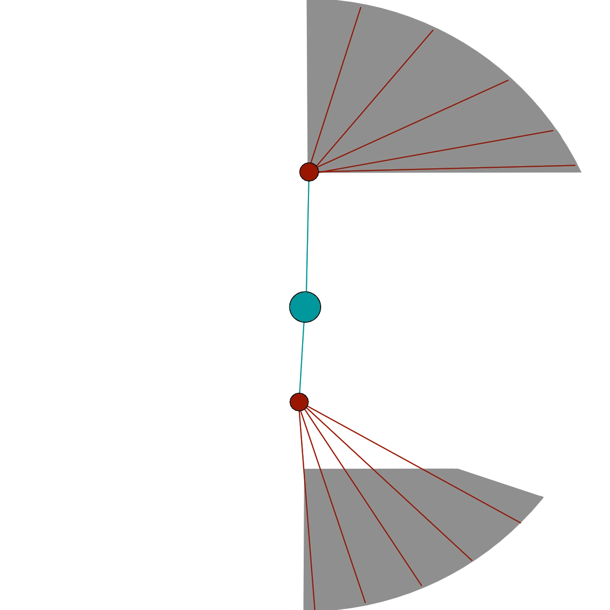

[Previous](envy.html){: .btn } [Next](gluttony.html){: .btn }

# Malicious Intent

Targets a random player with a tether. After 5 seconds, the tether will complete, applying a DoT and spawning an add on the player's location.

The add will start walking toward Cerus. If it reaches him, it will be sacrificed, and Cerus will gain 5 stacks of  [Empowered] and 95k  [Barrier].

Adds are immune to hard crowd control, and spawn with  [Resistance] that cannot be corrupted or removed, and lasts  for 30 seconds.

Adds take more power damage due to having reduced toughness.

{: .empowered_description }
Three people will be targeted by tethers, resulting in three adds spawning.

{: .legendary}
Adds have increased health and toughness.

  <ul class="mechtable">
    <li class="table-header">
      
      
      
      
      
      
      
      
    </li>
    <li class="table-row">
      
      
      
      
      
      
      
      
    </li>
    <li class="emp-row">
      
      
      
      
      
      
      
      
    </li>
  </ul>

1. Affects the DoT applied by tethers.
2. Prevents the tether DoT from being applied.

## Extra Information

- The behaviour with  [Resistance] running out before the adds reach the boss has been confirmed as intended.
- Adds have 2252 toughness in normal CM, giving power damage a +15.3% damage boost. In legendary CM, they instead have the normal 2597 toughness, making condition damage as effective as power.
- Adds have 630'960  HP in normal CM. In legendary CM, they instead have 1 million HP.
- If placed in certain areas on the east side of the platform, adds will pathfind to a point just north or south of the boss, instead of directly towards it, as shown in the figure.

- Adds are affected by all forms of soft crowd control once  [Resistance] runs out.
- Players will receive a sound cue and their screen border will become purple-white when targeted by the tether. Additionally, the remaining time before the tether completes is shown as a timer above their heads.
- This attack has a maximum range, and if no-one is in it, no tethers will be applied and no adds will spawn.

## Strategy

Malice is usually dealt with by using portals, usually either a  [Scourge]'s  [Sand Swell] or a  [Mesmer]'s  [Portal Entre], to drop the adds far from the boss.

Some strategies place the adds on the edge of the arena, and wait for their  [Resistance] to expire while they are walking to the boss. This way they can  [Immobilize] and kill them in melee while maintaining DPS uptime. In this case, placing the adds within the zones depicted above, as much to the east as possible, will ensure that they are as far as possible from the boss when they lose their  [Resistance], giving the squad more time to comfortably kill them.

Other strategies proactively position the squad so that the adds die before they even reach the boss.

 [Blocking](https://wiki.guildwars2.com/wiki/Block) the DoT effect is recommended, especially in the final 10% when the healers are already under pressure.

[Previous](envy.html){: .btn } [Next](gluttony.html){: .btn }

[Barrier]: https://wiki.guildwars2.com/wiki/Barrier
[Empowered]: https://wiki.guildwars2.com/wiki/Empowered_(Cerus)
[Resistance]: https://wiki.guildwars2.com/wiki/Resistance
[Scourge]: https://wiki.guildwars2.com/wiki/Scourge
[Sand Swell]: https://wiki.guildwars2.com/wiki/Sand_Swell
[Mesmer]: https://wiki.guildwars2.com/wiki/Mesmer
[Portal Entre]: https://wiki.guildwars2.com/wiki/Portal_Entre
[Immobilize]: https://wiki.guildwars2.com/wiki/Immobile