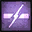
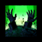
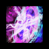

[Previous](regret.html){: .btn } [Next](){: .btn }

# Cry of Rage

Cerus charges up an attack that affects a large AoE centered on himself, dealing massive, unavoidable damage and inflicting  [Exposed](https://wiki.guildwars2.com/wiki/Exposed) to any players it hits.

Additionally, Cerus will gain a stack of  [Empowered] for each player hit.

{: .empowered }
The AoE is much larger.

  <ul class="mechtable">
    <li class="table-header">
      

        
      

      

        
      

      

        
      

      

        
      

      

        
      

      

        
      

      

        
      

      

        
      

    </li>
    <li class="table-row">
      

        
      

      

        
      

      

        
      

      

        
      

      

        
      

      

        
      

      

        
      

      

        
      

    </li>
    <li class="emp-row">
      

        
      

      

        
      

      

        
      

      

        
      

      

        
      

      

        
      

      

        
      

      

        
      

    </li>
  </ul>

## Strategy

Portals are used to move the squad out of the attack’s area of effect, usually either  [Sand Swell](https://wiki.guildwars2.com/wiki/Sand_Swell) on  [Scourge](https://wiki.guildwars2.com/wiki/Scourge) or  [Portal Entre](https://wiki.guildwars2.com/wiki/Portal_Entre) on  [Mesmer](https://wiki.guildwars2.com/wiki/Mesmer).

 [Portal Entre](https://wiki.guildwars2.com/wiki/Portal_Entre) can be prepared outside of the radius of the attack, and should generally be opened on top of the squad or in the center of the boss's hitbox.

 [Sand Swell](https://wiki.guildwars2.com/wiki/Sand_Swell)'s range is less than the radius of the empowered attack. When the situation calls for it, the  [Scourge](https://wiki.guildwars2.com/wiki/Scourge) should pre-position at the correct distance from the boss so that the portal clears the outer edge of the AoE.

Since  [Sand Swell](https://wiki.guildwars2.com/wiki/Sand_Swell) is not as easily visible as  [Portal Entre](https://wiki.guildwars2.com/wiki/Portal_Entre), it is common practice to place a marker on the  [Scourge](https://wiki.guildwars2.com/wiki/Scourge), who by positioning preemptively facilitates the other players' finding the portal entrance.

[Previous](regret.html){: .btn } [Next](){: .btn }

[Empowered]: https://wiki.guildwars2.com/wiki/Empowered_(Cerus)