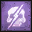

[Previous](despair.html){: .btn } [Next](rage.html){: .btn }

# Crushing Regret

Spawns a green circle on a random player that explodes after 5 seconds. If there are less than 5 players in its radius, _the entire squad will be instantly defeated_.

The green deals a small amount of unavoidable squad-wide damage, and applies a stack of  [Extreme Vulnerability](https://wiki.guildwars2.com/wiki/Extreme_Vulnerability) for 3 seconds.

{: .empowered }
Three greens will spawn, targeting random different players. Each green is functionally identical to the unempowered version, except it requires at least three people instead of five. Due to  [Extreme Vulnerability](https://wiki.guildwars2.com/wiki/Extreme_Vulnerability), people who are in the overlap between two greens when they pop will be instantly defeated. This is known as getting "Venn Diagrammed".

  <ul class="mechtable">
    <li class="table-header">
      

        
      

      

        
      

      

        
      

      

        
      

      

        
      

      

        
      

      

        
      

      

        
      

    </li>
    <li class="table-row">
      

        
      

      

        
      

      

        
      

      

        
      

      

        
      

      

        
      

      

        
      

      

        
      

    </li>
    <li class="emp-row">
      

        
      

      

        
      

      

        
      

      

        
      

      

        
      

      

        
      

      

        
      

      

        
      

    </li>
  </ul>

## Extra Information

- On failure, will technically applies 5 stacks of  [Empowered] to Cerus, and a stack of  [Exposed](https://wiki.guildwars2.com/wiki/Exposed) to every player .
- Has a maximum range. If you and the green are on opposite sides of the arena, you won’t die if it fails.
- **BUG:** the green circle has a visual radius of 240, but its actual radius is 360.

## Strategy

Managing the normal version of this attack is trivial.

The empowered version requires special attention. The most common strategy is to divide the squad into 3 groups of at least 3 people. Each group has a designated “Anchor” player and a designated “Runner” player, with the third player being the “Backup”. The 10th player is an optional “Float”.

In the following image, the first row represents the Anchors, the second the Backups, and the last one the Runners and Floats, while the columns represent individual groups.

The Anchors are usually [marked](https://wiki.guildwars2.com/wiki/Commander#Markers), and spread out to pre-established locations before each green mechanic, with their groups following them. When greens appear, if more than one green spawns inside of a group, the people targeted move to other groups, and the Runners from the other groups move back to cover the resulting gap. Runners should always be the first player to move in case of overlapping greens. Anchors should never move. Backups only move if both they and their Anchor have a green.

Proper prepositioning before each green is crucial for this strategy to work. Any confusion regarding which green belongs to which group can be fatal.

Correct and reliable execution of Empowered Regret is one of the major hurdles for any progression groups that choose to face this mechanic.

[Previous](despair.html){: .btn } [Next](rage.html){: .btn }

[Empowered]: https://wiki.guildwars2.com/wiki/Empowered_(Cerus)