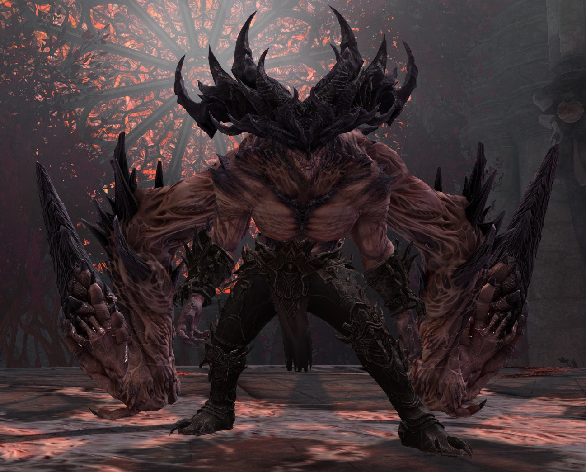
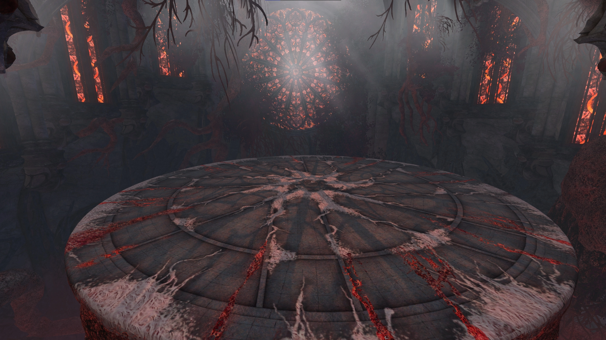

[Previous](mechanics.html){: .btn } [Next](empowered.html){: .btn }

# Cerus, the Glaive of House Nephus 

| **Health** | 106,174,800 (CM) or 130,064,136 (LCM) |
| **Armor** |  2597 (standard boss armor) |
| **Instance**| Day |
| **Enrage Timer** | 10 minutes - kills all players on running out. |

The encounter consists of **four phases** and **two split phases**.

	

		<h2>First Phase</h2>
		

			A relatively simple and unpunishing beginning, groups will have no issues here. Make sure you don't fail mechanics and try to phase as fast as possible.
		

	

	

		<h2>Second Phase</h2>
		

			A more challenging phase that requires some attention. At points careful positioning is necessary, and there are more opportunities for failure, and graver consequences.
		

	

	

		<h2>Third Phase</h2>
		

			A series of difficult sequences that require careful positioning and timing. Mistakes are often fatal, or severly impact the run.
		

	

    

		<h2>Final Phase</h2>
		

			The most extreme part of the fight. The squad is hammered by continuous, increasing, unavoidable damage while having to manage a barrage of relentless attacks.
		

	

## Arena - the Temple of Febe

The location in which you fight Cerus is the Temple of Febe. It is accessible from the Strike Mission portal in the [Wizard's Tower](https://wiki.guildwars2.com/wiki/The_Wizard%27s_Tower), and can be accessed freely once the [Treachery](https://wiki.guildwars2.com/wiki/Treachery) story step is completed.

Cerus will spawn in the center of this arena, and never moves from there.

In Challenge Mode, any player that falls off the arena is instantly defeated, differently from Normal Mode, where they only take massive damage.

The arena is not one single collision mesh, but many combined. This creates some strange issues with pathfinding, both when dealing with moving [adds]() that spawn throughout the fight, but also when using skills that require an uninterrupted path, such as  [Blink](https://wiki.guildwars2.com/wiki/Blink). These skills may not function properly when cast towards or from certain areas of the arena.

[Previous](mechanics.html){: .btn } [Next](empowered.html){: .btn }