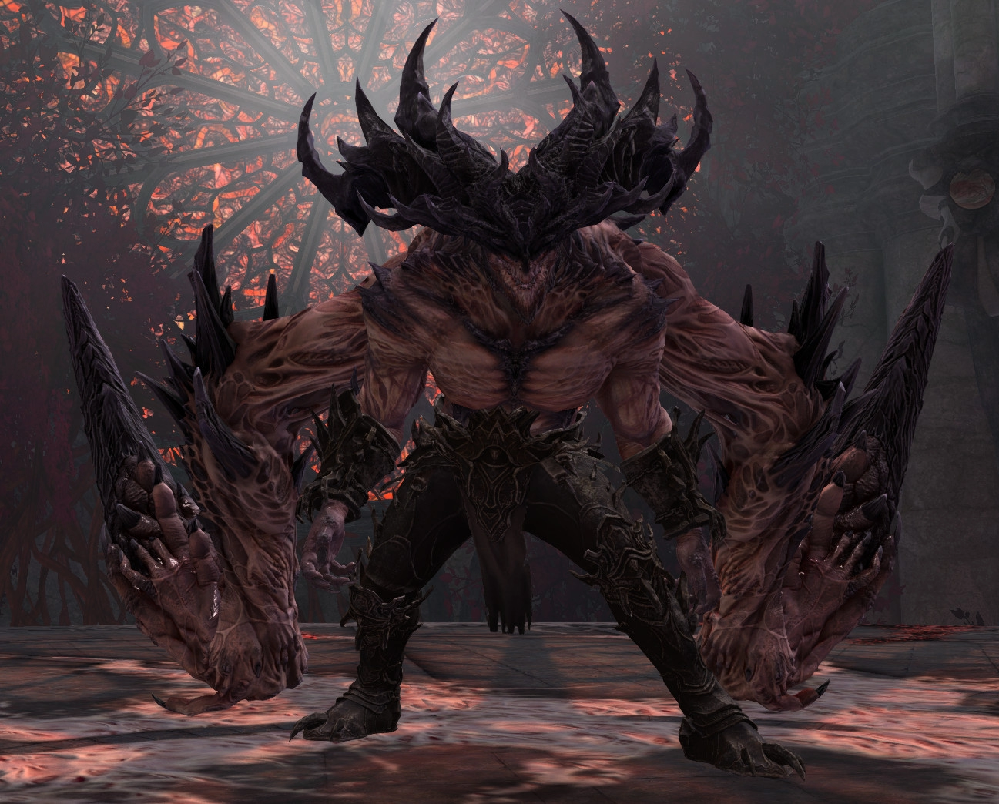
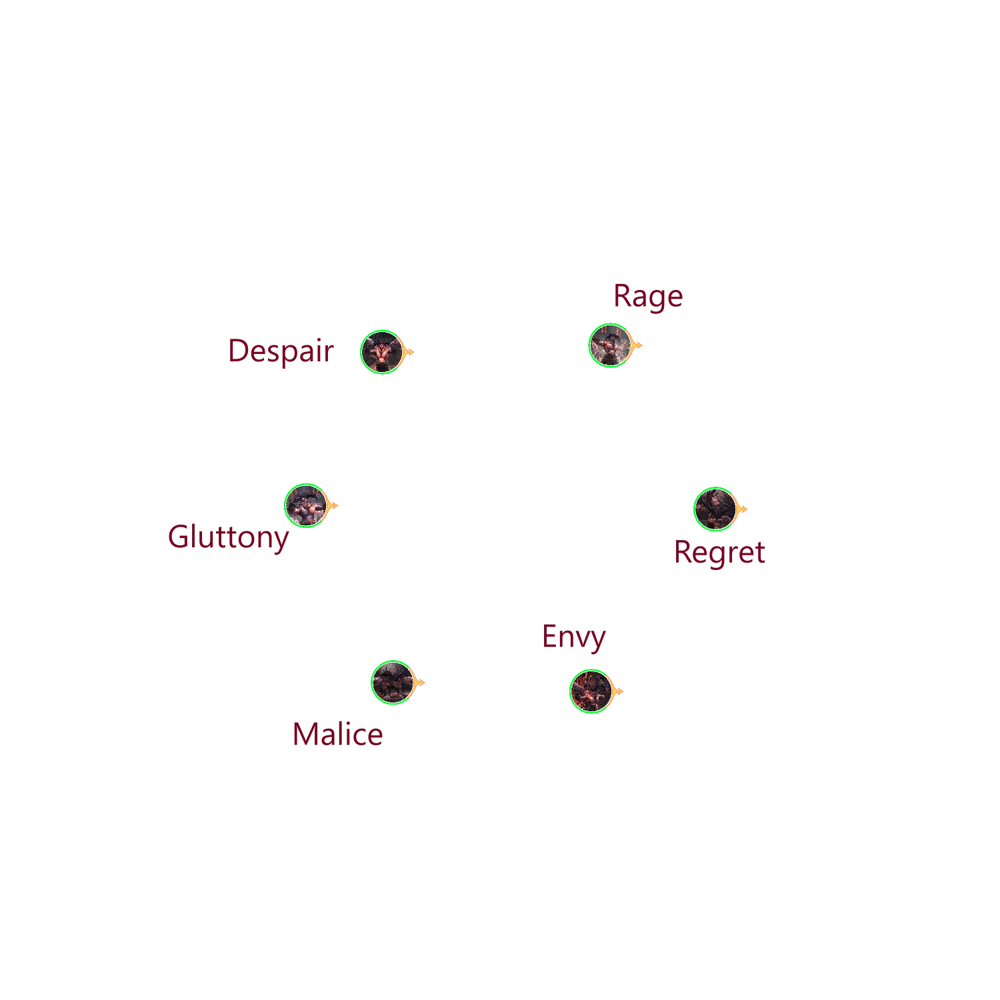

[Previous](../introduction/lcm.html){: .btn } [Next](general.html){: .btn }

# Cerus, the Glaive of House Nephus
{: .center .no_toc}

| **Health** | 95'557'328 (CM) or 117'057'712 (LCM) |
| **Armor** |  2597 (standard) |
| **Instance**| Day |
| **Enrage Timer** | 10 minutes - kills all players on running out. |

This section contains a detailed description of the various attacks and mechanics present in the Temple of Febe encounter.

<b>Table of Contents</b>

1. TOC
{:toc}

#### Main Points
{: .no_toc}

- Cerus's abilities are linked to his six [Aspects], each of which has one characteristic attack.
- As the fight progresses, Cerus will  **Empower** some of his recurring attacks, greatly increasing the challenge they pose.
- On failing certain mechanics, Cerus will gain stacks of  [Empowered], which permanently buff his damage for the rest of the fight.
- The final 10% is a dangerous healing check.

## Arena - the Temple of Febe

The location in which you fight Cerus is the Temple of Febe. It is accessible from the portal in the [Wizard's Tower](https://wiki.guildwars2.com/wiki/The_Wizard%27s_Tower), and can be entered freely once the [Treachery](https://wiki.guildwars2.com/wiki/Treachery) story step is completed.

Cerus will spawn in the center of this arena, and never moves from there.

In Challenge Mode, any player that falls off the arena is instantly defeated.

The arena is not a single collision mesh, but many combined. This creates some strange issues with pathfinding, both when dealing with moving [adds](aspects/malice.html) that spawn throughout the fight, but also when using skills that require an uninterrupted path, such as  [Blink](https://wiki.guildwars2.com/wiki/Blink). These skills may not function properly when cast towards or from certain 

## Fight Structure and Phases

The encounter consists of **four main phases** and **two split phases**.

---

### Main Phases

In these parts of the fight, Cerus is vulnerable and active. His mechanics consist of [Aspect] attacks, with each phase having its own unique sequence of mechanics that does not vary between pulls.

Furthermore, Cerus will summon in individual [Embodiments] at consistent intervals depending on the phase, with each aspect then performing the attack corresponding to its aspect. Learning to manage the overlap between these attacks and the ones originating from the boss is a large part of progression on this encounter.

---

#### First Phase - 100% to 80%
{: .no_toc}

<b>View Timeline</b>

  
  

This is the simplest phase, where mechanics are still relatively unforgiving. Cerus will spawn in an [Embodiment] every 30 seconds.

#### Second Phase - 80% to 50%
{: .no_toc}

<b>View Timeline</b>

  
  
  

In this phase, at least two [Aspects] will be  **Empowered**, increasing the challenge posed. [Embodiments] will start spawning in every 20 seconds.
{: .no_toc}

#### Third Phase - 50% to 10%
{: .no_toc}

<b>View Timeline</b>

  
  
  
  
  

At least four [Aspects] will be  **Empowered**, bringing noticeable difficulty. [Embodiments] will start spawning in every 15 seconds.

#### Final Phase - 10% to 0%
{: .no_toc}

<b>View Timeline</b>

  

The most difficult part of the fight. This phase starts with a  [Defiance Bar] and [Petrify] attack. Once this is done, Cerus will start casting [Enraged Smash] every four seconds, progressively gaining stacks of  [Empowered]. Meanwhile, a new [Embodiment] will spawn in every 5 seconds.

---

### Split Phases

The first and second split phase occur at 80% and 50% HP respectively. Each split phase begins with a  [Defiance Bar] and the [Petrify] attack, after which Cerus will disappear and all six [Embodiments] will spawn onto the platform in their standard positions.

Three [Embodiments] will gain the  **Empowered** effect. These can be identified due to being noticeably larger than usual.

- [Envy], [Rage] and [Regret] will always empower at 80%.
- [Despair], [Gluttony] and [Malice] will always empower at 50%.

Killing an Embodiment will complete the split phase and resummon Cerus, beginning the next main phase. Furthermore **all living Aspects will transfer their unique buffs to Cerus**. This includes both types of   **Empowered**.

The practical result is that at the end of the 80% split, at least two of Cerus's skills will be  **Empowered**, increasing to at least four under 50%.

## Aspects of Cerus
Cerus has six aspects: **Envy**, **Malice**, **Gluttony**, **Despair**, **Rage** and **Regret**. Each aspect corresponds to a unique attack and to an [Embodiment].

- [Envious Gaze](aspects/envy.html) (Envy) - rotating wall that strips boons.
- [Malicious Intent](aspects/malice.html) (Malice) - adds spawning on random players.
- [Insatiable Hunger](aspects/gluttony.html) (Gluttony) - orbs converging on the boss.
- [Wail of Despair](aspects/despair.html) (Despair) -  spreads that leave lingering pools.
- [Crushing Regret](aspects/regret.html) (Regret) - green circle.
- [Cry of Rage](aspects/rage.html) (Rage) - massive damaging AoE.

---

### Embodiments

Embodiments are adds that can spawn throughout the fight in fixed locations, shown in the figure below. They resemble miniature versions of Cerus, and are  [Invulnerable](https://wiki.guildwars2.com/wiki/Invulnerability), except during split phases.

{: .warning }
Cerus's Aspects are always present on the map, even when not visible. Their model is still loaded and occupies the same position as always, which means that their hitboxes will still block projectiles.

When summoned during one of Cerus's [main phases](#main-phases), Embodiments will immediately perform their unique attack and then despawn. When summoned at the beginning of a [split phase](#split-phases), Embodiments will

### Mitigation Tables

Whenever an attack directly affects the players, we will highlight how various skills interact with its effects using a table such as the following one.

  <ul class="mechtable">
    <li class="table-header">
      
      
      
      
      
      
      
      
    </li>
    <li class="table-row">
      
      
      
      
      
      
      
      
    </li>
    <li class="emp-row">
      
      
      
      
      
      
      
      
    </li>
  </ul>

The top header represents various skills, buffs and abilities:   [Distortion], damage-to-healing conversion such as  [Infuse Light],  [Feedback] and other projectile mitigation,  [Evasion],  Jumping,  [Protection],  [Blocking]/[Aegis] and  [Barrier].

The following row represents levels of mitigation for the normal attack.  means that the corresponding skill is effective against the attack if used correctly,  means the attack can be at least partially mitigated, and  means the skill has no effect whatsoever on the attack. The second row, if present, represents the same but for the _empowered_ version of the skill (more on this later).

[Previous](../introduction/lcm.html){: .btn } [Next](general.html){: .btn }

<!-- Guide Links -->
[Aspect]: #aspects-of-cerus
[Aspects]: #aspects-of-cerus
[Embodiment]: #aspects-of-cerus
[Embodiments]: #aspects-of-cerus
[Empowered]: https://wiki.guildwars2.com/wiki/Empowered_(Cerus)
[Petrify]: #petrify

<!-- buffs/debuffs -->
[Evasion]: https://wiki.guildwars2.com/wiki/Evade
[Protection]: https://wiki.guildwars2.com/wiki/Protection
[Blocking]: https://wiki.guildwars2.com/wiki/Block
[Aegis]: https://wiki.guildwars2.com/wiki/Aegis
[Barrier]: https://wiki.guildwars2.com/wiki/Barrier
[Invulnerable]: https://wiki.guildwars2.com/wiki/Invulnerability

<!-- Skills -->
[Distortion]: https://wiki.guildwars2.com/wiki/Distortion
[Infuse Light]: https://wiki.guildwars2.com/wiki/Infuse_Light
[Feedback]: https://wiki.guildwars2.com/wiki/Feedback

<!-- Other -->
[Defiance Bar]: https://wiki.guildwars2.com/wiki/Defiance_bar
