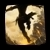

[Previous](../introduction/lcm.html){: .btn } [Next](general.html){: .btn }

# Mechanics Breakdown

This section contains a detailed description of the various attacks and mechanics present in ToF CM. The basic gameplay of the encounter is centered around keeping Cerus's attacks as manageable as possible while staying inside of the enrage timer. The fight **becomes progressively more difficult and unforgiving**, due to two important mechanics:

- In later stages of the fight, some of Cerus's recurring attacks will be  **Empowered**. The mechanism for which attacks are selected is deterministic, allowing the group to choose which skills get strengthened and enabling various different strategies.
- On failing certain mechanics, Cerus will gain stacks of  **Empowered**, which permanently buff his damage, and make managing the final phases much more difficult.

Minimising and mitigating the effects of these two mechanics is the most crucial aspect of the fight.

## Mitigation Tables

Whenever an attack directly affects the players, we will highlight how various skills mitigate its effect using a _Mitigation Table_ such as the following one.

  <ul class="mechtable">
    <li class="table-header">
      

        
      

      

        
      

      

        
      

      

        
      

      

        
      

      

        
      

      

        
      

      

        
      

    </li>
    <li class="table-row">
      

        
      

      

        
      

      

        
      

      

        
      

      

        
      

      

        
      

      

        
      

      

        
      

    </li>
    <li class="emp-row">
      

        
      

      

        
      

      

        
      

      

        
      

      

        
      

      

        
      

      

        
      

      

        
      

    </li>
  </ul>

The top header represents various skills, buffs and abilities:   [Distortion](https://wiki.guildwars2.com/wiki/Distortion), Herald's  [Infuse Light](https://wiki.guildwars2.com/wiki/Infuse_Light),  [Feedback](https://wiki.guildwars2.com/wiki/Feedback) and other projectile mitigation,  [Evasion](https://wiki.guildwars2.com/wiki/Evade),  Jumping,  [Protection](https://wiki.guildwars2.com/wiki/Protection),  [Blocking](https://wiki.guildwars2.com/wiki/Block)/[Aegis](https://wiki.guildwars2.com/wiki/Aegis) and  [Barrier](https://wiki.guildwars2.com/wiki/Barrier).

The following row represents levels of mitigation for the normal attack.  means that the attack is completely negated by the corresponding skill if used correctly,  means the attack can be at least partially mitigated, and  means the skill has no effect whatsoever on the attack. The second row, if present, represents the same but for the _empowered_ version of the skill (more on this later).

[Previous](../introduction/lcm.html){: .btn } [Next](general.html){: .btn }