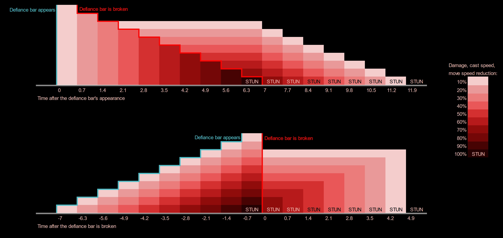
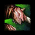

[Previous](../other-attacks.html){: .btn } [Next](smash.html){: .btn }

# Petrify

This attack is performed whenever Cerus gains a  [Defiance Bar](https://wiki.guildwars2.com/wiki/Defiance_bar), at 80%, 50% and 10% HP.

Cerus will tether to each player, applying a stack of  [Petrify](https://wiki.guildwars2.com/wiki/Petrify_(effect)), with an additional stack applied 0.7 seconds for 7 seconds. Stacks have individual duration, and reduce outgoing damage, speed and casting speed by 10% for 7 seconds. At 10 stacks, players are stunned for 8 seconds. This stun cannot be impeded or broken.

The attack can be interrupted by breaking Cerus’  [Defiance Bar](https://wiki.guildwars2.com/wiki/Defiance_bar). This removes the two stacks with the longest duration remaining.

If the  [Defiance Bar](https://wiki.guildwars2.com/wiki/Defiance_bar) is not broken within 7.7 seconds of it appearing, the entire squad is instantly defeated.

  <ul class="mechtable">
    <li class="table-header">
      

        
      

      

        
      

      

        
      

      

        
      

      

        
      

      

        
      

      

        
      

      

        
      

    </li>
    <li class="table-row">
      

        
      

      

        
      

      

        
      

      

        
      

      

        
      

      

        
      

      

        
      

      

        
      

    </li>
  </ul>

## Extra Information

- The condition damage reduction is evaluated on every condition damage tick; condition stacks that are applied with this effect will not have reduced damage on damage ticks that happen after the effect runs out.
-  [Petrify](https://wiki.guildwars2.com/wiki/Petrify_(effect)) is not visible in the user interface.
- It is possible to phase even after the stun occurs, if the boss is afflicted by defiance-breaking conditions, such as  [Chilled](https://wiki.guildwars2.com/wiki/Chilled),  [Immobilize](https://wiki.guildwars2.com/wiki/Immobile) or  [Fear](https://wiki.guildwars2.com/wiki/Fear).

## Strategy

Quickly breaking Cerus's  [Defiance Bar](https://wiki.guildwars2.com/wiki/Defiance_bar) is extremely important. Not only is it a de-facto DPS increase, it also facilitates transitions, especially in the final phase.

If the breakbar is completed within 1.4 seconds of its appearance, it will have no effects whatsoever on the beginning of the next phase. Any more, and the squad will be debuffed for five seconds. This is not terrible in the split phases, but in the final 10% you will need all the damage you can get.

Fortunately, the  [Defiance Bar](https://wiki.guildwars2.com/wiki/Defiance_bar) is not very difficult to break. Healers should be bringing heavy CC skills such as  [Summon Flesh Golem](https://wiki.guildwars2.com/wiki/Summon_Flesh_Golem) and  [Signet of Humility](https://wiki.guildwars2.com/wiki/Signet_of_Humility), and everyone else should just use basic CC skills.

[Previous](../other-attacks.html){: .btn } [Next](smash.html){: .btn }