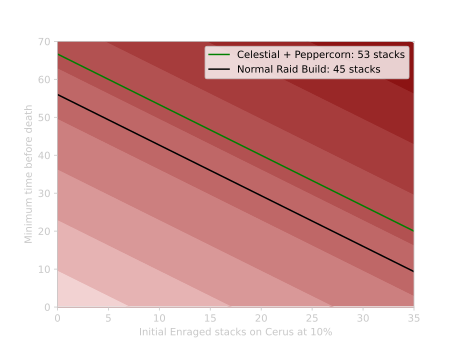

[Previous](petrify.html){: .btn } [Next](){: .btn }

# Enraged Smash

Cerus will perform this attack every four seconds in the final phase of the fight, and will not perform any other attacks. The first attack will occur as soon as the players break his  [Defiance Bar](https://wiki.guildwars2.com/wiki/Defiance_bar) at the end of the third phase.

Deals unavoidable damage to all players, and gives Cerus three stacks of  [Empowered]. The damage dealt by each smash therefore increases gradually until either Cerus or the squad dies.

  <ul class="mechtable">
    <li class="table-header">
      

        
      

      

        
      

      

        
      

      

        
      

      

        
      

      

        
      

      

        
      

      

        
      

    </li>
    <li class="table-row">
      

        
      

      

        
      

      

        
      

      

        
      

      

        
      

      

        
      

      

        
      

      

        
      

    </li>
  </ul>

## Extra Information

- Cerus will gain the  [Empowered] stacks _before_ applying damage. This means that the phase will always start with at least three stacks.
- The damage dealt by this skill is affected by direct damage reduction, such as from  [Protection](https://wiki.guildwars2.com/wiki/Protection),  [Ascended Food](https://wiki.guildwars2.com/wiki/Spherified_Peppercorn-Spiced_Oyster_Soup) or  [Rite of the Great Dwarf](https://wiki.guildwars2.com/wiki/Rite_of_the_Great_Dwarf).

## Strategy

Minimising the number of  [Empowered] stacks on Cerus _before_ getting to this phase is essential to keep the damage somewhat manageable. If the phase begins with ten or more stacks, it becomes extremely difficult to keep the squad alive.

The figure above shows the minimum survival time for two damage builds: a normal, raid-ready  [Condition Virtuoso](https://snowcrows.com/builds/raids/mesmer/condition-virtuoso), and a modified [version](http://en.gw2skills.net/editor/?PiwAgy3lVwQYKsEmLW6WdxdA-DyQY/o9oLrEaJzxoQaFvA89CIIBx2/tQ/DGUB-e) of the same build that is running  [Spherified Peppercorn-Spiced Oyster Soup](https://wiki.guildwars2.com/wiki/Spherified_Peppercorn-Spiced_Oyster_Soup) for more survivability. There is about a +/-5% variance in the damage dealt by each smash, so each build starts running the risk of getting oneshot at 45 and 53  [Empowered] respectively. With the Peppercorn build, if starting at 0 stacks, this means around 68 seconds into the phase. If starting at 10  [Empowered], this is lowered to 52 seconds, a much tighter interval.

Overall the greatest risk in this phase is given by the overlap between other mechanics (cast by Cerus's aspects) and the Enraged Smash. In particular:
- Additional incoming damage from [Malicious Intent](../aspects/malice.html)'s tethers, [Crushing Regret](../aspects/regret.html) popping, or  [Insatiable](https://wiki.guildwars2.com/wiki/Insatiable).
- Players off-stack due to other mechanics, such as dropping adds from [Malicious Intent](../aspects/malice.html) or collecting [Insatiable Hunger](../aspects/gluttony.html)'s orbs, not getting enough healing.

[Previous](petrify.html){: .btn } [Next](){: .btn }

[Empowered]: https://wiki.guildwars2.com/wiki/Empowered_(Cerus)