[Return to Home](index.html){: .btn } [Mechanical Reference](mechanics.html){: .btn }
{: .center}

# UNIT Strat
{: .no_toc}

UNIT, named after the guild who originally developed the strategy, is one of the two common strategies for ToF CM, alongside [Flower]. It was designed to facilitate PUG runs, since it requires few specialized roles, is relatively forgiving to mistakes, and it frees up strong defensive options for DPS players.

The downside of this strategy is that it forces most of the squad to play certain predefined builds, without much space for alternative play-styles.

<details>
<summary><b>Table of Contents</b></summary>
<div markdown=block>
1. TOC
{:toc}

</div>
</details>

---

#### Main Points
{: .no_toc}
UNIT compresses almost all mechanics into the two heal roles, covered by a  [Scourge] and  [Chronomancer]. Both of these classes bring strong utility that is used to manage many of Cerus's attacks:

- [Rage] is avoided by transporting the squad out of range using  [Sand Swell] and  [Portal Entre].
- [Malice] is mitigated by dropping the adds on the edge of the arena using portals, then either killing them, immobilizing them using  [Dark Pact], or phasing before they become an issue.
- [Regret] is killed during the first split phase so that it becomes trivial.
- [Gluttony] is killed during the second split phase, and projectile reflection is provided by  [Corrosive Poison Cloud] and  [Feedback].
- [Envy] is managed using some positioning tricks that take advantage of portals.
- [Despair], especially in its empowered state, benefits from using portals to place the dangerous pools far from the boss.

---

#### Marker Pack
{: .no_toc}
All markers referenced in this guide can be set up with the [Commander Markers](https://blishhud.com/modules/?module=Manlaan.CommanderMarkers) module for [Blish HUD](https://blishhud.com/), using the marker pack provided below.

<Details>
<Summary>Click to view markers</Summary>
<div markdown=block>

Paste the following code into Commander Markers to use this marker pack:

```
eyJlbmFibGVkIjp0cnVlLCJuYW1lIjoiUHVnIFN0cmF0IiwiZGVzY3JpcHRpb24iOiJkZXNjcmlwdGlvbiIsIm1hcElkIjoxNTIwLCJ0cmlnZ2VyIjp7IngiOjAuMCwieSI6MC4wLCJ6IjowLjB9LCJtYXJrZXJzIjpbeyJpIjoxLCJkIjoibWFya2VyIG5hbWUiLCJ4IjotNC44MjQ2NjEsInkiOi0xMDcuNzc0NzEyLCJ6IjoxNzguNjcxNH0seyJpIjozLCJkIjpudWxsLCJ4Ijo2LjQ3MDMyMiwieSI6LTEwMC40MTkxMjEsInoiOjE3OC42NzE2fSx7ImkiOjYsImQiOm51bGwsIngiOi05LjQ2MTc1MSwieSI6LTExMS44Njg0LCJ6IjoxNzguNjcxNDQ4fSx7ImkiOjUsImQiOm51bGwsIngiOi04Ljk4NjU3OSwieSI6LTEzMi42Njk3ODUsInoiOjE3OC42NzE0NDh9LHsiaSI6MiwiZCI6bnVsbCwieCI6MjcuNjA4MjI2OCwieSI6LTE0OC4wNzI4NzYsInoiOjE3OC42Njk4fSx7ImkiOjcsImQiOm51bGwsIngiOjM0LjU3NjY3NTQsInkiOi0xMDMuNDM1ODA2LCJ6IjoxNzguNjcxNjE2fSx7ImkiOjQsImQiOm51bGwsIngiOjI4LjEwNjk5LCJ5IjotOTQuMjAxODcsInoiOjE3OC42NzE2MTZ9LHsiaSI6OCwiZCI6bnVsbCwieCI6NC40MTk4OTEzNiwieSI6LTU1LjkxNDcwNzIsInoiOjE3OC42NzE2fV19
```
</div>
</Details>


## Composition
The constants present in every group are:
- A heal  [Chronomancer] running  [Feedback],  [Portal Entre] and  [Blink](https://wiki.guildwars2.com/wiki/Blink).
- A heal or celestial  [Scourge] running  [Corrosive Poison Cloud] and  [Sand Swell].

For boonDPS, while any provider is fine in theory,  [Herald] is the most common choice due to its good boon coverage, strong condition damage and the added defensive utility of  [Infuse Light].

UNIT strongly favours ranged builds with cleave and good personal defensive skills.  [Condition Virtuoso] is by far the safest and best performing build for this reason. This does not mean you cannot use other builds, however, it is best that you gain confidence with the fight before attempting to do so.

Most groups will run with 4-6 virtuosos, since their cleave is required to kill [Malice] adds safely.

---

#### Builds and PoVs

This is a non-exhaustive list of playable builds with this strategy. If anything is outdated, you can find up-to-date information on  [Void Lounge](https://discord.com/invite/voidlounge).

|Build|Role|PoV|Last updated|
| [Chronomancer](https://gw2skills.net/editor/?PigEQiWmB7iFyAZj4RPp2SA-DSRYNREMGF/lSLpQ1FQ6BVIRguvGCSo83S7bWQFA-e) | Heal & Portals | [PoV](https://www.youtube.com/watch?v=pCD9tqKod_I), [10% PoV](https://youtu.be/CXc8ou853fM?si=SXVfbr5KCnP-B-N-&t=439) | May 2026 |
| [Scourge](https://gw2skills.net/editor/?PSwEYCNsMDWEbj9xGxk9y71D-DSJYjR9fZUdVleq67BhgEK/t0+mFA-e) | Heal & Portals | [PoV](https://youtu.be/OPtZoWHRHLo), [10% PoV](https://youtu.be/OPtZoWHRHLo?si=0XhJl0u-w66Fmnwg&t=446) | May 2026 |
| [Herald](http://gw2skills.net/editor/?PmwEk8EtMFChZRRsLSihRQMRCkVQCc0lsaWA-DSJYmR3/pEnINSFQlChclUK8YQQEZBv+Hxe4AYNy4BDUB-e) | Condition Quickness | [PoV](https://www.youtube.com/watch?v=V_HrtnfNlDk) | May 2026 |
| [Virtuoso](http://gw2skills.net/editor/?PiwAgy3lVwQYKsEmLW6WdxdA-DyQY/o9oLrEaJzxoQaFvA89CIIBx2/tQ/DGUB-e) | Condition Quickness | [PoV](https://youtu.be/9h9HIxJyYnM?si=kp9Offkl9fqZ-IV7) | May 2026 |


## Strategy

UNIT strat, at its most basic level, consists of a series of scripted sequences. Since the order of mechanics does not change, players should know in advance all actions the boss and its [Embodiments] will undertake.

Most of the progression on with this strategy thus involves learning these sequences and executing them with enough precision to satisfy all mechanical requirements while maintaining enough damage on the boss.

The rest of this guide will explain these sequences in detail, divided by phase.


## First Phase

[Next Phase >](#first-split-phase){: .btn}

Mechanics are relatively simple and forgiving. Use this time to do as much damage as possible.

- Avoid  [Empowered] on the boss. Stacks commonly result from miscommunication during [Gluttony] or [Malice]. You should be ending this phase with zero  [Empowered] stacks.
- Practice the timing of dodging [Despair] spreads with little or no consequences.
- A new embodiment will perform their mechanic every 30 seconds.

---

### 1. [Regret], [Malice] & [Despair], [Envy]

<video class="center" width="70%" controls muted>
  <source src="./videos/phase1/seq1_alt.mp4" type="video/mp4">
</video>

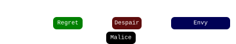

1. Glide into the arena and stack in the green in front of the boss.
2. Shortly after the green pops, the  [Chronomancer] activates their  [Continuum Split], prepares a  [Portal] on the group,  [Blinks](https://wiki.guildwars2.com/wiki/Blink) to the North-East corner of the arena, and opens their portal before exiting  [Continuum Split].
3. Everyone spreads to the south with [Despair], and dodges inwards. Whoever is targeted by [Malice] takes the portal and places their add on the edge of the arena, then takes it back after dropping their [Despair].
4. Stack up and sidestep [Envy] to the left once its indicator appears.
<details>
  <summary> Chronomancer POV</summary>
  <iframe class="youtube-video" src="https://www.youtube.com/embed/pCD9tqKod_I?si=70gGOl70VUTgL6iX&start=11&end=40&mute=1 " frameborder="0" allow="accelerometer; clipboard-write; encrypted-media; gyroscope; picture-in-picture; web-share" referrerpolicy="strict-origin-when-cross-origin" allowfullscreen></iframe>
</details>

#### Extra Information
{: .no_toc}
- The add from the [Malice] needs to be placed far enough to the North so as to take advantage of its pathfinding: if the add starts walking directly towards the center, then the portal was outside of the correct zone.
- Players should not move after taking the portal, as it runs the risk of placing the Malice in an incorrect position or falling off the platform.

---

### 2. [Malice], [Despair] & [Gluttony]

<video class="center" width="70%" controls muted>
  <source src="./videos/phase1/seq2_alt.mp4" type="video/mp4">
</video>

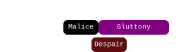

1. The  [Chronomancer] prepares their  [Portal Entre] on squad, then  [Blink]s to the North-Western edge of the arena and opens it after [Envy] disappears.
2. Whoever gets targeted by [Malice] takes the portal and leaves their add on the edge of the arena.
3. Everyone else spreads horizontally for [Despair], then rolls forward and focuses on collecting [Gluttony]. Use  [Feedback] or  [Corrosive Poison Cloud] on the boss to prevent it from gaining  [Barrier].
4. When spreading, the  [Scourge] should weapon swap to dagger and use  [Dark Pact] to  [Immobilize] the Malice add coming from the north of the arena. The  [Chronomancer] can also use  [Mind the Gap] into  [Phantasmal Lancer] to  [Immobilize] and  [Journey] to  [Cripple] the add.
<details>
  <summary> Chronomancer POV</summary>
  <iframe class="youtube-video" src="https://www.youtube.com/embed/pCD9tqKod_I?si=70gGOl70VUTgL6iX&start=40&end=73&mute=1 " frameborder="0" allow="accelerometer; clipboard-write; encrypted-media; gyroscope; picture-in-picture; web-share" referrerpolicy="strict-origin-when-cross-origin" allowfullscreen></iframe>
</details>

---

### 3. [Rage], [Regret] & [Envy], [Despair] 

<video class="center" width="70%" controls muted>
  <source src="./videos/phase1/seq3.mp4" type="video/mp4">
</video>

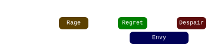

1. Once [Rage] appears, the  [Scourge] uses  [Sand Swell] to get the squad out of the AoE.
2. The squad takes the portal back and stacks for [Regret] on the eastern side of the boss, so as to avoid [Envy].
3. Once [Regret] pops, walk through the boss to the other side and drop [Despair].
4. If squad DPS is low or you're playing LCM, you may have to play a second [Envy]. Just sidestep it to the left.
<details>
  <summary> Scourge POV</summary>
  <iframe class="youtube-video" src="https://www.youtube.com/embed/6D6xMNLI84I?si=VCh6w5hiCAFD_cwh&start=69&end=86&mute=1 " frameborder="0" allow="accelerometer; clipboard-write; encrypted-media; gyroscope; picture-in-picture; web-share" referrerpolicy="strict-origin-when-cross-origin" allowfullscreen></iframe>
</details>

#### Extra Information
{: .no_toc}
- Throughout this sequence, continue applying  [Immobilize] to the Malice as necessary.
- Groups will usually phase around when [Regret] spawns.


## First Split Phase

[< Previous Phase](#first-phase){: .btn} [Next Phase >](#second-phase){: .btn}

Cerus will separate into his six [Embodiments], which will start doing attacks. The first attack will almost always be [Gluttony], while the second and further are random.
- The squad should kill [Regret], so as to disable the Triple Green mechanic.
- Do your full DPS rotation on the add, _never_ skill-save. With enough damage, the squad can skip the second mechanic, which can be crucial in case the mechanic is [Regret] (see Scourge/Chrono PoV for an example).
- The two healers and a boonDPS should go collect Gluttony. Sort out which boonDPS goes beforehand.
- Whoever opened instance should stand _west_ of the squad to bait  [Envy], in case it performs its attack. The rest of the squad should be ready to jump the fast wall.
- Walk back to the boss once [Regret] is dead.

<details>
  <summary> Chronomancer POV</summary>
  <iframe class="youtube-video" src="https://www.youtube.com/embed/OA3tzmAsea0?si=ytuj9FtN2UTVK0Zw&start=99&end=124&mute=1 " frameborder="0" allow="accelerometer; clipboard-write; encrypted-media; gyroscope; picture-in-picture; web-share" referrerpolicy="strict-origin-when-cross-origin" allowfullscreen></iframe>
</details>
<details>
  <summary> Herald POV</summary>
  <iframe class="youtube-video" src="https://www.youtube.com/embed/1NhFc7-NlkE?si=DkrrZ457SCPF-Rf5&start=97&end=124&mute=1 " frameborder="0" allow="accelerometer; clipboard-write; encrypted-media; gyroscope; picture-in-picture; web-share" referrerpolicy="strict-origin-when-cross-origin" allowfullscreen></iframe>
</details>
<details>
  <summary> Scourge POV</summary>
  <iframe class="youtube-video" src="https://www.youtube.com/embed/PxAi-bWHTsg?si=96CSuM_yvkiQjOEv&start=103&end=127&mute=1 " frameborder="0" allow="accelerometer; clipboard-write; encrypted-media; gyroscope; picture-in-picture; web-share" referrerpolicy="strict-origin-when-cross-origin" allowfullscreen></iframe>
</details>


## Second Phase

[< Previous Phase](#first-split-phase){: .btn} [Next Phase >](#second-split-phase){: .btn}

Two Aspects, [Envy] and [Rage], will be  [Empowered](./mechanics.html#-empowered-1), increasing the challenge posed.

- Avoid  [Empowered] on the boss. Stacks commonly result from miscommunication during [Gluttony] or [Malice].
- The double [Despair] followed by double  [Envy] 75 seconds in is the first true difficulty spike of the encounter.
- During this phase, an [Embodiment] will spawn and perform their attack every 20 seconds.

---

### 1. [Regret], [Rage] & [Despair], [Envy]

<video class="center" width="70%" controls muted>
  <source src="./videos/phase2/seq1.mp4" type="video/mp4">
</video>

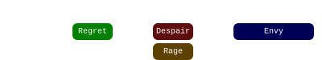

1. Run to the south of the boss and stack in [Regret].
2. Shortly after the green pops, the  [Scourge] will provide a  [Sand Swell] out of the   [Rage].
3. Spread for [Despair] after taking the portal. Dodge into the portal to avoid the damage, and take it once you see the "Evaded" tick.
4. Once the indicator for  [Envy] appears, run forward and to the right of it. After the wall spawns, chase the fast wall around the boss.

<details>
  <summary> Scourge POV</summary>
  <iframe class="youtube-video" src="https://www.youtube.com/embed/OPtZoWHRHLo?si=90jehxUyd7ZMwna1&start=103&end=136&mute=1 " frameborder="0" allow="accelerometer; clipboard-write; encrypted-media; gyroscope; picture-in-picture; web-share" referrerpolicy="strict-origin-when-cross-origin" allowfullscreen></iframe>
</details>

#### Extra Information
{: .no_toc}
- If the group has limited access to  [Swiftness], it becomes important for  [Virtuosos] for provide it via  [Temporal Curtain] during  [Envy].
- Try to avoid taking the  [Sand Swell] back too early as this can result in getting hit by [Rage] or dropping [Despair] pools on top of the boss.

---

### 2. [Gluttony]<sup>2</sup> & [Malice]<sup>2</sup>, [Rage]

<video class="center" width="70%" controls muted>
  <source src="./videos/phase2/seq2_alt.mp4" type="video/mp4">
</video>

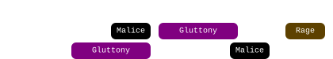

1. After  [Envy], the  [Chronomancer] activates their  [Continuum Split], prepares a  [Portal] on the group,  [Blinks] to the eastern edge of the arena, and opens their portal before exiting  [Continuum Split].
2. Whoever gets targeted by [Malice] takes the portal and drops the add on the edge. The rest of the squad focuses on collecting the two consecutive [Gluttony] mechanics. Alternate  [Feedback] and  [Corrosive Poison Cloud] on the boss to prevent it from gaining  [Barrier](https://wiki.guildwars2.com/wiki/Barrier).
3. After the last orb is collected, the  [Chronomancer] prepares a  [Portal] on the group,  [Blinks] to the add, and opens their portal.
4. Whoever gets targeted by the second Malice takes the portal immediately, the rest of the squad takes it as soon as  [Rage] appears.
5. Stack behind the adds and cleave them down while targeting the boss. Players who are melee can take the portal back for more DPS provided cleave is sufficient.

<details>
  <summary> Chronomancer POV</summary>
  <iframe class="youtube-video" src="https://www.youtube.com/embed/pCD9tqKod_I?si=70gGOl70VUTgL6iX&start=142&end=180&mute=1 " frameborder="0" allow="accelerometer; clipboard-write; encrypted-media; gyroscope; picture-in-picture; web-share" referrerpolicy="strict-origin-when-cross-origin" allowfullscreen></iframe>
</details>

#### Extra Information
{: .no_toc}
-  [Chronomancers] should delay opening their portal as much as possible: this allows melee players to take it back after the [Rage], increasing their damage uptime.
- There is an invisible [Embodiment] ([Regret]) on  Triangle: ensure the  [Portal] is placed slightly south of the horizontal line, or this add will block some projectiles, making it more difficult to cleave the Malices.
- The player targeted by the second [Malice] should try to drop their add on top of the previous one, to make cleaving them together easier.

---

### 3. [Regret], [Despair]<sup>2</sup>, [Envy]<sup>2</sup>

<video class="center" width="70%" controls muted>
  <source src="./videos/phase2/seq3.mp4" type="video/mp4">
</video>

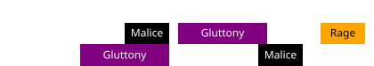

1. [Regret] appears while the squad is stacked behind the Malices.
2. A soon as the green pops, spread out with the first [Despair] in a crescent far from the boss.
3. Dodge forward once Despair drops, and position on the inside of the pools for the second set.
4. Dodge forward again and quickly stack up on  Heart to bait  [Envy] from the boss.
5. Once the wall's indicator appears, run to the right of the boss and chase the fast wall back to  Heart. You should be on  Heart when the [Embodiment] starts casting their own  [Envy].
5. Circle the boss to  Arrow, jumping over the fast wall when it crosses the squad.

<details>
  <summary> Virtuoso POV</summary>
  <iframe class="youtube-video" src="https://www.youtube.com/embed/71JEURWXLko?si=YroyfB-PRhH9Z4Tv&start=205&end=240&mute=1 " frameborder="0" allow="accelerometer; clipboard-write; encrypted-media; gyroscope; picture-in-picture; web-share" referrerpolicy="strict-origin-when-cross-origin" allowfullscreen></iframe>
</details> 

#### Extra Information
{: .no_toc}
- The first set of spreads will no longer deal damage once the [Embodiment] of [Despair] disappears. Melee classes can therefore place them closer to the boss to greed for a bit more damage.
- After jumping the fast wall, support players should cleanse conditions, strip boons from Cerus and re-apply boons on the squad in case anyone failed their jump.

---

### 4. [Malice], [Gluttony] & [Regret]

<video class="center" width="70%" controls muted>
  <source src="./videos/phase2/seq4.mp4" type="video/mp4">
</video>

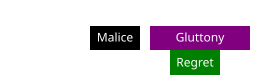

1. The  [Chronomancer] prepares their  [Portal] right as  [Envy] is about to end, then they  [Blink] to the southern edge and open their portal.
2. Whoever is targeted by [Malice] takes the portal and drops their add on the edge.
3. [Gluttony] will happen at the same time as [Regret]. Each subgroup should follow their marked person to collect, this way there will always be at least five people in the green even when the squad is spread. Use  [Feedback] or  [Corrosive Poison Cloud] on the boss to prevent it from gaining  [Barrier].

<details>
  <summary> Chronomancer POV</summary>
  <iframe class="youtube-video" src="https://www.youtube.com/embed/OA3tzmAsea0?si=ytuj9FtN2UTVK0Zw&start=222&end=245&mute=1 " frameborder="0" allow="accelerometer; clipboard-write; encrypted-media; gyroscope; picture-in-picture; web-share" referrerpolicy="strict-origin-when-cross-origin" allowfullscreen></iframe>
</details> 

---

### 5. [Rage]<sup>2</sup>, [Regret]

<video class="center" width="70%" controls muted>
  <source src="./videos/phase2/seq5.mp4" type="video/mp4">
</video>

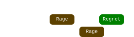

1. The  [Scourge] uses their  [Sand Swell] south to the add as soon as the  [Rage] indicator appears.
2. Take the portal back and walk out of the second  [Rage].
3. Optionally: stay stacked behind the add and cleave it down while targeting the boss. [Regret]'s green will spawn while everyone is still stacked.
4. You should be phasing shortly after the green. Otherwise, you will have to play a final [Despair].

<details>
  <summary> Scourge POV</summary>
  <iframe class="youtube-video" src="https://www.youtube.com/embed/PxAi-bWHTsg?si=96CSuM_yvkiQjOEv&start=251&end=280&mute=1 " frameborder="0" allow="accelerometer; clipboard-write; encrypted-media; gyroscope; picture-in-picture; web-share" referrerpolicy="strict-origin-when-cross-origin" allowfullscreen></iframe>
</details>

#### Extra Information
{: .no_toc}
With good damage, it is possible to phase during  [Rage], either the Cerus's or the Aspect's. In this case the boss' Rage will be effectively cancelled as soon as he gains his  [Defiance Bar](https://wiki.guildwars2.com/wiki/Defiance_bar), becoming purely visual. However, _the Aspect will continue casting until the defiance bar is broken_.


## Second Split Phase

[< Previous Phase](#second-phase){: .btn} [Next Phase >](#third-phase){: .btn}

Cerus will again separate into his [Embodiments], which will start doing their mechanics. The first one will almost always be  [Gluttony], while the second one and on are random.
- Kill  [Gluttony].
- Do your full DPS rotation on the add, _never_ skill-save.
- In Legendary Mode, you _should not_ collect orbs. Any  [Empowered] gained by Gluttony will be lost once it dies.
- In normal CM, you instead _should_ collect, since  [Insatiable] will wear off before it becomes an issue. Try not to gain more than 3 stacks.
- Healers can use  [Feedback] or   [Corrosive Poison Cloud] to reduce the amount of  [Barrier] gained by [Gluttony], slightly speeding up the phase overall.
- Whoever opened instance should stand _south_ of the squad to bait  [Envy] in case it performs its attack. The rest of the squad should be ready to jump the fast wall.


## Third Phase

[< Previous Phase](#second-split-phase){: .btn} [Next Phase >](#phasing-to-10){: .btn}

Four adds, [Despair], [Envy], [Malice] and [Rage], will be  [Empowered](./mechanics.html#-empowered-1), requiring careful coordination from the entire squad to manage the combined mechanics.

- Large difficulty spikes come from double  [Despair] into double  [Envy], 55s and 130s into the phase. Surviving these sequences intact will determine if you get to 10%.
-  [Rage] & [Gluttony] 100s into the phase, known as "bad collection", is one of the harder mechanics to do correctly, and may result in many stacks of  [Empowered] on the boss if misplayed.
- Transitioning into the final 10% is best done at certain specific moments, otherwise some attacks risk [carrying over to the final phase](./mechanics.html#transition-into-10), potentially screwing up the entire run.
- During this phase, an Embodiment will spawn and perform their attack every 15 seconds.

---

### 1. [Regret], [Rage], [Envy]

<video class="center" width="70%" controls muted>
  <source src="./videos/phase3/seq1.mp4" type="video/mp4">
</video>

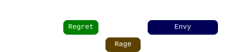

1. Run to the left of  Heart (when looking at the boss) and stack in [Regret].
2. Once the  [Rage] indicator appears, the  [Scourge] casts  [Sand Swell] to .
3. Everyone takes the portal to avoid the AoE and *stands still* on the portal exit. The  [Envy] indicator will appear on top of the squad.
4. Everyone takes the portal back to  as soon as Rage pops.
5. Chase the fast wall around the boss.

<details>
  <summary> Scourge POV</summary>
  <iframe class="youtube-video" src="https://www.youtube.com/embed/OPtZoWHRHLo?si=pZQ3VWykbt9AmI1b&start=240&end=260&mute=1 " frameborder="0" allow="accelerometer; clipboard-write; encrypted-media; gyroscope; picture-in-picture; web-share" referrerpolicy="strict-origin-when-cross-origin" allowfullscreen></iframe>
</details>

#### Extra Information
{: .no_toc}
-  [Virtuosos] can use their  [Signet of Illusions] and  [Thousand Cuts] in their opener. <u>For the rest of the fight, they should only use them at specific moments.</u>
- This sequence is commonly called the "Feep-Foop".
- The marker positions for placing  [Sand Swell] in these sequence are a reference: the important part is angling the portal enough so that  [Envy] does not hit the squad.

---

### 2. [Gluttony]<sup>2</sup>, [Malice], [Rage]

<video class="center" width="70%" controls muted>
  <source src="./videos/phase3/seq2.mp4" type="video/mp4">
</video>

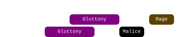

1. During the  [Envy] in the previous sequence, the  [Chronomancer] can run out and prepare their  [Portal] on  Triangle.
2. Each subgroup follows their marker to collect all orbs during the two consecutive [Gluttony] mechanics. Alternate  [Feedback] and  [Corrosive Poison Cloud] on the boss to prevent it from gaining  [Barrier].
3. Once players get targeted by  [Malice], the  [Chronomancer] opens their portal on the boss. All tethered players take the portal and drop the adds on the exit. 
4. Everyone else takes the portal once the indicator for  [Rage] appears, and stacks behind the adds, cleaving them down while targeting the boss.

<details>
  <summary> Chronomancer POV</summary>
  <iframe class="youtube-video" src="https://www.youtube.com/embed/OA3tzmAsea0?si=ytuj9FtN2UTVK0Zw&start=319&end=353&mute=1 " frameborder="0" allow="accelerometer; clipboard-write; encrypted-media; gyroscope; picture-in-picture; web-share" referrerpolicy="strict-origin-when-cross-origin" allowfullscreen></iframe>
</details>

---

### 3. [Despair]<sup>2</sup> & [Malice], [Envy]<sup>2</sup> & [Regret]<sup>2</sup>

<video class="center" width="70%" controls muted>
  <source src="./videos/phase3/seq3.mp4" type="video/mp4">
</video>

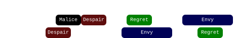

1. Form a line in preparation for  [Despair] while cleaving the Malices. All  [Virtuosos] should stack just in range of the boss, in front of .  [Heralds] should be in front of them, while the  [Scourge] and  [Chronomancer] remain behind everyone else.
2. Optional: the  [Scourge] prepares a  [Sand Swell] from  for the melee players: see the PoV below.
3. When the  [Despair] spreads drop, dodge them towards .  [Virtuosos] should use their  [Distortion] to ignore the initial damage, the Chronomancer and Heralds should save their defensive skills for the second drop.
4. Players will get targeted by  [Malice] during Despair. Everyone who is targeted should take care to drop their add on  Square. The tighter the adds are grouped up, the easier it will be to kill them. 
5. Prepare for the second set of  [Despair]. Virtuosos should reset their  [Distortion] with  [Signet of Illusions] and stack with the Heralds on square. Heralds should swap to  [Legendary Dragon](https://wiki.guildwars2.com/wiki/Legendary_Dragon_Stance). Healers should remain off stack, usually a bit to the right looking at the boss.
6. Dodge the second set of  [Despair] forward. Virtuosos should use their  [Distortion], Heralds should use  [Infuse Light].
7. Stack behind the Malices in [Regret] and cleave thm while targeting the boss. Virtuosos should use their  [Thousand Cuts] now.
8.  [Envy] will spawn from the add.  Jump the fast wall, then once the adds die move to  Arrow to avoid the slow wall.
9. A second  [Envy] will spawn from the boss. Run to the right and follow the fast wall around the boss.

<details>
  <summary> Chronomancer POV</summary>
  <iframe class="youtube-video" src="https://www.youtube.com/embed/OA3tzmAsea0?si=ytuj9FtN2UTVK0Zw&start=353&end=395&mute=1 " frameborder="0" allow="accelerometer; clipboard-write; encrypted-media; gyroscope; picture-in-picture; web-share" referrerpolicy="strict-origin-when-cross-origin" allowfullscreen></iframe>
</details>
<details>
  <summary> Scourge POV</summary>
  <iframe class="youtube-video" src="https://www.youtube.com/embed/OPtZoWHRHLo?si=pZQ3VWykbt9AmI1b&start=291&end=334&mute=1 " frameborder="0" allow="accelerometer; clipboard-write; encrypted-media; gyroscope; picture-in-picture; web-share" referrerpolicy="strict-origin-when-cross-origin" allowfullscreen></iframe>
</details>
<details>
  <summary> Herald POV</summary>
  <iframe class="youtube-video" src="https://www.youtube.com/embed/1NhFc7-NlkE?si=DkrrZ457SCPF-Rf5&start=326&end=369&mute=1 " frameborder="0" allow="accelerometer; clipboard-write; encrypted-media; gyroscope; picture-in-picture; web-share" referrerpolicy="strict-origin-when-cross-origin" allowfullscreen></iframe>
</details>
<details>
  <summary> Virtuoso POV</summary>
  <iframe class="youtube-video" src="https://www.youtube.com/embed/71JEURWXLko?si=YroyfB-PRhH9Z4Tv&start=365&end=409&mute=1 " frameborder="0" allow="accelerometer; clipboard-write; encrypted-media; gyroscope; picture-in-picture; web-share" referrerpolicy="strict-origin-when-cross-origin" allowfullscreen></iframe>
</details>

#### Extra Information
{: .no_toc}
- Remember that  [Distortion] and  [Evasion](https://wiki.guildwars2.com/wiki/Evade) only work for the initial  [Despair] damage. 
- DO NOT DODGE EARLY! Early dodges will leave your pool at the end of your dodge, potentially killing your teammates. Wait for the spreads to drop, using your defensive skills to soak up the initial damage, and then use your dodge to get out of the pool faster. You have about a second to get out before you down.
-  [Infuse Light] also works on the pools, so heralds can be even more patient. They don't even need to dodge and can just walk out of the pools.
- For the first set of spreads, the  [Chronomancer] can stack far off group and then  [Blink] to  after they drop, giving a bit more space to the others.
- After the second dodge, the pools on the left facing the boss are purely visual. Don't hesitate to walk through them to cleave the  [Malice].
- The adds will die relatively easily in normal CM. In Legendary Mode, it is crucial that all  [Virtuosos] save their  [Thousand Cuts] and use it on the second set of Malices. Similarly it is also extremely important that everyone stacks precisely on  so that they are neatly stacked far from the boss.
- After jumping the fast wall, support players should cleanse conditions, strip boons from Cerus and re-apply boons on the squad in case anyone failed their jump.
- This sequence is commonly called "Double Drops".

---

### 4. [Gluttony]<sup>2</sup> & [Rage]<sup>2</sup>

<video class="center" width="70%" controls muted>
  <source src="./videos/phase3/seq4.mp4" type="video/mp4">
</video>

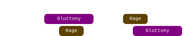

1. Move to  Heart.
2. As soon as the [Embodiment]'s  [Rage] indicator appears, the  [Chronomancer] opens  [Continuum Split], prepares a  [Portal],  [Blinks] to  Swirl, opens their portal, and terminates their  [Continuum Split].
3. Everyone takes the  [Portal] out of  [Rage], or walks out keeping an eye for any [Gluttony] orbs they can collect on the way.
4. Once  [Rage] pops, players should take the  [Portal] back to the boss to grab any orbs that were not yet fully collected.
5. The  [Scourge] prepositions north of the boss, towards  X. When the boss's  [Rage]'s indicator appears, they should  [Sand Swell] towards the marker.
6. Everyone takes the  [Sand Swell] before Rage pops. The  [Chronomancer] runs out and prepares their  [Portal] on  X.
7. Everyone takes the  [Sand Swell] back to the boss and quickly collects all orbs. Marked people should call out where they're moving.
8. As soon as the final orb is collected, the  [Chronomancer] opens their  [Portal] on the boss.

<details>
  <summary> Chronomancer POV</summary>
  <iframe class="youtube-video" src="https://www.youtube.com/embed/OA3tzmAsea0?si=ytuj9FtN2UTVK0Zw&start=395&end=425&mute=1 " frameborder="0" allow="accelerometer; clipboard-write; encrypted-media; gyroscope; picture-in-picture; web-share" referrerpolicy="strict-origin-when-cross-origin" allowfullscreen></iframe>
</details>
<details>
  <summary> Scourge POV</summary>
  <iframe class="youtube-video" src="https://www.youtube.com/embed/PxAi-bWHTsg?si=96CSuM_yvkiQjOEv&start=400&end=430&mute=1 " frameborder="0" allow="accelerometer; clipboard-write; encrypted-media; gyroscope; picture-in-picture; web-share" referrerpolicy="strict-origin-when-cross-origin" allowfullscreen></iframe>
</details>

#### Extra Information
{: .no_toc}
- The  [Chronomancer] can start saving their clones once  [Envy] disappears: the portal is much easier to place with three clones.
-  [Heralds] can give  [Superspeed] during the first  [Rage] with  [Chaotic Release](https://wiki.guildwars2.com/wiki/Chaotic_Release), and can get back to the boss quickly with  [Frigid Blitz](https://wiki.guildwars2.com/wiki/Frigid_Blitz) if they are running Axe.
-  [Scourge] can quickly move out of Rage with  [Path of Gluttony](https://wiki.guildwars2.com/wiki/Path_of_Gluttony).
- This sequence is commonly called "Bad Collect".

---

### 5. [Malice]<sup>2</sup>, [Despair]<sup>2</sup>, [Envy]<sup>2</sup> & [Gluttony]

<video class="center" width="70%" controls muted>
  <source src="./videos/phase3/seq5.mp4" type="video/mp4">
</video>

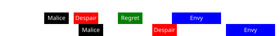

1. As soon as  [Malice] chooses targets, everyone immediately takes the  [Portal] to . The players targeted by tethers will drop the adds on top of the portal exit.
2. Spread with  [Despair] along the northern edge of the arena. Take all the space you need, and then  dodge forward.
3. Stack inside [Regret] while in range of the boss. The adds will walk into your cleave, so there is no need to focus them specifically.
4. The  [Scourge], if they don't have the green, can move in front and to the left of the stack. As soon as the second  [Despair] spawns, they  [Sand Swell] behind the boss, immediately taking it back.
5. The squad stacks to the right of the portal, leaving enough space in front of them for the healers. Prepare to dodge the second set of despair. Virtuosos should use their  [Distortion], Heralds should use  [Infuse Light].
6. The indicator for  [Envy] from the boss will appear on top of the squad  while the it is stacked. Dodge the  [Despair]  to the left, and take the  [Sand Swell] to avoid the wall.
7. Chase the fast wall around the boss and run back to  in time for the add's  [Envy]. When it spawns, follow the slow wall to  and jump the fast wall.
8. [Gluttony] will happen while the slow wall is still up. You may have to go through the wall to collect orbs.

<details>
  <summary> Chronomancer POV</summary>
  <iframe class="youtube-video" src="https://www.youtube.com/embed/OA3tzmAsea0?si=ytuj9FtN2UTVK0Zw&start=422&end=475&mute=1 " frameborder="0" allow="accelerometer; clipboard-write; encrypted-media; gyroscope; picture-in-picture; web-share" referrerpolicy="strict-origin-when-cross-origin" allowfullscreen></iframe>
</details>
<details>
  <summary> Scourge POV</summary>
  <iframe class="youtube-video" src="https://www.youtube.com/embed/PxAi-bWHTsg?si=96CSuM_yvkiQjOEv&start=426&end=479&mute=1 " frameborder="0" allow="accelerometer; clipboard-write; encrypted-media; gyroscope; picture-in-picture; web-share" referrerpolicy="strict-origin-when-cross-origin" allowfullscreen></iframe>
</details>
<details>
  <summary> Herald POV</summary>
  <iframe class="youtube-video" src="https://www.youtube.com/embed/1NhFc7-NlkE?si=DkrrZ457SCPF-Rf5&start=395&end=448&mute=1 " frameborder="0" allow="accelerometer; clipboard-write; encrypted-media; gyroscope; picture-in-picture; web-share" referrerpolicy="strict-origin-when-cross-origin" allowfullscreen></iframe>
</details>
<details>
  <summary> Virtuoso POV</summary>
  <iframe class="youtube-video" src="https://www.youtube.com/embed/71JEURWXLko?si=YroyfB-PRhH9Z4Tv&start=435&end=488&mute=1 " frameborder="0" allow="accelerometer; clipboard-write; encrypted-media; gyroscope; picture-in-picture; web-share" referrerpolicy="strict-origin-when-cross-origin" allowfullscreen></iframe>
</details>

#### Extra Information
{: .no_toc}
- If everyone takes the  [Portal] immediately once it opens, no-one will be in range for the second  [Malice], and you will have to deal with one less mechanic. If some players do get tethers, they should try to place their adds on top of the previous set.
- Remember that  [Distortion] and  [Evasion](https://wiki.guildwars2.com/wiki/Evade) only work for the initial  [Despair] damage,   [Infuse Light] however also works on the pools, so the  [Heralds] don't even need to dodge.
- The  [Scourge] can spam Interact (default F key) to instantly take their  [Sand Swell] back after casting it.
- After jumping the fast wall, support players should cleanse conditions, strip boons from Cerus and re-apply boons on the squad in case anyone failed their jump.
- This sequence is commonly called "T-drop".


## Phasing to 10%

[< Previous Phase](#third-phase){: .btn} [Next Phase >](#final-phase){: .btn}

Once you finish the [T-drop](#5-malice2-despair2-envy2--gluttony) sequence, you are within range of phasing and you should start planning out when exactly to transition to the final 10%. This is not a straightforward matter: based on [mechanics of the transition](./mechanics.html#transition-into-10), we can divide the final part of the fight into several sections based on phasing convenience:


-  Green sections represent periods where the phasing is more convenient. Carried over mechanics will be inconsequential, or mechanics will be cancelled by the transition.
-  Yellow sections can be managed with small deviations from the normal strategy.
-  Orange sections are inconvenient timings that should be avoided, but are not run-ending.
-  Red sections represent bad timings that should be avoided at all costs.

The rest of this section analyzes the final sequences of the third phase with an eye towards transitioning.

---

### 1. [Regret], [Rage]<sup>2</sup>, [Malice], [Despair]

<video class="center" width="70%" controls muted>
  <source src="./videos/phase3/seq6.mp4" type="video/mp4">
</video>

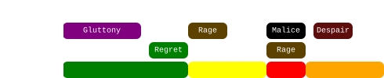

1. Stack in [Regret] south of the boss. When  [Rage] spawns, the  [Scourge] uses their  [Sand Swell] towards the  marker, and the whole squad takes it, then takes it back once the AoE pops.
2. The  [Chronomancer] opens their  [Continuum Split] and creates a  [Portal] from  to . Everyone targeted by [Malice] will take this portal and place their add on the edge of the arena.
3. Everyone who did not get [Malice] should stay outside of the Embodiment's  [Rage].
4. Before  [Despair] starts, everyone should spread in a semi-circle around the boss. Players who stayed on  should favor spreading more to the left, leaving space for the Malice players once they get back from the portal.
5. Dodge  [Despair] towards the boss.

<details>
  <summary> Chronomancer POV</summary>
  <iframe class="youtube-video" src="https://www.youtube.com/embed/OA3tzmAsea0?si=ytuj9FtN2UTVK0Zw&start=469&end=504&mute=1 " frameborder="0" allow="accelerometer; clipboard-write; encrypted-media; gyroscope; picture-in-picture; web-share" referrerpolicy="strict-origin-when-cross-origin" allowfullscreen></iframe>
</details>
<details>
  <summary> Scourge POV</summary>
  <iframe class="youtube-video" src="https://www.youtube.com/embed/PxAi-bWHTsg?si=96CSuM_yvkiQjOEv&start=474&end=509&mute=1 " frameborder="0" allow="accelerometer; clipboard-write; encrypted-media; gyroscope; picture-in-picture; web-share" referrerpolicy="strict-origin-when-cross-origin" allowfullscreen></iframe>
</details>

#### Extra Information
{: .no_toc}
- _Don't_ use  [Distortion] or  [Infuse Light] for  [Despair]: you will need them at the start of the final phase.
- The  [Portal] can be done both from  to  or from  to , choose which suits you best.
- Players who don't get targeted by  [Malice] should tend to spread left with their  [Despair], leaving more space for their teammates once they come back with the portal.

---

#### Phasing

####  Before  [Rage]
{: .no_toc}
High damage groups should aim for this window. Once [Regret] spawns, you will get a green leading into the final phase, but this is very easy to deal with.

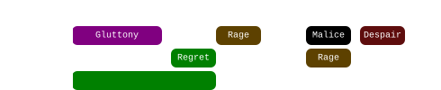

---

####  After  [Rage]
{: .no_toc}
This requires a small adaptation: the  [Sand Swell] out of the  [Rage] should be replaced by a  [Continuum Split]  [Portal], so that  [Sand Swell] will be available for the start of the final phase.
If the Embodiment of  [Rage] spawns, remember that it will _always_ conclude its attack, even if you phase. Depending on the timing of the attack, the commander may make the call to play the start of the final phase from .

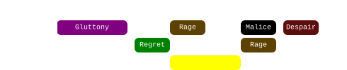

<details style="background-color: rgb(33, 35, 37);border: 4px solid #171717;">
  <summary>View Animation</summary>
  <video class="center" width="70%" controls muted>
  <source src="./videos/phase3/seq6_alt.mp4" type="video/mp4">
</video>
</details>
<details>
  <summary> Chronomancer POV</summary>
  <iframe class="youtube-video" src="https://www.youtube.com/embed/c6C1ttm5shI?si=eRmgZnFVgPIsh3PC&start=443&end=457&mute=1 " frameborder="0" allow="accelerometer; clipboard-write; encrypted-media; gyroscope; picture-in-picture; web-share" referrerpolicy="strict-origin-when-cross-origin" allowfullscreen></iframe>
  <b>Note</b>: in this PoV, the squad dps was not enough to phase during the Rage mechanic, so damage was held in order to phase at the beginning of the following sequence. However, its a good showcase of the CS portal.
</details>

---

####  During  [Malice]
{: .no_toc}
If you phase while  [Malice] tethers are active, the tethers will not disappear, and you will get an extra set of adds persisting through to the next phase. This is extremely inconvenient, since usually the squad will not be ready to cleave them, resulting in a full 15 stacks of  [Empowered] on the boss, and a wipe. You should generally try to phase Cerus before he puts his wings to the floor, or hold damage and try to phase at the start of the next sequence.

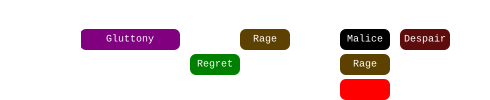

---

####  After  [Malice]
{: .no_toc}
Phasing here will result in the  [Malice] adds despawning. However, you will always get [Gluttony] persisting through the beginning of the final phase. While not catastrophic, this is however a significant increase in difficulty, and should be avoided. You should hold damage and try to phase at the beginning of the next sequence.

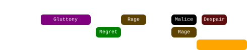

---

### 2.[Gluttony] & [Regret], [Envy] & [Malice] ([Despair])

<video class="center" width="70%" controls muted>
  <source src="./videos/phase3/seq7.mp4" type="video/mp4">
</video>

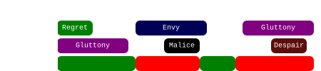

1. After dodging  [Despair], stack on the boss for the green.
2. Use [Feedback](https://wiki.guildwars2.com/wiki/Feedback) and  [Corrosive Poison Cloud](https://wiki.guildwars2.com/wiki/Corrosive_Poison_Cloud) during [Gluttony] to avoid the boss getting  [Barrier]. Focus on collecting.
3. When  [Envy] spawns, run to the right, then chase the fast wall around the boss.
4. Whoever gets targeted by  [Malice] should run out in the space between pools, and drop the adds as far as possible.
5. Phase as soon as possible after the adds spawn. Be ready to break Cerus's  [Defiance Bar](https://wiki.guildwars2.com/wiki/Defiance_bar).

#### Phasing

####  During [Gluttony]
{: .no_toc}
A generally good moment, normal damage groups should aim to phase here, as soon as the green appears. Any [Gluttony] orbs already present on the map will despawn, and both attacks will be invalidated.

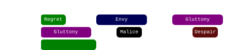

---

####  During  [Envy]
{: .no_toc}
The wall appears as soon as the  [Malice] Embodiment spawns. If you phase here, Malice will complete their attack and you will get an extra set of adds persisting through to the next phase. This usually leads to 15 stacks of  [Empowered] on the boss and a wipe.

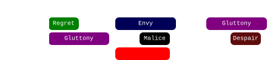

---

####  After  [Malice]
{: .no_toc}
This is the final safe phasing point. As soon as the  [Malice] adds spawn, phasing will make them despawn, leading to a safe transition.

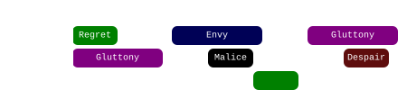

---

####  Fast  [Despair]
{: .no_toc}
Phasing too late after  [Malice] means that  [Despair] will spawn and complete its attack. This results in an extremely inconvenient set of pools that will persist throughout the final phase, usually leading to a wipe. Phasing after the despair is also usually fatal, since at least one set of adds will walk in.

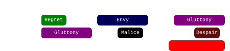


## Final Phase

[< Previous Phase](#phasing-to-10){: .btn}

The most difficult part of the fight. Ever-increasing damage accompanied by relentless successive mechanics make for a challenging mechanical, healing and damage check, as you try to finish the fight before Cerus kills you all.

- Cerus will start casting his [Enraged Smash] every four seconds, progressively gaining more stacks of  [Empowered]. Meanwhile, a new [Embodiment] will spawn and perform their mechanic every 5 seconds.
- The superposition of other damage sources with the [Enraged Smash] is one of the most common reason for downs. Most commonly this happens with [Regret] or  [Malice].
- Large difficulty spikes come from the  [Despair] stacks, 5 and 35 seconds into the phase.
- 65-70 seconds is usually the limit for concluding this phase: beyond this point, the combination of a third Despair, Malices walking in and the boss having more than 50  [Empowered] almost always results in a wipe.
-  [Virtuosos] should not use their healing skill during this phase: the passive healing is more important than the phantasm reset. Only use it if you need the active heal.

---

### 1. [Despair], [Envy], [Rage]

<video class="center" width="70%" controls muted>
  <source src="./videos/phase4/seq1.mp4" type="video/mp4">
</video>

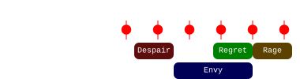

1. Stack on the  side of the boss.
2. Once the  [Despair] indicator appears, the  [Scourge] uses their  [Sand Swell] to .
3. Everyone takes the portal and stays on the portal exit, except for the healers, who can stack behind the rest of the squad.
4.  Dodge  [Despair] to the right.  [Virtuosos] use their  [Distortion],  [Heralds] use  [Infuse Light].
5. After the dodge, the  [Chronomancer] prepares their  [Portal] next to the pools.
6. Run east towards  [Envy] and chase the fast wall around the boss.
7. Run to either  or  to avoid the slow wall.  is safer but  allows melee builds to greed more damage.
8. Stack in [Regret] when it spawns, and sidestep  [Rage].

<details>
  <summary> Chronomancer POV</summary>
  <iframe class="youtube-video" src="https://www.youtube.com/embed/OA3tzmAsea0?si=ytuj9FtN2UTVK0Zw&start=529&end=559&mute=1 " frameborder="0" allow="accelerometer; clipboard-write; encrypted-media; gyroscope; picture-in-picture; web-share" referrerpolicy="strict-origin-when-cross-origin" allowfullscreen></iframe>
</details>
<details>
  <summary> Scourge POV</summary>
  <iframe class="youtube-video" src="https://www.youtube.com/embed/PxAi-bWHTsg?si=96CSuM_yvkiQjOEv&start=534&end=564&mute=1 " frameborder="0" allow="accelerometer; clipboard-write; encrypted-media; gyroscope; picture-in-picture; web-share" referrerpolicy="strict-origin-when-cross-origin" allowfullscreen></iframe>
</details>
<details>
  <summary> Herald POV</summary>
  <iframe class="youtube-video" src="https://www.youtube.com/embed/1NhFc7-NlkE?si=DkrrZ457SCPF-Rf5&start=482&end=512&mute=1 " frameborder="0" allow="accelerometer; clipboard-write; encrypted-media; gyroscope; picture-in-picture; web-share" referrerpolicy="strict-origin-when-cross-origin" allowfullscreen></iframe>
</details>
<details>
  <summary> Virtuoso POV</summary>
  <iframe class="youtube-video" src="https://www.youtube.com/embed/71JEURWXLko?si=YroyfB-PRhH9Z4Tv&start=542&end=572&mute=1 " frameborder="0" allow="accelerometer; clipboard-write; encrypted-media; gyroscope; picture-in-picture; web-share" referrerpolicy="strict-origin-when-cross-origin" allowfullscreen></iframe>
</details>

#### Alternative: North-East Portal
{: .no_toc}
An alternative way of playing this first sequence is by casting the first  [Sand Swell] towards the North-East, as shown in the image below, then dodging forwards. This has the advantage of immediately placing the group in melee with the boss, but can be difficult to play in certain situations, such as when the [Rage] add is casting right after the phase transition.

In this situation, the  [Chronomancer] should prepare their portal during,  [Rage], while the entire group is moving out of the center.

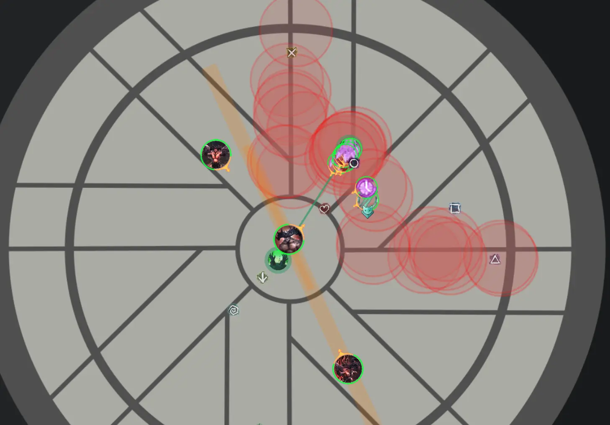

<details>
  <summary> NE Portal POV</summary>
  <iframe class="youtube-video" src="https://www.youtube.com/embed/nt8ziWTG6TE?si=LTkOmjl7v6DcAzFx&start=420&end=445&mute=1 " frameborder="0" allow="accelerometer; clipboard-write; encrypted-media; gyroscope; picture-in-picture; web-share" referrerpolicy="strict-origin-when-cross-origin" allowfullscreen></iframe>
</details>

---

#### Extra Information
{: .no_toc}
- Any players who go down due to  [Despair] and aren't immediately revived should /gg. This will avoid you getting targeted by [Regret] while off-stack, which usually means a wipe.
- If the  [Chronomancer] didn't use  [Continuum Split] to place the final portal of the previous phase, they will not have their portal available now, and will have to  [Blink] out and place it in the following sequence.
-  [Virtuosos] should reset their  [Distortion] with  [Signet of Illusions] soon after the dodge.

---

### 2. All Embodiments Go

<video class="center" width="70%" controls muted>
  <source src="./videos/phase4/seq2.mp4" type="video/mp4">
</video>

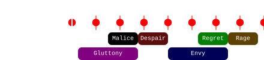

1. Focus on collecting [Gluttony]. Use  [Feedback] and  [Corrosive Poison Cloud] on the boss to prevent it from gaining  [Barrier].
2. As soon as  [Malice] tethers spawn, the   [Chronomancer] opens their  [Portal] on the boss. Targeted players should wait until they are full health after the smash at ~32s, then take the portal. Drop the adds on the portal exit.
3. Once  [Despair] spreads spawn, everyone takes the portal and prepares to dodge. The majority of the squad should stack on top of the exit while the healers move behind. Virtuosos should use their  [Thousand Cuts] now while targeting the boss to cleave the adds.
4.  Dodge  [Despair] to the right.  [Virtuosos] use their  [Distortion],  [Heralds] use  [Infuse Light].
5. Run east towards  [Envy] and chase the fast wall around the boss.
6. Run to either  or  to avoid the slow wall.  is safer but  allows melee builds to greed more damage.
7. Stack in [Regret] when it spawns, and sidestep  [Rage].

<details>
  <summary> Chronomancer POV</summary>
  <iframe class="youtube-video" src="https://www.youtube.com/embed/OA3tzmAsea0?si=ytuj9FtN2UTVK0Zw&start=559&end=589&mute=1 " frameborder="0" allow="accelerometer; clipboard-write; encrypted-media; gyroscope; picture-in-picture; web-share" referrerpolicy="strict-origin-when-cross-origin" allowfullscreen></iframe>
</details>
<details>
  <summary> Scourge POV</summary>
  <iframe class="youtube-video" src="https://www.youtube.com/embed/PxAi-bWHTsg?si=96CSuM_yvkiQjOEv&start=563&end=593&mute=1 " frameborder="0" allow="accelerometer; clipboard-write; encrypted-media; gyroscope; picture-in-picture; web-share" referrerpolicy="strict-origin-when-cross-origin" allowfullscreen></iframe>
</details>
<details>
  <summary> Herald POV</summary>
  <iframe class="youtube-video" src="https://www.youtube.com/embed/1NhFc7-NlkE?si=DkrrZ457SCPF-Rf5&start=512&end=542&mute=1 " frameborder="0" allow="accelerometer; clipboard-write; encrypted-media; gyroscope; picture-in-picture; web-share" referrerpolicy="strict-origin-when-cross-origin" allowfullscreen></iframe>
</details>
<details>
  <summary> Virtuoso POV</summary>
  <iframe class="youtube-video" src="https://www.youtube.com/embed/71JEURWXLko?si=YroyfB-PRhH9Z4Tv&start=572&end=602&mute=1 " frameborder="0" allow="accelerometer; clipboard-write; encrypted-media; gyroscope; picture-in-picture; web-share" referrerpolicy="strict-origin-when-cross-origin" allowfullscreen></iframe>
</details>

#### Extra Information
{: .no_toc}
- It is important that players targeted by  [Malice] wait until after the smash to take the portal. This will give the healers time to bring them to full health, otherwise they will likely downstate on the smash right after  [Despair] spreads spawn.
-  [Virtuosos] targeted by  [Malice] should try to  [Block] the tethers to reduce incoming damage, since they will be far from their healers when they complete.
- If you are missing some damage, it is best to move to  after  [Envy], so you can cleave the adds. If they walk in, the squad will die very quickly.

---

### 3. [Gluttony], [Malice], [Despair]

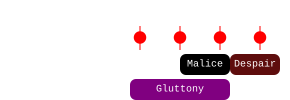

This sequence is identical to the Gluttony, Malice, Despair at the start of the previous sequence.

1. Focus on collecting [Gluttony]. Use  [Feedback](https://wiki.guildwars2.com/wiki/Feedback) and  [Corrosive Poison Cloud](https://wiki.guildwars2.com/wiki/Corrosive_Poison_Cloud) on the boss to prevent it from gaining  [Barrier](https://wiki.guildwars2.com/wiki/Barrier). Avoid barrier at all costs: one single orb going in means 4-5 more seconds of dps. That's an extra smash to deal with: often the difference between a kill and a wipe.
2. Players targeted by  [Malice] can try running out. Don't run too far, or else you will quickly die to smashes.
3. If  [Despair] spawns: spread, DPS, pray.
4. [You are dead.](https://www.youtube.com/watch?v=dNQs_Bef_V8)


[Return to Home](index.html){: .btn } [Mechanical Reference](mechanics.html){: .btn } [Return to Top](#unit-strat){: .btn .fixed}
{: .center}

<!-- Guide Links -->
[Flower]: ./flower.html
[Rage]: mechanics.html#rage---cry-of-rage
[Malice]: ./mechanics.html#malice---malicious-intent
[Despair]: ./mechanics.html#despair---wail-of-despair
[Regret]: ./mechanics.html#regret---crushing-regret
[Gluttony]: ./mechanics.html#gluttony---insatiable-hunger
[Envy]: ./mechanics.html#envy---envious-gaze
[Empowered]: ./mechanics.html#-empowered
[Embodiment]: ./mechanics.html#embodiments
[Embodiments]: ./mechanics.html#embodiments
[Insatiable]: ./mechanics.html#-insatiable
[Enraged Smash]: ./mechanics.html#enraged-smash

<!-- buffs/debuffs -->
[Immobilize]: https://wiki.guildwars2.com/wiki/Immobile
[Cripple]: https://wiki.guildwars2.com/wiki/Crippled
[Barrier]: https://wiki.guildwars2.com/wiki/Barrier
[Swiftness]: https://wiki.guildwars2.com/wiki/Swiftness
[Superspeed]: https://wiki.guildwars2.com/wiki/Superspeed

<!-- Classes/Specializations -->
[Chronomancers]: #builds-and-povs
[Chronomancer]: #builds-and-povs
[Condition Virtuoso]: #builds-and-povs
[Virtuosos]: #builds-and-povs
[Scourge]: #builds-and-povs
[Herald]: #builds-and-povs
[Heralds]: #builds-and-povs

<!-- Skills -->
[Sand Swell]: https://wiki.guildwars2.com/wiki/Sand_Swell
[Portal Entre]: https://wiki.guildwars2.com/wiki/Portal_Entre
[Corrosive Poison Cloud]: https://wiki.guildwars2.com/wiki/Corrosive_Poison_Cloud
[Feedback]: https://wiki.guildwars2.com/wiki/Feedback
[Infuse Light]: https://wiki.guildwars2.com/wiki/Infuse_Light
[Portal]: https://wiki.guildwars2.com/wiki/Portal_Entre
[Blink]: https://wiki.guildwars2.com/wiki/Blink
[Blinks]: https://wiki.guildwars2.com/wiki/Blink
[Continuum Split]: https://wiki.guildwars2.com/wiki/Continuum_Split
[Dark Pact]: https://wiki.guildwars2.com/wiki/Dark_Pact
[Journey]: https://wiki.guildwars2.com/wiki/Journey
[Mind the Gap]: https://wiki.guildwars2.com/wiki/Mind_the_Gap
[Phantasmal Lancer]: https://wiki.guildwars2.com/wiki/Phantasmal_Lancer
[Temporal Curtain]: https://wiki.guildwars2.com/wiki/Temporal_Curtain
[Signet of Illusions]: https://wiki.guildwars2.com/wiki/Signet_of_Illusions
[Thousand Cuts]: https://wiki.guildwars2.com/wiki/Thousand_Cuts
[Distortion]: https://wiki.guildwars2.com/wiki/Distortion

<!-- Other -->
[Dark Pact]: https://wiki.guildwars2.com/wiki/Dark_Pact