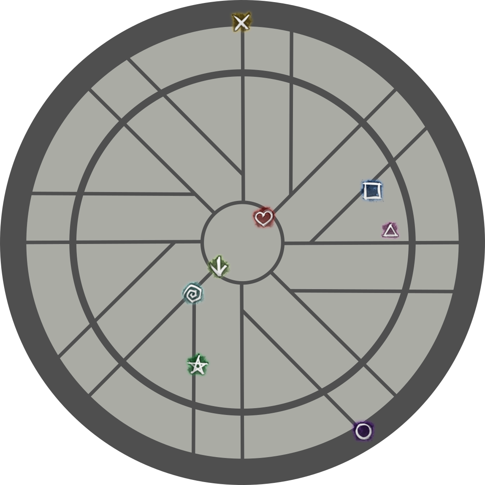

[Previous](../mechanics/other/smash.html){: .btn } [Next](phase1.html){: .btn }

# UNIT Strat

UNIT, named after the guild who originally developed it, is the ubiquitous strategy for ToF CM. It was designed to facilitate PUG runs, since it requires few specialized roles, is relatively forgiving to mistakes, and it frees up strong defensive options for DPS players.

The downside of this strategy is that it forces most of the squad to play certain predefined builds, without much space for alternative playstyles.

## General Concepts

UNIT compresses almost all mechanics into the two heal roles, which are usually covered by a  [Scourge] and  [Chronomancer]. Both of these classes bring strong utility that is used to manage many of Cerus's attacks:

-  [Rage] is avoided by transporting the squad out of range using  [Sand Swell] and  [Portal Entre].
-  [Malice] is mitigated by dropping the adds on the edge of the arena using portals, then either killing them, immobilizing them using  [Dark Pact], or phasing before they become an issue.
-  [Regret] is killed during the first split phase so that it becomes trivial.
-  [Gluttony] is killed during the second split phase, and projectile reflection is provided by  [Corrosive Poison Cloud] and  [Feedback]. Additionally, both healers can delete orbs using  [Blink](https://wiki.guildwars2.com/wiki/Blink) and  [Path of Gluttony](https://wiki.guildwars2.com/wiki/Path_of_Gluttony).
-  [Envy] is managed using some positioning tricks that take advantage of portals.
-  [Despair], especially in its empowered state, benefits from using portals to place the dangerous pools far from the boss.

## Composition
The typical squad composition looks like this:

First subgroup:
- A heal  [Chronomancer] running  [Feedback],  [Portal Entre] and  [Blink](https://wiki.guildwars2.com/wiki/Blink).
- A  /  [BoonDPS](https://wiki.guildwars2.com/wiki/Quickness).
- Three DPS.

Second subgroup:
- A heal  [Scourge] taking  [Corrosive Poison Cloud],  [Sand Swell] and  [Serpent Siphon](https://wiki.guildwars2.com/wiki/Serpent_Siphon).
- A  [QuickDPS](https://wiki.guildwars2.com/wiki/Quickness).
- Three DPS.

Common choices for boon providers include  [Herald](https://wiki.guildwars2.com/wiki/Herald) and  [Chronomancer] due to their defensive utilities, with  [Herald](https://wiki.guildwars2.com/wiki/Herald) being more common due to its easier playstyle and better boon coverage.

DPS isn't extremely important outside of the legendary mode, however, the strategy strongly favours ranged builds with cleave and good personal defensive skills.  [Condition Virtuoso] is by far the safest and best performing build for this strategy. This does not mean you cannot use other builds, however, it is best that you gain confidence with the fight before attempting to do so.

Most groups will run with 4-6 virtuosos, since their cleave is required to kill [Malice] adds safely.

## Marker Pack
All markers referenced in this guide can be set up with the [Commander Markers](https://blishhud.com/modules/?module=Manlaan.CommanderMarkers) module for [Blish HUD](https://blishhud.com/), using the marker pack provided below.

    
Click to view markers

    <contents>
        
        
Paste the following code into Commander Markers to use this marker pack:

        <code class="wrap">
        eyJlbmFibGVkIjp0cnVlLCJuYW1lIjoiUHVnIFN0cmF0IiwiZGVzY3JpcHRpb24iOiJkZXNjcmlwdGlvbiIsIm1hcElkIjoxNTIwLCJ0cmlnZ2VyIjp7IngiOjAuMCwieSI6MC4wLCJ6IjowLjB9LCJtYXJrZXJzIjpbeyJpIjoxLCJkIjoibWFya2VyIG5hbWUiLCJ4IjotNC44MjQ2NjEsInkiOi0xMDcuNzc0NzEyLCJ6IjoxNzguNjcxNH0seyJpIjozLCJkIjpudWxsLCJ4Ijo2LjQ3MDMyMiwieSI6LTEwMC40MTkxMjEsInoiOjE3OC42NzE2fSx7ImkiOjYsImQiOm51bGwsIngiOi05LjQ2MTc1MSwieSI6LTExMS44Njg0LCJ6IjoxNzguNjcxNDQ4fSx7ImkiOjUsImQiOm51bGwsIngiOi04Ljk4NjU3OSwieSI6LTEzMi42Njk3ODUsInoiOjE3OC42NzE0NDh9LHsiaSI6MiwiZCI6bnVsbCwieCI6MjcuNjA4MjI2OCwieSI6LTE0OC4wNzI4NzYsInoiOjE3OC42Njk4fSx7ImkiOjcsImQiOm51bGwsIngiOjM0LjU3NjY3NTQsInkiOi0xMDMuNDM1ODA2LCJ6IjoxNzguNjcxNjE2fSx7ImkiOjQsImQiOm51bGwsIngiOjI4LjEwNjk5LCJ5IjotOTQuMjAxODcsInoiOjE3OC42NzE2MTZ9LHsiaSI6OCwiZCI6bnVsbCwieCI6NC40MTk4OTEzNiwieSI6LTU1LjkxNDcwNzIsInoiOjE3OC42NzE2fV19
        </code>
        </contents>

## Full Step-By-Step Visualization
The following pages will contain a full playthrough of UNIT strat, where we will provide detailed information covering everything about the strategy.

For convenience's sake, we will be subdividing each phase into _sequences_: sets of mechanics that logically flow together, where it makes sense to talk about the group instead of the individual. For each phase we will provide an analysis of each sequence, with animations and POVs provided for related roles.

[Previous](../mechanics/other/smash.html){: .btn } [Next](phase1.html){: .btn }

[Condition Virtuoso]: https://snowcrows.com/builds/raids/mesmer/condition-virtuoso
[Scourge]: https://wiki.guildwars2.com/wiki/Scourge
[Chronomancer]: https://wiki.guildwars2.com/wiki/Chronomancer
[Sand Swell]: https://wiki.guildwars2.com/wiki/Sand_Swell
[Portal Entre]: https://wiki.guildwars2.com/wiki/Portal_Entre
[Corrosive Poison Cloud]: https://wiki.guildwars2.com/wiki/Corrosive_Poison_Cloud
[Feedback]: https://wiki.guildwars2.com/wiki/Feedback
[Immobilize]: https://wiki.guildwars2.com/wiki/Immobile
[Dark Pact]: https://wiki.guildwars2.com/wiki/Dark_Pact

[Rage]: ../mechanics/aspects/rage.html
[Malice]: ../mechanics/aspects/malice.html
[Despair]: ../mechanics/aspects/despair.html
[Regret]: ../mechanics/aspects/regret.html
[Gluttony]: ../mechanics/aspects/gluttony.html
[Envy]: ../mechanics/aspects/envy.html