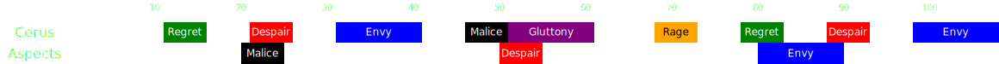

[Previous](overview.html){: .btn } [Next](phase1/seq1.html){: .btn }

# First Phase - 100% to 80%

Mechanics are relatively simple and unpunishing. Use this time to do as much damage as possible.

- Avoid  [Empowered] on the boss. Stacks commonly result from miscommunication during [Gluttony](../../mechanics/aspects/gluttony.html) or [Malice](../../mechanics/aspects/malice.html). You should be ending this phase with zero  [Empowered] stacks.
- Practice the timing of dodging [Despair](../../mechanics/aspects/despair.html) spreads with little or no consequences.
- A new embodiment will perform their mechanic every 30 seconds.

### Full Timeline

(Use shift+scroll or swipe if on mobile)

  

[Previous](overview.html){: .btn } [Next](phase1/seq1.html){: .btn }

[Empowered]: https://wiki.guildwars2.com/wiki/Empowered_(Cerus)
[Insatiable]: https://wiki.guildwars2.com/wiki/Insatiable
[Barrier]: https://wiki.guildwars2.com/wiki/Barrier
[Mesmer]: https://wiki.guildwars2.com/wiki/Mesmer
[Feedback]: https://wiki.guildwars2.com/wiki/Feedback
[Signet of Illusions]: https://wiki.guildwars2.com/wiki/Signet_of_Illusions
[Blink]: https://wiki.guildwars2.com/wiki/Blink
[Scourge]: https://wiki.guildwars2.com/wiki/Scourge
[Path of Gluttony]: https://wiki.guildwars2.com/wiki/Path_of_Gluttony
[Virtuoso]: https://wiki.guildwars2.com/wiki/Virtuoso