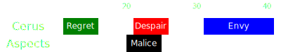

[Previous](../phase1.html){: .btn } [Next](seq2.html){: .btn }

# [Regret], [Malice] & [Despair], [Envy]
{: .center}

Difficulty: 
{: .center}

<video class="center" width="90%" controls muted>
  <source src="../../videos/phase1/seq1.mp4" type="video/mp4">
</video>

## Description
A simple and straightforward opening sequence. A [Malice] add needs to be placed far from the boss, and [Despair] needs to be dodged.

## Sequence
1. Glide into the arena and stack in the green in front of the boss.
2. Shortly after the green pops, the  [Scourge] places their  [Sand Swell] a bit south of the boss, going southwards. More distance means more time to DPS the add.
3. Everyone takes the portal once [Despair] spreads appear. Spread horizonally, or remain on the portal exit and use   [Distortion]/ [Infuse Light]. Whoever was targeted by [Malice] should stay on the portal exit, so that their add drops in the middle of the squad.  Dodge _forward_ once [Despair] drops.
4. Stack up behind the add and cleave it down while targeting the boss. Once [Envy] appears, sidestep the wall to the left, then move back behind the add and cleave it down.

  
 Scourge POV

  <iframe class="youtube-video" src="https://www.youtube.com/embed/PxAi-bWHTsg?si=96CSuM_yvkiQjOEv&start=11&end=40&mute=1 " frameborder="0" allow="accelerometer; clipboard-write; encrypted-media; gyroscope; picture-in-picture; web-share" referrerpolicy="strict-origin-when-cross-origin" allowfullscreen></iframe>

  
 Virtuoso POV

  <iframe class="youtube-video" src="https://www.youtube.com/embed/71JEURWXLko?si=YroyfB-PRhH9Z4Tv&start=16&end=56&mute=1 " frameborder="0" allow="accelerometer; clipboard-write; encrypted-media; gyroscope; picture-in-picture; web-share" referrerpolicy="strict-origin-when-cross-origin" allowfullscreen></iframe>

 

## Extra Information
- If the exit of the  [Sand Swell] is placed too far to the east, the add will do some strange pathfinding that will make it more difficult to cleave (see [Malice] for more information). If in doubt, aim the portal more towards .
-  [Heralds](https://wiki.guildwars2.com/wiki/Herald) can return to the boss to deal some additional damage after the spread, if cleave is good enough. Otherwise they should stay at range and help kill the add.
- Healers should be ready to condition cleanse and re-apply boons in case someone gets hit by the wall.

## Advanced Version
If squad damage is high enough, the squad can "ignore" the malice add. In this case, the  [Sand Swell] is replaced by  a  [Portal] that the  [Chronomancer] prepares using  [Continuum Split] from the boss to the north-east edge of the arena, abusing pathfinding.

This has the advantage of being much easier (you no longer need to stack spreads) and more melee-friendly for the DPS players, at the cost of a small skill check for the healers:  [Chronomancer] for the portal and  [Scourge] to  [Immobilize](https://wiki.guildwars2.com/wiki/Immobile) with [Dark Pact](https://wiki.guildwars2.com/wiki/Dark_Pact). For these reasons, this variant is standard in experienced runs.

  
View Animation

  <video class="center" width="90%" controls muted>
  <source src="../../videos/phase1/seq1_alt.mp4" type="video/mp4">
</video>

[Previous](../phase1.html){: .btn } [Next](seq2.html){: .btn }

[Regret]: ../../mechanics/aspects/regret.html
[Envy]: ../../mechanics/aspects/envy.html
[Malice]: ../../mechanics/aspects/malice.html
[Despair]: ../../mechanics/aspects/despair.html
[Scourge]: https://wiki.guildwars2.com/wiki/Scourge
[Sand Swell]: https://wiki.guildwars2.com/wiki/Sand_Swell
[Distortion]: https://wiki.guildwars2.com/wiki/Distortion
[Infuse Light]: https://wiki.guildwars2.com/wiki/Infuse_Light
[Chronomancer]: https://wiki.guildwars2.com/wiki/Chronomancer
[Portal]: https://wiki.guildwars2.com/wiki/Portal_Entre
[Blink]: https://wiki.guildwars2.com/wiki/Blink
[Continuum Split]: https://wiki.guildwars2.com/wiki/Continuum_Split