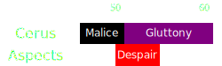

[Previous](seq1.html){: .btn } [Next](seq3.html){: .btn }

# [Malice] - [Despair] + [Gluttony]

  <iframe src="../../videos/phase1/seq2.mp4" frameborder="0" allowfullscreen></iframe>

## Sequence

1. The  [Chronomancer] prepairs their  [Portal Entre] on squad, then  [Blink]s to the edge of the arena and opens it after [Envy] disappears.
2. Whoever gets targeted by [Malice] takes the portal and leaves their add on the edge of the arena.
3. Everyone else spreads horizontally for [Despair], then rolls foreward and focuses on collecting [Gluttony].

  
 Chronomancer POV

  <iframe class="youtube-video" src="https://www.youtube.com/embed/OA3tzmAsea0?si=ytuj9FtN2UTVK0Zw&start=38&end=63&mute=1 " frameborder="0" allow="accelerometer; clipboard-write; encrypted-media; gyroscope; picture-in-picture; web-share" referrerpolicy="strict-origin-when-cross-origin" allowfullscreen></iframe>

## Variants
There are various places where the  [Portal Entre] can be opened:
- "Classically", the portal is placed on the eastern edge. This way the [Malice] add pathfinds straight towards the boss, making it easier to cleave.
- More recently, the portal has been placed more to the north/south, to abuse pathfinding. This is because often DPS is enough to phase the boss before the add becomes relevant, and there is always  [Scourge]'s  [Dark Pact](https://wiki.guildwars2.com/wiki/Dark_Pact) for emergency  [Immobilize](https://wiki.guildwars2.com/wiki/Immobile).

[Previous](seq1.html){: .btn } [Next](seq3.html){: .btn }

[Gluttony]: ../../mechanics/aspects/gluttony.html
[Malice]: ../../mechanics/aspects/malice.html
[Despair]: ../../mechanics/aspects/despair.html
[Envy]: ../../mechanics/aspects/envy.html
[Chronomancer]: https://wiki.guildwars2.com/wiki/Chronomancer
[Portal Entre]: https://wiki.guildwars2.com/wiki/Portal_Entre
[Blink]: https://wiki.guildwars2.com/wiki/Blink
[Scourge]: https://wiki.guildwars2.com/wiki/Scourge