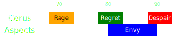

[Previous](seq2.html){: .btn } [Next](../split1.html){: .btn }

# [Rage], [Regret] & [Envy], [Despair] 
{: .center}

Difficulty: 
{: .center}

<video class="center" width="90%" controls muted>
  <source src="../../videos/phase1/seq3.mp4" type="video/mp4">
</video>

## Description
Final sequence of the phase, with some alternatives on positioning and dealing with the [Malice] adds.

## Sequence
1. Once [Rage] appears, the  [Scourge]  [Sand Swell]s the squad out of the AoE.
2. The squad takes the portal back and stacks for [Regret] on the eastern side of the boss, so as to avoid [Envy].
3. Once [Regret] pops, walk through the boss to the other side and drop [Despair].
4. If squad DPS is low or you're playing LCM, you may have to play a second [Envy]. Just sidestep it to the left.

  
 Scourge POV

  <iframe class="youtube-video" src="https://www.youtube.com/embed/PxAi-bWHTsg?si=96CSuM_yvkiQjOEv&start=66&end=105&mute=1 " frameborder="0" allow="accelerometer; clipboard-write; encrypted-media; gyroscope; picture-in-picture; web-share" referrerpolicy="strict-origin-when-cross-origin" allowfullscreen></iframe>

## Variants
Based on where the Malice was placed in the previous sequence, there are two ways of playing the  [Sand Swell].

If the add was placed directly east, then the squad can stay at range behind the add and cleave it down while targeting the boss (As shown in the POV).

  
View Animation

  <video class="center" width="90%" controls muted>
    <source src="../../videos/phase1/seq3_alt2.mp4" type="video/mp4">
  </video>

Alternatively, the squad can "ignore" the add and return to the boss after Rage, overall increasing melee uptime and therefore DPS.

  
View Animation

  <video class="center" width="90%" controls muted>
    <source src="../../videos/phase1/seq3_alt1.mp4" type="video/mp4">
  </video>

The  [Scourge] should always  [Immobilize](https://wiki.guildwars2.com/wiki/Immobile) the add when necessary using [Dark Pact](https://wiki.guildwars2.com/wiki/Dark_Pact) (dagger 3).

[Previous](seq2.html){: .btn } [Next](../split1.html){: .btn }

[Rage]: ../../mechanics/aspects/rage.html
[Regret]: ../../mechanics/aspects/regret.html
[Malice]: ../../mechanics/aspects/malice.html
[Despair]: ../../mechanics/aspects/despair.html
[Envy]: ../../mechanics/aspects/envy.html
[Chronomancer]: https://wiki.guildwars2.com/wiki/Chronomancer
[Portal Entre]: https://wiki.guildwars2.com/wiki/Portal_Entre
[Blink]: https://wiki.guildwars2.com/wiki/Blink
[Scourge]: https://wiki.guildwars2.com/wiki/Scourge
[Sand Swell]: https://wiki.guildwars2.com/wiki/Sand_Swell