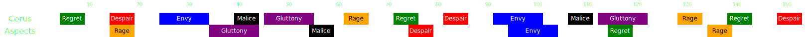

[Previous](split1.html){: .btn } [Next](phase2/seq1.html){: .btn }

# Second Phase - 80% to 50%

Two adds, [Envy] and [Rage], will be  **Empowered**, increasing the challenge posed.

- Avoid  [Empowered] on the boss. Stacks commonly result from miscommunication during [Gluttony] or [Malice].
- The double [Despair] followed by double  [Envy] 75 seconds in is the first true difficulty spike of the encounter..

### Full Timeline

(Use shift+scroll or swipe if on mobile)

  

[Previous](split1.html){: .btn } [Next](phase2/seq1.html){: .btn }

[Envy]: ../mechanics/aspects/envy.md
[Rage]: ../mechanics/aspects/rage.md
[Gluttony]: ../mechanics/aspects/gluttony.md
[Malice]: ../mechanics/aspects/malice.md
[Despair]: ../mechanics/aspects/despair.html
[Empowered]: https://wiki.guildwars2.com/wiki/Empowered_(Cerus)