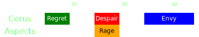

[Previous](../phase2.html){: .btn } [Next](seq2.html){: .btn }

# [Regret] > [Rage], [Despair] > [Envy]
{: .center}

<video class="center" width="90%" controls muted>
  <source src="../../videos/phase2/seq1.mp4" type="video/mp4">
</video>

## Sequence

1. Run to the south of the boss and stack in [Regret].
2. After the green pops, start walking out south-westwards to avoid  [Rage]. The  [Scourge] or  [Chronomancer] can provide a portal for this, but it is not strictly necessary.
3. Everyone spreads for [Despair]. Make sure to leave enough space that you can dodge forward without getting hit by Rage.
4. Run to the boss and stack up to prepare for  [Envy].
5. Once the indicator for the wall appears, run foreward and to the right of it. After the wall spawns, chase the fast wall around the boss.

  
 Scourge POV

  <iframe class="youtube-video" src="https://www.youtube.com/embed/PxAi-bWHTsg?si=96CSuM_yvkiQjOEv&start=128&end=163&mute=1 " frameborder="0" allow="accelerometer; clipboard-write; encrypted-media; gyroscope; picture-in-picture; web-share" referrerpolicy="strict-origin-when-cross-origin" allowfullscreen></iframe>

[Previous](../phase2.html){: .btn } [Next](seq2.html){: .btn }

[Regret]: ../../mechanics/aspects/regret.html
[Envy]: ../../mechanics/aspects/envy.html
[Rage]: ../../mechanics/aspects/rage.html
[Despair]: ../../mechanics/aspects/despair.html
[Scourge]: https://wiki.guildwars2.com/wiki/Scourge
[Sand Swell]: https://wiki.guildwars2.com/wiki/Sand_Swell
[Distortion]: https://wiki.guildwars2.com/wiki/Distortion
[Infuse Light]: https://wiki.guildwars2.com/wiki/Infuse_Light
[Chronomancer]: https://wiki.guildwars2.com/wiki/Chronomancer
[Portal]: https://wiki.guildwars2.com/wiki/Portal_Entre
[Blink]: https://wiki.guildwars2.com/wiki/Blink
[Continuum Split]: https://wiki.guildwars2.com/wiki/Continuum_Split