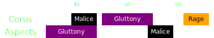

[Previous](seq1.html){: .btn } [Next](seq3.html){: .btn }

# [Gluttony]2 & [Malice]2, [Rage]
{: .center}

Difficulty: 
{: .center}

<video class="center" width="90%" controls muted>
  <source src="../../videos/phase2/seq2_alt.mp4" type="video/mp4">
</video>

## Description
Double [Gluttony] and [Malice] give Cerus lots of opportunities for gaining  [Empowered](https://wiki.guildwars2.com/wiki/Empowered_(Cerus)). Make sure to collect properly and not fail portals.

## Sequence
1. After  [Envy], the  [Chronomancer] activates their  [Continuum Split], prepares a  [Portal] on the group,  [Blinks](https://wiki.guildwars2.com/wiki/Blink) to the eastern edge of the arena, and opens their portal before exiting  [Continuum Split].
2. Whoever gets targeted by [Malice] takes the portal and drops the add on the edge. The rest of the squad focuses on collecting the two consecutive [Gluttony] mechanics. Alternate  [Feedback](https://wiki.guildwars2.com/wiki/Feedback) and  [Corrosive Poison Cloud](https://wiki.guildwars2.com/wiki/FeedbCorrosive_Poison_Cloudack) on the boss to prevent it from gaining  [Barrier](https://wiki.guildwars2.com/wiki/Barrier).
3. After the last orb is collected, the  [Chronomancer] prepares a  [Portal] on the group,  [Blinks](https://wiki.guildwars2.com/wiki/Blink) to the add, and opens their portal.
4. Whoever gets targeted by the second Malice takes the portal immediately, the rest of the squad takes it as soon as  [Rage] appears.
5. Stack behind the adds and cleave them down while targeting the boss.

  
 Chronomancer POV

  <iframe class="youtube-video" src="https://www.youtube.com/embed/pCD9tqKod_I?si=70gGOl70VUTgL6iX&start=142&end=180&mute=1 " frameborder="0" allow="accelerometer; clipboard-write; encrypted-media; gyroscope; picture-in-picture; web-share" referrerpolicy="strict-origin-when-cross-origin" allowfullscreen></iframe>

## Extra Information
- Remember that there is an invisible add (Regret) on  Triangle! The  [Portal] should be placed slightly south of the horizontal line, or the add will block some projectiles, making it more difficult to cleave the Malices.
- The player targeted by the second [Malice] should try to drop their add on top of the previous one, to make cleaving them together easier.
- Confident  [Chronomancer]s can delay opening their portal as much as possible: this allows melee players to take it back after the [Rage] and increase their damage uptime.

## Legacy Version
Originally this sequence was done by having the  [Scourge] handle the second portal out of [Rage]. On the one hand this made life easier for the  [Chronomancer] as they would not have to do a "CS portal", but on the other it also meant less overall melee uptime for the damage dealers. Furhtermore,  [Portal] is also much easier to find on the fly than  [Sand Swell], leading to less misplays.

  
View Animation

  <video class="center" width="90%" controls muted>
    <source src="../../videos/phase2/seq2.mp4" type="video/mp4">
  </video>

  
 Legacy Scourge POV

  <iframe class="youtube-video" src="https://www.youtube.com/embed/PxAi-bWHTsg?si=96CSuM_yvkiQjOEv&start=160&end=194&mute=1 " frameborder="0" allow="accelerometer; clipboard-write; encrypted-media; gyroscope; picture-in-picture; web-share" referrerpolicy="strict-origin-when-cross-origin" allowfullscreen></iframe>

[Previous](seq1.html){: .btn } [Next](seq3.html){: .btn }

[Gluttony]: ../../mechanics/aspects/gluttony.html
[Malice]: ../../mechanics/aspects/malice.html
[Rage]: ../../mechanics/aspects/rage.html
[Envy]: ../../mechanics/aspects/envy.html
[Scourge]: https://wiki.guildwars2.com/wiki/Scourge
[Sand Swell]: https://wiki.guildwars2.com/wiki/Sand_Swell
[Distortion]: https://wiki.guildwars2.com/wiki/Distortion
[Infuse Light]: https://wiki.guildwars2.com/wiki/Infuse_Light
[Chronomancer]: https://wiki.guildwars2.com/wiki/Chronomancer
[Portal]: https://wiki.guildwars2.com/wiki/Portal_Entre
[Blink]: https://wiki.guildwars2.com/wiki/Blink
[Continuum Split]: https://wiki.guildwars2.com/wiki/Continuum_Split