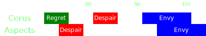

[Previous](seq2.html){: .btn } [Next](seq4.html){: .btn }

# [Regret], [Despair]2, [Envy]2
{: .center}

<video class="center" width="90%" controls muted>
  <source src="../../videos/phase2/seq3.mp4" type="video/mp4">
</video>

## Sequence

1. [Regret] appears while the squad is stacked behind the adds, which should die before it's complete.
2. A soon as the green pops, spread out with the first [Despair] in a crescent far from the boss.
3. Dodge forward once Despair drops, and position on the inside of the pools for the second set.
4. Dodge forward again and quickly stack up on  Heart to bait  [Envy] from the boss.
5. Once the wall's indicator appears, run quickly to the right of the boss and chase the fast wall back to  Heart. You should be on  Heart when the embodiment starts casting their own  [Envy].
5. Follow the slow wall to  Arrow, jumping the fast wall when it crosses the squad.
6. End the sequence on  Arrow.

  
 Virtuoso POV

  <iframe class="youtube-video" src="https://www.youtube.com/embed/71JEURWXLko?si=YroyfB-PRhH9Z4Tv&start=205&end=240&mute=1 " frameborder="0" allow="accelerometer; clipboard-write; encrypted-media; gyroscope; picture-in-picture; web-share" referrerpolicy="strict-origin-when-cross-origin" allowfullscreen></iframe>

 

## Extra Information
-  [Virtuosos] should provide  [Swiftness] with  [Temporal Curtain] for  [Envy].
- Support players should be ready to cleanse conditions and re-apply boons after the fast wall, in case anyone failed the jump. Save your skills for this if necessary.

[Previous](seq2.html){: .btn } [Next](seq4.html){: .btn }

[Regret]: ../../mechanics/aspects/regret.html
[Despair]: ../../mechanics/aspects/despair.html
[Envy]: ../../mechanics/aspects/envy.html
[Virtuosos]: https://wiki.guildwars2.com/wiki/Virtuoso
[Temporal Curtain]: https://wiki.guildwars2.com/wiki/Temporal_Curtain
[Swiftness]: https://wiki.guildwars2.com/wiki/Swiftness