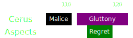

[Previous](seq3.html){: .btn } [Next](seq5.html){: .btn }

# [Malice], [Gluttony] & [Regret]
{: .center}

Difficulty: 
{: .center}

<video class="center" width="90%" controls muted>
  <source src="../../videos/phase2/seq4.mp4" type="video/mp4">
</video>

## Description
A bit of a breather after the previous sequence. However, the combination of spreading out to collect [Gluttony] at the same time as [Regret]'s green can be very punishing if the squad doesn't handle it correctly.

Squads with high DPS can phase during this sequence, often before [Gluttony].

## Sequence
1. The  [Chronomancer] prepares their  [Portal] right as  [Envy] is about to end, then they  [Blink] to the southern edge and open their portal.
2. Whoever is targeted by [Malice] takes the portal and drops their add on the edge.
3. [Gluttony] will happen at the same time as [Regret]. Each subgroup should follow their marked person to collect, this way there will always be at least five people in the green even when the squad is spread. Use  [Feedback](https://wiki.guildwars2.com/wiki/Feedback) or  [Corrosive Poison Cloud](https://wiki.guildwars2.com/wiki/FeedbCorrosive_Poison_Cloudack) on the boss to prevent it from gaining  [Barrier](https://wiki.guildwars2.com/wiki/Barrier).

  
 Chronomancer POV

  <iframe class="youtube-video" src="https://www.youtube.com/embed/OA3tzmAsea0?si=ytuj9FtN2UTVK0Zw&start=222&end=245&mute=1 " frameborder="0" allow="accelerometer; clipboard-write; encrypted-media; gyroscope; picture-in-picture; web-share" referrerpolicy="strict-origin-when-cross-origin" allowfullscreen></iframe>

 

[Previous](seq3.html){: .btn } [Next](seq5.html){: .btn }

[Regret]: ../../mechanics/aspects/regret.html
[Envy]: ../../mechanics/aspects/envy.html
[Malice]: ../../mechanics/aspects/malice.html
[Gluttony]: ../../mechanics/aspects/gluttony.html
[Chronomancer]: https://wiki.guildwars2.com/wiki/Chronomancer
[Portal]: https://wiki.guildwars2.com/wiki/Portal_Entre
[Blink]: https://wiki.guildwars2.com/wiki/Blink