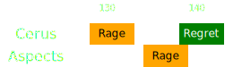

[Previous](seq4.html){: .btn } [Next](seq5.html){: .btn }

# [Rage]2, [Regret]
{: .center}

<video class="center" width="90%" controls muted>
  <source src="../../videos/phase2/seq5.mp4" type="video/mp4">
</video>

## Sequence

1. The  [Scourge] uses their  [Sand Swell] south to the add as soon as the  [Rage] indicator appears.
2. Everyone stays stacked up behind the add and cleaves it down.
3. [Regret]'s green will spawn while everyone is still stacked.
4. You should be phasing shortly after the green. Otherwise, you will have to play a final [Despair]

  
 Scourge POV

  <iframe class="youtube-video" src="https://www.youtube.com/embed/PxAi-bWHTsg?si=96CSuM_yvkiQjOEv&start=251&end=280&mute=1 " frameborder="0" allow="accelerometer; clipboard-write; encrypted-media; gyroscope; picture-in-picture; web-share" referrerpolicy="strict-origin-when-cross-origin" allowfullscreen></iframe>

## Extra Information
With good damage, it is possible to phase during  [Rage], either the Cerus's or the Aspect's. In this case the boss' Rage will be effectively cancelled as soon as he gains his  [Defiance Bar](https://wiki.guildwars2.com/wiki/Defiance_bar), becoming purely visual. However, _the Aspect will continue casting until the defiance bar is broken_.

[Previous](seq4.html){: .btn } [Next](seq5.html){: .btn }

[Rage]: ../../mechanics/aspects/rage.html
[Envy]: ../../mechanics/aspects/envy.html
[Regret]: ../../mechanics/aspects/regret.html
[Despair]: ../../mechanics/aspects/regret.html
[Scourge]: https://wiki.guildwars2.com/wiki/Scourge
[Sand Swell]: https://wiki.guildwars2.com/wiki/Sand_Swell