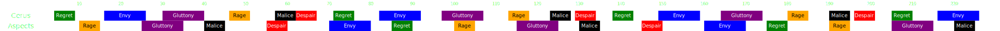

[Previous](split2.html){: .btn } [Next](phase3/seq1.html){: .btn }

# Third Phase - 50% to 10%

Four adds, [Despair], [Envy], [Malice] and [Rage], will be  **Empowered**, requiring careful coordination from the entire squad to manage the combined mechanics.

- Large difficulty spikes come from the double  [Despair] into double  [Envy], 55s and 130s into the phase. Surviving these sequences intact will determine if you get to 10%.
-  [Rage] & [Gluttony] 100s into the phase, known as "bad collection", is one of the harder mechanics to do correctly, and may result in many stacks on the boss if failed.
- Transitioning into the final 10% is best done at certain specific moments, otherwise some attacks risk carrying over to the final phase, potentially screwing up the entire run.
- During this phase, an Embodiment will spawn and perform their attack every 15 seconds.

### Full Timeline

(Use shift+scroll or swipe if on mobile)

  

[Previous](split2.html){: .btn } [Next](phase3/seq1.html){: .btn }

[Envy]: ../mechanics/aspects/envy.html
[Rage]: ../mechanics/aspects/rage.html
[Gluttony]: ../mechanics/aspects/gluttony.html
[Malice]: ../mechanics/aspects/malice.html
[Despair]: ../mechanics/aspects/despair.html
[Empowered]: https://wiki.guildwars2.com/wiki/Empowered_(Cerus)