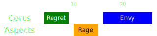

[Previous](../phase2.html){: .btn } [Next](seq2.html){: .btn }

# [Regret], [Rage], [Envy]
{: .center}

Difficulty: 
{: .center}

<video class="center" width="90%" controls muted>
  <source src="../../videos/phase3/seq1.mp4" type="video/mp4">
</video>

## Description
A tricky overlap between  [Rage] and  [Envy] that is dealt with using a fun little  [Sand Swell].

## Sequence
1. Run to  Heart and stack in [Regret].
2. Once the  [Rage] indicator appears, the  [Scourge]  [Sand Swell]s to .
3. Everyone takes the portal to avoid Rage and stays on the portal exit (a.k.a. "Feep"). The  [Envy] indicator will appear on top of the squad.
4. Everyone takes the portal back to  as soon as Rage pops (a.k.a. "Foop"), and chases the fast wall around the boss.

  
 Scourge POV

  <iframe class="youtube-video" src="https://www.youtube.com/embed/PxAi-bWHTsg?si=96CSuM_yvkiQjOEv&start=308&end=325&mute=1 " frameborder="0" allow="accelerometer; clipboard-write; encrypted-media; gyroscope; picture-in-picture; web-share" referrerpolicy="strict-origin-when-cross-origin" allowfullscreen></iframe>

## Extra Information
-  [Virtuosos] should provide  [Swiftness] with  [Temporal Curtain] for  [Envy].
-  [Virtuosos] can use their  [Signet of Illusions](https://wiki.guildwars2.com/wiki/Signet_of_Illusions) and  [Thousand Cuts](https://wiki.guildwars2.com/wiki/Thousand_Cuts) in their opener. <u>For the rest of the fight, they should only use them at specific moments.</u>

## Variants
 [Chronomancer] can also provide their  [Portal] for this mechanic by using  [Continuum Split].

[Previous](../phase2.html){: .btn } [Next](seq2.html){: .btn }

[Regret]: ../../mechanics/aspects/regret.html
[Envy]: ../../mechanics/aspects/envy.html
[Rage]: ../../mechanics/aspects/rage.html
[Scourge]: https://wiki.guildwars2.com/wiki/Scourge
[Sand Swell]: https://wiki.guildwars2.com/wiki/Sand_Swell
[Distortion]: https://wiki.guildwars2.com/wiki/Distortion
[Infuse Light]: https://wiki.guildwars2.com/wiki/Infuse_Light
[Chronomancer]: https://wiki.guildwars2.com/wiki/Chronomancer
[Portal]: https://wiki.guildwars2.com/wiki/Portal_Entre
[Blink]: https://wiki.guildwars2.com/wiki/Blink
[Continuum Split]: https://wiki.guildwars2.com/wiki/Continuum_Split
[Virtuosos]: https://wiki.guildwars2.com/wiki/Virtuoso
[Temporal Curtain]: https://wiki.guildwars2.com/wiki/Temporal_Curtain
[Swiftness]: https://wiki.guildwars2.com/wiki/Swiftness