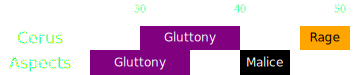

[Previous](seq1.html){: .btn } [Next](seq3.html){: .btn }

# [Gluttony]2, [Malice], [Rage]
{: .center}

<video class="center" width="90%" controls muted>
  <source src="../../videos/phase3/seq2.mp4" type="video/mp4">
</video>

## Description
Requires some coordination to collect all [Gluttony] orbs as usual. Otherwise use this sequence to pump damage and psychologically prepare for the following, much more difficult sequence.

## Sequence
1. During the  [Envy] in the previous sequence, the  [Chronomancer] can run out and prepare their portal on  Triangle.
2. Each subgroup follows their marker to collect all orbs during the two consecutive [Gluttony] mechanics. Alternate  [Feedback](https://wiki.guildwars2.com/wiki/Feedback) and  [Corrosive Poison Cloud](https://wiki.guildwars2.com/wiki/FeedbCorrosive_Poison_Cloudack) on the boss to prevent it from gaining  [Barrier](https://wiki.guildwars2.com/wiki/Barrier).
3. Once players get targeted by  [Malice] the  [Chronomancer] opens their portal on the boss. All tethered players take the portal and drop the adds on the exit. 
4. Everyone takes the portal once the indicator for  [Rage] appears, and stack behind the adds, cleaving them down while targeting the boss.

  
 Chronomancer POV

  <iframe class="youtube-video" src="https://www.youtube.com/embed/OA3tzmAsea0?si=ytuj9FtN2UTVK0Zw&start=319&end=353&mute=1 " frameborder="0" allow="accelerometer; clipboard-write; encrypted-media; gyroscope; picture-in-picture; web-share" referrerpolicy="strict-origin-when-cross-origin" allowfullscreen></iframe>

[Previous](seq1.html){: .btn } [Next](seq3.html){: .btn }

[Gluttony]: ../../mechanics/aspects/regret.html
[Malice]: ../../mechanics/aspects/malice.html
[Rage]: ../../mechanics/aspects/rage.html
[Envy]: ../../mechanics/aspects/envy.html
[Chronomancer]: https://wiki.guildwars2.com/wiki/Chronomancer
[Portal]: https://wiki.guildwars2.com/wiki/Portal_Entre