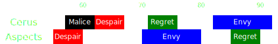

[Previous](seq2.html){: .btn } [Next](seq4.html){: .btn }

# [Despair]2 & [Malice], [Envy]2 & [Regret]2
{: .center}

<video class="center" width="90%" controls muted>
  <source src="../../videos/phase3/seq3.mp4" type="video/mp4">
</video>

## Description
One of the most difficult sequences of the fight.

Two successive sets of  [Despair] need to be placed far from the boss. While placing them, the squad must also dispatch two sets of  [Malice], one from the previous sequence, and another that spawns smack in the middle of the two Despairs. Dodging the Despairs correctly has somewhat of a learning curve, and is very punishing on failure.

Once the Despair have been placed, the squad must then deal with a double  [Envy] with some [Regret] sprinkled in for extra flavour.

## Sequence
1. Form a line in preparation for  [Despair] while cleaving the adds from the previous sequence. All  [Virtuosos] should stack just in range of the boss, in front of  Triangle.  [Heralds] should be in front of them, while the  [Scourge] and  [Chronomancer] remain behind everyone else.
2. When the  [Despair] spreads drop,  [Dodge](https://wiki.guildwars2.com/wiki/Evade) them towards  Square. Virtuosos should use their  [Distortion] to ignore the initial damage, the Chronomancer and Heralds should save their defensive skills for the second drop.
3. Players will get targeted by  [Malice] during Despair. Everyone who is targeted should take care to drop their add on  Square. The tighter the adds are grouped up, the easier it will be to kill them. 
4. Prepare for the second set of  [Despair]. Virtuosos should reset their  [Distortion] with  [Signet of Illusions] and stack with the Heralds on square. Heralds should swap to  [Legendary Dragon](https://wiki.guildwars2.com/wiki/Legendary_Dragon_Stance). Healers should remain off stack, usually a bit to the north of the rest of the squad, or to the right looking at the boss.
5. Dodge the second set of despair forward. Virtuosos should use their  [Distortion], Heralds should use  [Infuse Light].
6. Stack in [Regret] and cleave the adds while targeting the boss. Virtuosos should use their  [Thousand Cuts] now.
7.  [Envy] will spawn from the add.  Jump the fast wall, then once the adds die move to  Arrow to avoid the slow wall.
8. A second  [Envy] will spawn from the boss. Run to the right and follow the fast wall around the boss.

  
 Chronomancer POV

  <iframe class="youtube-video" src="https://www.youtube.com/embed/OA3tzmAsea0?si=ytuj9FtN2UTVK0Zw&start=353&end=395&mute=1 " frameborder="0" allow="accelerometer; clipboard-write; encrypted-media; gyroscope; picture-in-picture; web-share" referrerpolicy="strict-origin-when-cross-origin" allowfullscreen></iframe>

  
 Scourge POV

  <iframe class="youtube-video" src="https://www.youtube.com/embed/PxAi-bWHTsg?si=96CSuM_yvkiQjOEv&start=358&end=400&mute=1 " frameborder="0" allow="accelerometer; clipboard-write; encrypted-media; gyroscope; picture-in-picture; web-share" referrerpolicy="strict-origin-when-cross-origin" allowfullscreen></iframe>

  
 Herald POV

  <iframe class="youtube-video" src="https://www.youtube.com/embed/1NhFc7-NlkE?si=DkrrZ457SCPF-Rf5&start=326&end=369&mute=1 " frameborder="0" allow="accelerometer; clipboard-write; encrypted-media; gyroscope; picture-in-picture; web-share" referrerpolicy="strict-origin-when-cross-origin" allowfullscreen></iframe>

  
 Virtuoso POV

  <iframe class="youtube-video" src="https://www.youtube.com/embed/71JEURWXLko?si=YroyfB-PRhH9Z4Tv&start=365&end=409&mute=1 " frameborder="0" allow="accelerometer; clipboard-write; encrypted-media; gyroscope; picture-in-picture; web-share" referrerpolicy="strict-origin-when-cross-origin" allowfullscreen></iframe>

## Extra Information
- Remember that  [Distortion] and  [Evasion](https://wiki.guildwars2.com/wiki/Evade) only work for the initial  [Despair] damage. 
- DO NOT DODGE EARLY! Early dodges will leave your pool at the end of your dodge, potentially killing your teammates. Wait for the spreads to drop, using your defensive skills on the inital damage, and then use your dodge to get out of the pool faster. You have about a second to get out before you down.
-  [Infuse Light] also works on the pools, so heralds can be even more patient. They don't even need to dodge.
- For the first set of spreads, the  [Chronomancer] can stack far off group and then  [Blink] to  Square after they drop, giving a bit more space to the others.
- After the second dodge, the pools on the left facing the boss are purely visual. Don't hesitate to walk through them to cleave the  [Malice].
- The adds will die relatively easily in normal CM. In Legendary Mode, it is crucial that all  [Virtuosos] save their  [Thousand Cuts] and use it on the second set of Malices. Similarly it is also extremely important that everyone stacks precisely on  Square so that they are neatly stacked far from the boss.
-  [Scourge] players can cast their  [Garish Pillar] immediately after the second dodge to save anyone who downed in the pools.
- After jumping the fast wall, support players should cleanse conditions, strip boons from Cerus and re-apply boons on the squad in case anyone failed their jump.

[Previous](seq2.html){: .btn } [Next](seq4.html){: .btn }

[Despair]: ../../mechanics/aspects/despair.html
[Envy]: ../../mechanics/aspects/envy.html
[Regret]: ../../mechanics/aspects/regret.html
[Malice]: ../../mechanics/aspects/malice.html
[Scourge]: https://wiki.guildwars2.com/wiki/Scourge
[Infuse Light]: https://wiki.guildwars2.com/wiki/Infuse_Light
[Chronomancer]: https://wiki.guildwars2.com/wiki/Chronomancer
[Portal]: https://wiki.guildwars2.com/wiki/Portal_Entre
[Distortion]: https://wiki.guildwars2.com/wiki/Distortion
[Signet of Illusions]: https://wiki.guildwars2.com/wiki/Signet_of_Illusions
[Virtuosos]: https://wiki.guildwars2.com/wiki/Virtuoso
[Heralds]: https://wiki.guildwars2.com/wiki/Herald
[Blink]: https://wiki.guildwars2.com/wiki/Blink
[Thousand Cuts]: https://wiki.guildwars2.com/wiki/Thousand_Cuts
[Garish Pillar]: https://wiki.guildwars2.com/wiki/Garish_Pillar