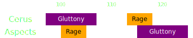

[Previous](seq3.html){: .btn } [Next](seq5.html){: .btn }

# [Gluttony]2 & [Rage]2
{: .center}

Difficulty: 
{: .center}

<video class="center" width="90%" controls muted>
  <source src="../../videos/phase3/seq4.mp4" type="video/mp4">
</video>

## Description
A tricky overlap between  [Rage] and [Gluttony] that makes it difficult to collect orbs. If played incorrectly or with bad coordination, it will result in many  [Empowered](https://wiki.guildwars2.com/wiki/Empowered_(Cerus)) stacks on the boss, potentially compromising the run. 

## Sequence
1. The sequence starts with everyone on .
2. The  [Chronomancer] prepares a  [Portal] using their  [Continuum Split] to  as soon as the Aspect's  [Rage] indicator appears.
3. Players should move out of the AoE or take the  [Portal]. Everyone should keep an eye out for any [Gluttony] orbs they can collect on the way out and try to grab as many as possible.
4. Once  [Rage] pops, players should take the  [Portal] back to the boss to grab any orbs that were not yet fully collected.
5. The  [Scourge] should preposition north of the boss, towards . When the boss's  [Rage]'s indicator appears, they should  [Sand Swell] towards the marker.
6. Everyone takes the  [Sand Swell] before Rage pops. The  [Chronomancer] runs out and prepares their  [Portal] on .
7. Everyone takes the  [Sand Swell] back to the boss and quickly collects all orbs. Marked people should call out where they're moving.
8. As soon as the final orb is collected, the  [Chronomancer] opens their  [Portal] on the boss.

  
 Chronomancer POV

  <iframe class="youtube-video" src="https://www.youtube.com/embed/OA3tzmAsea0?si=ytuj9FtN2UTVK0Zw&start=395&end=425&mute=1 " frameborder="0" allow="accelerometer; clipboard-write; encrypted-media; gyroscope; picture-in-picture; web-share" referrerpolicy="strict-origin-when-cross-origin" allowfullscreen></iframe>

  
 Scourge POV

  <iframe class="youtube-video" src="https://www.youtube.com/embed/PxAi-bWHTsg?si=96CSuM_yvkiQjOEv&start=400&end=430&mute=1 " frameborder="0" allow="accelerometer; clipboard-write; encrypted-media; gyroscope; picture-in-picture; web-share" referrerpolicy="strict-origin-when-cross-origin" allowfullscreen></iframe>

## Extra Information
- The  [Chronomancer] can start saving their clones once  [Envy] disappears: the portal is much easier to place with three clones.
-  [Heralds] can give superspeed during the first  [Rage] with  [Chaotic Release](https://wiki.guildwars2.com/wiki/Chaotic_Release), and can get back to the boss quickly with  [Frigid Blitz](https://wiki.guildwars2.com/wiki/Frigid_Blitz).
-  [Scourge] can quickly move out of Rage with  [Path of Gluttony](https://wiki.guildwars2.com/wiki/Path_of_Gluttony).

[Previous](seq3.html){: .btn } [Next](seq5.html){: .btn }

[Gluttony]: ../../mechanics/aspects/gluttony.html
[Rage]: ../../mechanics/aspects/rage.html
[Envy]: ../../mechanics/aspects/envy.html
[Scourge]: https://wiki.guildwars2.com/wiki/Scourge
[Chronomancer]: https://wiki.guildwars2.com/wiki/Chronomancer
[Portal]: https://wiki.guildwars2.com/wiki/Portal_Entre
[Blink]: https://wiki.guildwars2.com/wiki/Blink
[Continuum Split]: https://wiki.guildwars2.com/wiki/Continuum_Split
[Sand Swell]: https://wiki.guildwars2.com/wiki/Sand_Swell
[Heralds]: https://wiki.guildwars2.com/wiki/Herald