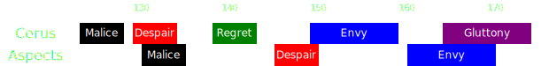

[Previous](seq4.html){: .btn } [Next](../phasing.html){: .btn }

# [Malice]2, [Despair]2, [Envy]2 & [Gluttony]
{: .center}

Difficulty: 
{: .center}

<video class="center" width="90%" controls muted>
  <source src="../../videos/phase3/seq5.mp4" type="video/mp4">
</video>

## Description
Another pair of  [Despair] need to be placed far from the boss. While placing them, the squad must also deal with a set of  [Malice].

The sequence also features challenging overlaps between  [Despair] and  [Envy], and [Gluttony] and  [Envy].

## Sequence
1. As soon as  [Malice] chooses targets, everyone quickly takes the  [Portal] to . The players targeted by tethers should drop the adds on top of the portal exit.
2. Spread with  [Despair] along the northern edge of the arena. Take all the space you need, and then  dodge forward. You should not be in more than 2/3 spreads at this time.
3. Stack inside [Regret] while in range of the boss. The adds will walk into your cleave, so there is no need to focus them specifically.
4. The  [Scourge], if they don't have the green, can move in front and to the left of the stack. As soon as the second  [Despair] spawns, they  [Sand Swell] behind the boss, immediately taking it back.
5. The squad stacks to the right of the portal, leaving enough space in front of them for the healers. Prepare to dodge the second set of despair. Virtuosos should use their  [Distortion], Heralds should use  [Infuse Light].
6. The indicator for  [Envy] from the boss will appear on top of the squad  while the it is stacked. Dodge the  [Despair]  to the left, and take the  [Sand Swell] to avoid the wall.
7. Chase the fast wall around the boss and run back to  in time for the add's  [Envy]. When it spawns, follow the slow wall to  and jump the fast wall.
8. [Gluttony] will happen while the slow wall is still up. You may have to go through the wall to collect orbs.

  
 Chronomancer POV

  <iframe class="youtube-video" src="https://www.youtube.com/embed/OA3tzmAsea0?si=ytuj9FtN2UTVK0Zw&start=422&end=475&mute=1 " frameborder="0" allow="accelerometer; clipboard-write; encrypted-media; gyroscope; picture-in-picture; web-share" referrerpolicy="strict-origin-when-cross-origin" allowfullscreen></iframe>

  
 Scourge POV

  <iframe class="youtube-video" src="https://www.youtube.com/embed/PxAi-bWHTsg?si=96CSuM_yvkiQjOEv&start=426&end=479&mute=1 " frameborder="0" allow="accelerometer; clipboard-write; encrypted-media; gyroscope; picture-in-picture; web-share" referrerpolicy="strict-origin-when-cross-origin" allowfullscreen></iframe>

  
 Herald POV

  <iframe class="youtube-video" src="https://www.youtube.com/embed/1NhFc7-NlkE?si=DkrrZ457SCPF-Rf5&start=395&end=448&mute=1 " frameborder="0" allow="accelerometer; clipboard-write; encrypted-media; gyroscope; picture-in-picture; web-share" referrerpolicy="strict-origin-when-cross-origin" allowfullscreen></iframe>

  
 Virtuoso POV

  <iframe class="youtube-video" src="https://www.youtube.com/embed/71JEURWXLko?si=YroyfB-PRhH9Z4Tv&start=435&end=488&mute=1 " frameborder="0" allow="accelerometer; clipboard-write; encrypted-media; gyroscope; picture-in-picture; web-share" referrerpolicy="strict-origin-when-cross-origin" allowfullscreen></iframe>

## Extra Information
- If everyone takes the  [Portal] immediately once it opens, no-one will be in range for the second  [Malice], and you will have to deal with one less mechanic. If some players do get tethers, they should try to place their adds on top of the previous set.
- Remember that  [Distortion] and  [Evasion](https://wiki.guildwars2.com/wiki/Evade) only work for the initial  [Despair] damage,   [Infuse Light] however also works on the pools, so the  [Heralds] don't even need to dodge.
- The  [Scourge] can spam Interact (default F key) to instantly take their  [Sand Swell] back after casting it.
- After jumping the fast wall, support players should cleanse conditions, strip boons from Cerus and re-apply boons on the squad in case anyone failed their jump.

[Previous](seq4.html){: .btn } [Next](../phasing.html){: .btn }

[Despair]: ../../mechanics/aspects/despair.html
[Gluttony]: ../../mechanics/aspects/despair.html
[Envy]: ../../mechanics/aspects/envy.html
[Regret]: ../../mechanics/aspects/regret.html
[Malice]: ../../mechanics/aspects/malice.html
[Scourge]: https://wiki.guildwars2.com/wiki/Scourge
[Infuse Light]: https://wiki.guildwars2.com/wiki/Infuse_Light
[Chronomancer]: https://wiki.guildwars2.com/wiki/Chronomancer
[Portal]: https://wiki.guildwars2.com/wiki/Portal_Entre
[Distortion]: https://wiki.guildwars2.com/wiki/Distortion
[Garish Pillar]: https://wiki.guildwars2.com/wiki/Garish_Pillar
[Virtuosos]: https://wiki.guildwars2.com/wiki/Virtuoso
[Heralds]: https://wiki.guildwars2.com/wiki/Herald
[Thousand Cuts]: https://wiki.guildwars2.com/wiki/Thousand_Cuts
[Sand Swell]: https://wiki.guildwars2.com/wiki/Sand_Swell