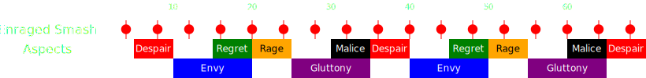

[Previous](phasing/seq7.html){: .btn } [Next](phase4/seq1.html){: .btn }

# Final Phase - 10% to 0%

The most difficult part of the fight. Ever-increasing damage superimposed on relentless successive mechanics make for a challenging, mechanical, healing and damage check, as you try to finish the fight before Cerus kills you all.

- Cerus will start casting his [Enraged Smash] every four seconds, progressively gaining more stacks of  [Empowered]. Meanwhile, a new Aspect will spawn and perform their mechanic every 5 seconds.
- The superposition of other damage sources with the [Enraged Smash] is one of the most common reason for downs. Most commonly this happens with [Regret] or  [Malice].
- Large difficulty spikes come from the  [Despair] stacks, 5 and 35 seconds into the phase. Failing a dodge here means death for the offender.
- 65-70 seconds is usually the limit for concluding this phase: beyond this point, the combination of a third Despair, adds walking in and the boss usually having more than 50  [Empowered] is almost always a wipe.
- Detailed rotations for healing this phase with many classes are available in Minas's [spreadsheet](https://www.google.com/url?q=https://docs.google.com/spreadsheets/d/1DLKL0aOoxAxW7RoQwaEpQCWjzMpPoqugMgocI53ARGM/edit%23gid%3D316003762&sa=D&source=editors&ust=1720029091297141&usg=AOvVaw06F124pJ6zsN9mc72J2zzb).
-  [Virtuosos](https://wiki.guildwars2.com/wiki/Virtuoso) should not use their healing skill during this phase: the passive healing is more important than the phantasm reset. Only use it if you need the active heal.

### Full Timeline

(Use shift+scroll or swipe if on mobile)

  

[Previous](phasing/seq7.html){: .btn } [Next](phase4/seq1.html){: .btn }

[Enraged Smash]: ../mechanics/other/smash.html
[Regret]: ../mechanics/aspects/regret.html
[Gluttony]: ../mechanics/aspects/gluttony.html
[Malice]: ../mechanics/aspects/malice.html
[Despair]: ../mechanics/aspects/despair.html
[Empowered]: https://wiki.guildwars2.com/wiki/Empowered_(Cerus)