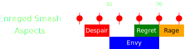

[Previous](../phase2.html){: .btn } [Next](seq2.html){: .btn }

# [Despair], [Envy], [Rage]
{: .center}

<video class="center" width="90%" controls muted>
  <source src="../../videos/phase4/seq1.mp4" type="video/mp4">
</video>

## Description
The most difficult part of this sequence is a very punishing dodge at the start. If you survive the dodge, you'll be in a good position to handle the rest of the mechanics.

## Sequence
1. Stack on the  side of the boss.
2. Once the  [Despair] indicator appears, the  [Scourge] uses their  [Sand Swell] to .
3. Everyone takes the portal and stays on the portal exit, except for the healers, who can stack behind the rest of the squad.
4.  Dodge  [Despair] to the right.  [Virtuosos] use their  [Distortion],  [Heralds] use  [Infuse Light].
5. After the dodge, the  [Chronomancer] prepares their  [Portal] next to the pools.
6. Run east towards  [Envy] and chase the fast wall around the boss.
7. Run to either  or  to avoid the slow wall.  is safer but  allows melee builds to greed more damage.
8. Stack in [Regret] when it spawns, and sidestep  [Rage].

  
 Chronomancer POV

  <iframe class="youtube-video" src="https://www.youtube.com/embed/OA3tzmAsea0?si=ytuj9FtN2UTVK0Zw&start=529&end=559&mute=1 " frameborder="0" allow="accelerometer; clipboard-write; encrypted-media; gyroscope; picture-in-picture; web-share" referrerpolicy="strict-origin-when-cross-origin" allowfullscreen></iframe>

  
 Scourge POV

  <iframe class="youtube-video" src="https://www.youtube.com/embed/PxAi-bWHTsg?si=96CSuM_yvkiQjOEv&start=534&end=564&mute=1 " frameborder="0" allow="accelerometer; clipboard-write; encrypted-media; gyroscope; picture-in-picture; web-share" referrerpolicy="strict-origin-when-cross-origin" allowfullscreen></iframe>

  
 Herald POV

  <iframe class="youtube-video" src="https://www.youtube.com/embed/1NhFc7-NlkE?si=DkrrZ457SCPF-Rf5&start=482&end=512&mute=1 " frameborder="0" allow="accelerometer; clipboard-write; encrypted-media; gyroscope; picture-in-picture; web-share" referrerpolicy="strict-origin-when-cross-origin" allowfullscreen></iframe>

  
 Virtuoso POV

  <iframe class="youtube-video" src="https://www.youtube.com/embed/71JEURWXLko?si=YroyfB-PRhH9Z4Tv&start=542&end=572&mute=1 " frameborder="0" allow="accelerometer; clipboard-write; encrypted-media; gyroscope; picture-in-picture; web-share" referrerpolicy="strict-origin-when-cross-origin" allowfullscreen></iframe>

## Extra Information
- Any players who go down due to  [Despair] and aren't immediately revived should /gg. This will avoid you getting targeted by [Regret] , which usually means a wipe.
- If the  [Chronomancer] didn't use  [Continuum Split] to place the final portal of the previous phase, they will not have their portal available now, and will have to  [Blink] out and place it in the following sequence.
-  [Virtuosos] should reset their  [Distortion] with  [Signet of Illusions] soon after the dodge.
-  [Virtuosos] should provide  [Swiftness] with  [Temporal Curtain] for  [Envy].

[Previous](../phase2.html){: .btn } [Next](seq2.html){: .btn }

[Despair]: ../../mechanics/aspects/despair.html
[Regret]: ../../mechanics/aspects/regret.html
[Rage]: ../../mechanics/aspects/rage.html
[Envy]: ../../mechanics/aspects/envy.html
[Scourge]: https://wiki.guildwars2.com/wiki/Scourge
[Sand Swell]: https://wiki.guildwars2.com/wiki/Sand_Swell
[Distortion]: https://wiki.guildwars2.com/wiki/Distortion
[Infuse Light]: https://wiki.guildwars2.com/wiki/Infuse_Light
[Chronomancer]: https://wiki.guildwars2.com/wiki/Chronomancer
[Portal]: https://wiki.guildwars2.com/wiki/Portal_Entre
[Blink]: https://wiki.guildwars2.com/wiki/Blink
[Continuum Split]: https://wiki.guildwars2.com/wiki/Continuum_Split
[Virtuosos]: https://wiki.guildwars2.com/wiki/Virtuoso
[Heralds]: https://wiki.guildwars2.com/wiki/Herald
[Signet of Illusions]: https://wiki.guildwars2.com/wiki/Signet_of_Illusions
[Temporal Curtain]: https://wiki.guildwars2.com/wiki/Temporal_Curtain
[Swiftness]: https://wiki.guildwars2.com/wiki/Swiftness