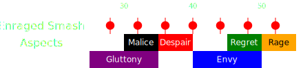

[Previous](seq1.html){: .btn } [Next](seq3.html){: .btn }

# [Gluttony], [Malice], [Despair]
{: .center}

<video class="center" width="90%" controls muted>
  <source src="../../videos/phase4/seq2.mp4" type="video/mp4">
</video>

## Description
A very difficult part of the fight. The squad will naturally tend to separate and spread out due to [Gluttony] and  [Malice], meaning the healers will struggle to keep everyone alive during one of the most stressful series of mechanics.

## Sequence
1. Focus on collecting [Gluttony]. Use  [Feedback](https://wiki.guildwars2.com/wiki/Feedback) and  [Corrosive Poison Cloud](https://wiki.guildwars2.com/wiki/Corrosive_Poison_Cloud) on the boss to prevent it from gaining  [Barrier](https://wiki.guildwars2.com/wiki/Barrier).
2. As soon as  [Malice] tethers spawn, the   [Chronomancer] opens their  [Portal] on the boss. Targeted players should wait until they are full health after the smash at ~32s, then take the portal. Drop the adds on the portal exit.
3. Once  [Despair] spreads spawn, everyone takes the portal and prepares to dodge. The majority of the squad should stack on top of the exit while the healers move behind. Virtuosos should use their  [Thousand Cuts] now while targeting the boss to cleave the adds.
4.  Dodge  [Despair] to the right.  [Virtuosos] use their  [Distortion],  [Heralds] use  [Infuse Light].

  
 Chronomancer POV

  <iframe class="youtube-video" src="https://www.youtube.com/embed/OA3tzmAsea0?si=ytuj9FtN2UTVK0Zw&start=559&end=573&mute=1 " frameborder="0" allow="accelerometer; clipboard-write; encrypted-media; gyroscope; picture-in-picture; web-share" referrerpolicy="strict-origin-when-cross-origin" allowfullscreen></iframe>

## Extra Information
- Any players who go down after  [Despair] and aren't immediately revived should /gg.
- It is important that players targeted by  [Malice] wait until after the smash to take the portal. This will give the healers time to bring them to full health, otherwise they will likely downstate on the smash right after  [Despair] spreads spawn.
-  [Virtuosos] targeted by  [Malice] should try to  [Block] the tethers to reduce incoming damage, since they will be far from their healers when they complete.

[Previous](seq1.html){: .btn } [Next](seq3.html){: .btn }

[Gluttony]: ../../mechanics/aspects/gluttony.html
[Malice]: ../../mechanics/aspects/malice.html
[Despair]: ../../mechanics/aspects/despair.html
[Regret]: ../../mechanics/aspects/regret.html
[Distortion]: https://wiki.guildwars2.com/wiki/Distortion
[Infuse Light]: https://wiki.guildwars2.com/wiki/Infuse_Light
[Chronomancer]: https://wiki.guildwars2.com/wiki/Chronomancer
[Portal]: https://wiki.guildwars2.com/wiki/Portal_Entre
[Virtuosos]: https://wiki.guildwars2.com/wiki/Virtuoso
[Heralds]: https://wiki.guildwars2.com/wiki/Herald
[Signet of Illusions]: https://wiki.guildwars2.com/wiki/Signet_of_Illusions
[Thousand Cuts]: https://wiki.guildwars2.com/wiki/Thousand_Cuts
[Block]: https://wiki.guildwars2.com/wiki/Block