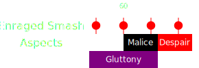

[Previous](seq2.html){: .btn }

# [Gluttony], [Malice], [Despair]
{: .center}

## Description
This sequence is identical to the Gluttony, Malice, Despair at the start of the [previous](seq2.html) sequence.
Here it's do or die: most squads will wipe soon after the final  [Despair], due to the incredible damage pressure and the inavailablity of portals.

## Sequence
1. Focus on collecting [Gluttony]. Use  [Feedback](https://wiki.guildwars2.com/wiki/Feedback) and  [Corrosive Poison Cloud](https://wiki.guildwars2.com/wiki/Corrosive_Poison_Cloud) on the boss to prevent it from gaining  [Barrier](https://wiki.guildwars2.com/wiki/Barrier). Avoid barrier at all costs: one single orb going in means 4-5 more seconds of dps. That's an extra smash to deal with: often the difference between a kill and a wipe.
2. Players targeted by  [Malice] can try running out. Don't run too far, or else you will quickly die to smashes.
3. If  [Despair] spawns: spread, dps, pray.
4. [You are dead.](https://www.youtube.com/watch?v=dNQs_Bef_V8)

[Previous](seq3.html){: .btn }

[Gluttony]: ../../mechanics/aspects/gluttony.html
[Malice]: ../../mechanics/aspects/malice.html
[Despair]: ../../mechanics/aspects/despair.html