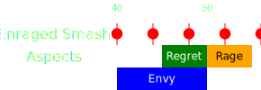

[Previous](seq3.html){: .btn }

# [Gluttony], [Malice], [Despair]
{: .center}

<video class="center" width="90%" controls muted>
  <source src="../../videos/phase4/seq4.mp4" type="video/mp4">
</video>

## Description
This sequence is exactly identical to the previous [Gluttony, Malice, Despair](seq2.html) combination, only with added stress and more difficult healing.
Here it's do or die: most squads will wipe soon after the final  [Despair], due to the incredible damage pressure.

[Previous](seq3.html){: .btn }

[Envy]: ../../mechanics/aspects/envy.html
[Regret]: ../../mechanics/aspects/regret.html
[Rage]: ../../mechanics/aspects/rage.html