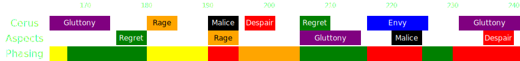

[Previous](phase3/seq5.html){: .btn } [Next](phasing/seq6.html){: .btn }

# Phasing to the Final 10%

Once you finish the second [Double Drops](phase3/seq5.html) sequence, you are within range of phasing and you should start planning out when exactly to transition to the final 10%. This is not a straightforward matter: some Embodiment attacks will carry over into the following phase through the breakbar, possibly making the start of the final phase much more difficult, and potentially compromising the entire run. In particular, when the breakbar appears:
- Most attacks originating from the boss will be completely interrupted.
- Any Aspects that have already spawned will finish casting their ability.
-  [Malice] tethers will not disappear, but any adds already present will despawn.
- Any [Gluttony] orbs already present will despawn.
- Any  [Despair] puddles that were spawned in by the Aspect will persist throughout the final phase. Puddles that were spawned by the boss will instead disappear as soon as he gains his  [Defiance Bar].

We can divide the final part of the fight into several sections based on phasing convenience:

-  Green sections represent periods where the phasing is more convenient. Carried over mechanics will be inconsequential, or mechanics will be cancelled by the transition.
-  Yellow sections have a small amount of added difficulty or deviations from normal strategy that require adaptation on the fly.
-  Orange sections are inconvenent timings that should be avoided, but are not run-ending.
-  Red sections represent bad timings that should be avoided at all costs.

Over the next few pages we will see the final couple of sequences for the third phase, with added annotations on phase timings.

[Previous](phase3/seq5.html){: .btn } [Next](phasing/seq6.html){: .btn }

[Gluttony]: ../mechanics/aspects/gluttony.md
[Malice]: ../mechanics/aspects/malice.md
[Despair]: ../mechanics/aspects/despair.md
[Defiance Bar]: https://wiki.guildwars2.com/wiki/Defiance_bar