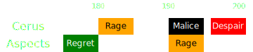

[Previous](../phasing.html){: .btn } [Next](seq7.html){: .btn }

# [Regret], [Rage]2, [Malice], [Despair]
{: .center}

Difficulty: 
{: .center}

<video class="center" width="90%" controls muted>
  <source src="../../videos/phase3/seq6.mp4" type="video/mp4">
</video>

## Description
 [Rage] and  [Malice] will both require portals to be managed correctly. This puts some strain on the healers, but the rest of the squad should have it relatively easy.

## Normal Sequence
1. Stack in [Regret] south of the boss. When  [Rage] spawns, the  [Scourge] uses their  [Sand Swell] towards the  marker, and the whole squad takes it, then takes it back once the AoE pops.
2. The  [Chronomancer] opens their  [Continuum Split] and creates a  [Portal] from  to . Everyone targeted by [Malice] will take this portal and place their add on the edge of the arena.
3. Everyone who did not get [Malice] should stay outside of the Embodiment's  [Rage].
4. Before  [Despair] starts, everyone should spread in a semi-circle around the boss. Players who stayed on  should favor spreading more to the left, leaving space for the Malice players once they get back from the portal.
5. Dodge  [Despair] towards the boss.

  
 Chronomancer POV

  <iframe class="youtube-video" src="https://www.youtube.com/embed/OA3tzmAsea0?si=ytuj9FtN2UTVK0Zw&start=469&end=504&mute=1 " frameborder="0" allow="accelerometer; clipboard-write; encrypted-media; gyroscope; picture-in-picture; web-share" referrerpolicy="strict-origin-when-cross-origin" allowfullscreen></iframe>

  
 Scourge POV

  <iframe class="youtube-video" src="https://www.youtube.com/embed/PxAi-bWHTsg?si=96CSuM_yvkiQjOEv&start=474&end=509&mute=1 " frameborder="0" allow="accelerometer; clipboard-write; encrypted-media; gyroscope; picture-in-picture; web-share" referrerpolicy="strict-origin-when-cross-origin" allowfullscreen></iframe>

## Phasing
There are several points where you can phase during this sequence.

###  Early during  [Envy]

This will only happen if you have very high damage. In this case, if anybody failed the jump and got stripped by the fast wall, it is likely that the add will maintain  [Alacrity](https://wiki.guildwars2.com/wiki/Alacrity) and  [Quickness](https://wiki.guildwars2.com/wiki/Quickness), resulting in a faster, invisible [Envy] in the beginning of the final phase. Players should be ready and aware.

---

###  Before  [Rage]

High damage groups should aim for this window. Once [Regret] spawns, you will get a green leading into the final phase, but this is very easy to deal with.

---

###  After  [Rage]
This requires a small adaptation: the  [Sand Swell] out of the  [Rage] should be replaced by a  [Continuum Split]  [Portal], so that  [Sand Swell] will be available for the start of the final phase.
If the Embodiment of  [Rage] spawns, remember that it will _always_ cast its attack, even if you phase. Depending on the timing of the attack, the commander may make the call to play the start of the final phase from .

  
View Animation

  <video class="center" width="90%" controls muted>
  <source src="../../videos/phase3/seq6_alt.mp4" type="video/mp4">
</video>

  
 Chronomancer POV

  <iframe class="youtube-video" src="https://www.youtube.com/embed/c6C1ttm5shI?si=eRmgZnFVgPIsh3PC&start=443&end=457&mute=1 " frameborder="0" allow="accelerometer; clipboard-write; encrypted-media; gyroscope; picture-in-picture; web-share" referrerpolicy="strict-origin-when-cross-origin" allowfullscreen></iframe>
  <b>Note</b>: in this PoV, the squad dps was not enough to phase during the Rage mechanic, so damage was held in order to phase at the beginning of the following sequence. However, its a good showcase of the CS portal.

---

###  During  [Malice]
If you phase while  [Malice] tethers are active, the tethers will not disappear, and you will get an extra set of adds persisting through to the next phase. This is extremely inconvenient, since usually the squad will not be ready to cleave them, resulting in a full 15 stacks of  [Empowered] on the boss, and a wipe. You should generally try to phase Cerus before he puts his wings to the floor, or hold damage and try to phase at the start of the next sequence.

---

###  After  [Malice]
Phasing here will result in the  [Malice] adds despawning. However, you will always get [Gluttony] persisting through the beginning of the final phase. While not catastrophic, this is however a significant increase in difficulty, and should be avoided. You should hold damage and try to phase at the beginning of the next sequence.

---

## Extra Information
- _Don't_ use  [Distortion] or  [Infuse Light] for  [Despair]: you will need them at the start of the final phase.
- The  [Portal] can be done both from  to  or from  to , choose which suits you best.
- Players who don't get targeted by  [Malice] should tend to spread left with their  [Despair], leaving more space for their teammates once they come back with the portal.

[Previous](../phasing.html){: .btn } [Next](seq7.html){: .btn }

[Rage]: ../../mechanics/aspects/despair.html
[Despair]: ../../mechanics/aspects/despair.html
[Gluttony]: ../../mechanics/aspects/despair.html
[Envy]: ../../mechanics/aspects/envy.html
[Regret]: ../../mechanics/aspects/regret.html
[Malice]: ../../mechanics/aspects/malice.html
[Scourge]: https://wiki.guildwars2.com/wiki/Scourge
[Chronomancer]: https://wiki.guildwars2.com/wiki/Chronomancer
[Portal]: https://wiki.guildwars2.com/wiki/Portal_Entre
[Virtuosos]: https://wiki.guildwars2.com/wiki/Virtuoso
[Sand Swell]: https://wiki.guildwars2.com/wiki/Sand_Swell
[Continuum Split]: https://wiki.guildwars2.com/wiki/Continuum_Split
[Infuse Light]: https://wiki.guildwars2.com/wiki/Infuse_Light
[Distortion]: https://wiki.guildwars2.com/wiki/Distortion
[Empowered]: https://wiki.guildwars2.com/wiki/Empowered_(Cerus)