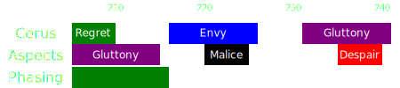
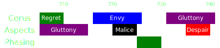

[Previous](seq6.html){: .btn } [Next](../phase4.html){: .btn }

# [Gluttony] & [Regret], [Envy] & [Malice], [Despair]
{: .center}

<video class="center" width="90%" controls muted>
  <source src="../../videos/phase3/seq7.mp4" type="video/mp4">
</video>

## Description
The final sequence of phase 3. Nothing mechanically difficult, outside of phasing with the correct timings.

## Normal Sequence
1. After dodging  [Despair], stack on the boss for the green.
2. Use [Feedback](https://wiki.guildwars2.com/wiki/Feedback) and  [Corrosive Poison Cloud](https://wiki.guildwars2.com/wiki/Corrosive_Poison_Cloud) during [Gluttony] to avoid the boss getting  [Barrier]. Focus on collecting.
3. When  [Envy] spawns, run to the right, then chase the fast wall around the boss.
4. Whoever gets targeted by  [Malice] should run out in the space between pools, and drop the adds as far as possible.
5. Phase as soon as possible after the adds spawn. Be ready to break Cerus's  [Defiance Bar](https://wiki.guildwars2.com/wiki/Defiance_bar).

## Phasing
There are two good points where you can phase during this sequence, and two very bad points.

###  During [Gluttony]
A generally good moment, normal damage groups should aim to phase here, as soon as the green appears. Any [Gluttony] orbs already present on the map will despawn, and both attacks will be invalidated.

---

###  During  [Envy]
The wall appears as soon as the  [Malice] Embodiment spawns. If you phase here, Malice will complete their attack and you will get an extra set of adds persisting through to the next phase. This usually leads to 15 stacks of  [Empowered] on the boss and a wipe.

---

###  After  [Malice]
This is the final safe phasing point. As soon as the  [Malice] adds spawn, phasing will make them despawn, leading to a safe transition.

---

###  Fast  [Despair]
Phasing too late after  [Malice] means that  [Despair] will spawn and complete its attack. This results in an extremely inconvenient set of pools that will persist throughout the final phase, usually leading to a wipe. Phasing after the despair is also usually fatal, since at least one set of adds will walk in.

---

[Previous](seq6.html){: .btn } [Next](../phase4.html){: .btn }

[Rage]: ../../mechanics/aspects/despair.html
[Despair]: ../../mechanics/aspects/despair.html
[Gluttony]: ../../mechanics/aspects/despair.html
[Envy]: ../../mechanics/aspects/envy.html
[Regret]: ../../mechanics/aspects/regret.html
[Malice]: ../../mechanics/aspects/malice.html
[Barrier]: https://wiki.guildwars2.com/wiki/Barrier
[Empowered]: https://wiki.guildwars2.com/wiki/Empowered_(Cerus)